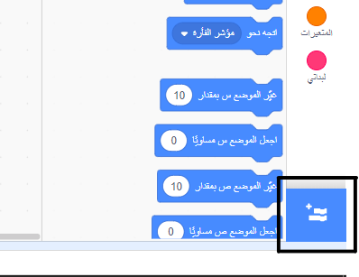
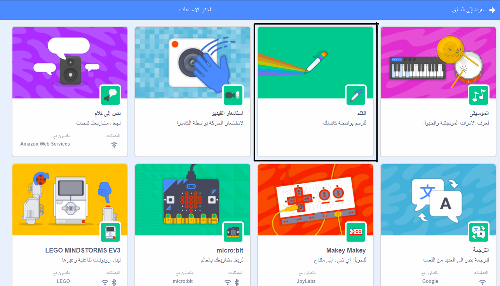
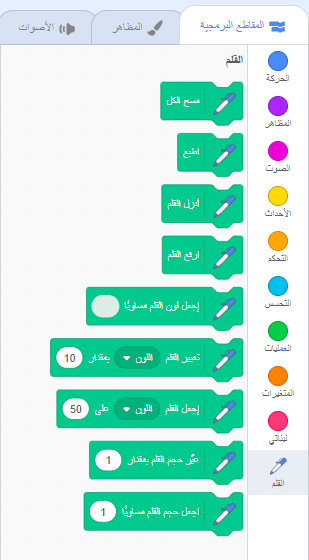

## استخدام أداة القلم

يعتمد المشروع الذي ستقوم بصنعه على أداة **القلم** التي ترسم خطًا خلف مركز الكائن أثناء تحركه. سوف تتعلم كيفية استخدامها الآن!

\--- task \---

افتح ملف Scratch جديدًا ، وحدد كائن قطة برنامج Scratch ، واسحب بعض الكتل التي قد شاهدتها بالفعل ، حتى يبدو كما يلي:

```blocks3
    عندما ينقر العلم الأخضر
    الذهاب إلى x: (0) y: (0)
    تحرك (50) خطوة
    استدر باتجاه عقارب الساعة (15) درجة
```

\--- /task \---

الآن ، حان الوقت لاختبار القلم!

لاستخدام كتل القلم في سكراتش ، تحتاج إلى إدراج** إضافة القلم**.

\--- task \---

اضغط على زر **إدراج إضافة** في الزاوية اليسرى السفلى.



انقر على ملحق **القلم** لإضافته.



يظهر قسم القلم في أسفل قائمة الكتل.



من قسم **القلم** ، حدد المربع `أنزل القلم`{: class = "block3extensions"} وأضفه إلى بداية البرنامج ، مثل هذا:

```blocks3
    عند نقر العلم الأخضر
+ أنزل القلم
    اذهب إلى إلى س: (0) ص: (0)
```

\--- /task \---

\--- task \---

الآن انقر على العلم الأخضر عدة مرات وشاهد ما يحدث.

\--- /task \---

إذا كنت تستطيع رؤية الخطوط الموجودة خلف كائن القط ، فإن القلم يعمل ويمكنك البدء في رسم أنماط رائعة حقًا.

أولا ، يجب عليك التخلص من الكائن. إنه يعيق الرسم!

\--- task \---

أضف `كتلة إخفاء ` {:class="block3looks"} من ** المظاهر ** إلى بداية البرنامج وسوف تختفي.

```blocks3
    عند نقر العلم الأخضر
+ إخف
    انزل القلم
```

\--- /task \---

الآن ، يمكنك تغيير لون القلم مع كتلة أخرى من قسم **القلم** ، لكن الكتلة تختلف قليلاً عن الأخريات التي رأيتها. إنها كتلة `اجعل لون القلم مساويا `{:class="block3extensions"} و تبدو كهذا:

```blocks3
    اجعل لون القلم مساويا [#4a6cd4]
```

\--- task \---

اسحب كتلة `اجعل لون القلم مساوياً`{:class="block3extensions"} لداخل لوحة الكائن الخاص بك, واجلبها فوق كتلة`انزل القلم`{:class="block3extensions"}.

```blocks3
    عندما ينقر العلم الأخضر
    اخفاء
+ تحديد لون القلم إلى [# 4a6cd4]
    القلم إلى أسفل
```

الآن ، انقر فوق مربع اللون (في الكود أعلاه هو اللون الأزرق) ، واختر اللون.

\--- /task \---

إذا كنت تنقر على العلم الأخضر لاختبار التعليمات البرمجية ، فستلاحظ أن الرسومات التي يقوم بها القلم لا تختفي.

\--- task \---

أضف كتلة `مسح الكل`{:class="block3extensions"} من قسم **القلم** إلى بداية الكود الخاص بك لتتولى أمر ذلك:

```blocks3
    عند نقر العلم الأخضر
+ امسح الكل
    إخف
```

\--- /task \---