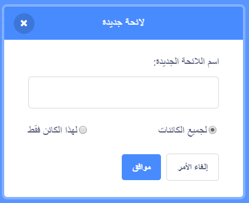
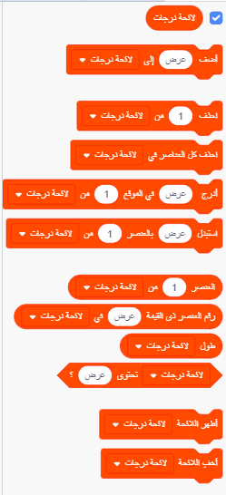
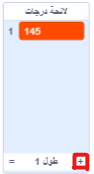

## مساعدة الكمبيوتر

هل تتذكر بضع خطوات إلى الوراء ، حيث قلت لك أن تدون بعض قيمك المفضلة لـ `زيادة`{:class="block3variables"} و `درجات`{:class="block3variables"},تلك التي أعطت أفضل الأنماط؟ إذا لم تقم بذلك ، فلا تقلق: يمكنك فقط مشاهدة البرنامج العشوائي وهو يعمل لفترة من الوقت الآن وتدوين المجموعات التي تعطي نتائج رائعة.

ستقوم بتعليم Scratch تلك المجموعات من القيم، بحيث يمكن استخدامها لصنع صور رائعة!

للقيام بذلك ، ستحتاج إلى **لائحة**. ستجد اللوائح مع المتغيرات في قسم **المتغيرات**. مثلما فعلت مع المتغيرات الخاصة بك، ستحتاج إلى إنشاء لائحتك أولاً!

\--- task \---

انقر فوق **إنشاء لائحة**، وأدخل `قائمة درجات`{:class= "block3variables"} كاسم.



\--- /task \---

ستظهر قائمتك، الفارغة في الوقت الحالي، على المسرح، وسترى مجموعة من الكتل الخاصة بها في **المتغيرات**.



\--- task \---

قم بعمل قائمة أخرى تسمى ` قائمة الزيادة ` {:class="block3variables"}

\--- /task \---

\--- task \---

الآن, من خلال النقر على علامة الزائد الصغيرة (**+**) في أسفل اللوائح، أضف الزوج الأول من قيم `زيادة`{:class= "block3variables"} و `درجات` {:class="block3variables"} التي أعجبتك ، كل قيمة في القائمة الصحيحة. قم بذلك مرة أخرى لإضافة الزوج الثاني من القيم. سيكون هذا كافيًا في الوقت الحالي - ستضيف بقية أزواج القيمة التي تريدها لاحقًا!



تأكد من أن قيمة `درجات`{: class = "block3variables"} و قيمة `زيادة`{: class = "block3variables"} التي عملت جيدًا معًا تكون في نفس الموضع في`لائحة درجات` {: class = "block3variables"} و `لائحة زيادة` {:class="block3variables". يجب أن يكونوا هناك حتى يتمكن البرنامج من مطابقتهم مرة أخرى باستخدام مواقعهم!

\--- /task \---

الآن لديك اللوائح، تحتاج فقط إلى جعل التعليمات البرمجية الخاصة بك لقراءتها والتكرار عليها! للقيام بذلك ، ستستخدم متغيرًا جديدًا ليكون بمثابة عداد، بعض **تزايد**, و كتلة **تحكم** `إذا`{:class="block3control"}.

## \--- collapse \---

## title: ما معنى التزايد؟

زيادة شيء يعني إضافة شيء إليه.

ستستخدم متغيرًا لتعمل كعداد لتتبع الموضع الذي تتواجد فيه في قوائمك. للتنقل خلال القوائم ، ستستمر في زيادة العداد بمقدار `1` (لذلك ، اضافة`1` اليه) حتى تصل إلى نهاية القائمة.

\--- /collapse \---

\--- task \---

قم بإنشاء متغير جديد يسمى `عداد`{:class="block3variables"}، وقم بتحديث الكود الخاصة بك ليبدو كما يلي:

```blocks3
    عند نقر العلم الاخضر
    اجعل [counter v] مساوياً [0]
    كرر باستمرار 
+        اذا < (عداد) = (طول [لائحة زيادة] :: لائحة)> 
+            اجعل [عداد] مساوياً [0]
        نهاية
 +       غير [عداد] بمقدار بمقدار (1)
        اجعل [عداد] مساويا [0]
+       اجعل [زيادة] مساويا (العنصر (عداد) من [لائحة زيادة] :: لائحة)
+       اجعل [درجات] مساويا (العنصر (عداد) من [لائحة درجات] :: لائحة) 
        أرفع القلم
        امسح الكل
        اذهب إلى x: (0) y: (0)
        اجعل لون القلم مساوياً [#4a6cd4]
        أنزل القلم
        كرر حتى <touching [edge v] ?> 
            تحرك (خطوات) خطوة
            استدر باتجاه الساعة (درجات) درجة
            غير [خطوات] بمقدار (زيادة)
        نهاية
    نهاية
```

\--- /task \---

لاحظ الكتل الجديدة التي:

1. تجعل `عداد`{:class="block3variables"} مساوياً `0`, خارج جميع الحلقات.
2. تتحقق مما إذا كان الرقم المخزن في `عداد`{: class = "block3variables"} هو طول القائمة ، وإذا كان الأمر كذلك، فقم بتعيين ` عداد ` {: class = "block3variables"} إلى `0`. هذا يعني أن هذا المتغير سيكون دائمًا رقم الموضع في اللوائح، ولن يزيد عن ذلك.
3. تضيف `1` إلى `عداد`{:class="block3variables"}.
4. تختار العنصر من `قائمة زيادة`{: class = "block3variables"} الموجودة في الموضع الموصوف بواسطة `عداد`{:class="block3variables"}، ووضعه في متغير `زيادة` {: class = "block3variables"}. تفعل نفس الشيء في `قائمة الدرجات` {: class = "block3variables"} و متغير `درجات`{: class = "block3variables"}.

## \--- collapse \---

## title: كيف تعمل هذه التعليمات البرمجية؟

هذا ما يحدث عند تشغيل البرنامج:

1. ضبط ` العداد ` {: class = "block3variables"} إلى ` 0 `.
2. ابدا حلقة `كرر باستمرار`{:class="block3control"}.
3. تحقق مما إذا كان `عداد`{:class="block3variables"} (`0`) هو نفس طول `قائمة زيادة`{:class="block3variables"}(`2`). ليس كذلك.
4. غير `عداد`{:class="block3variables"} بمقدار`1`. الان `عداد`{:class="block3variables"} = `1`.
5. اجعل `خطوات`{:class="block3variables"} مساوياً `0`.
6. احصل على العنصر في الموضع المسمى بـ `عداد`{:class="block3variables"} (`1`) في `لائحة زيادة`{:class="block3variables"}, وضعه في متغير`زيادة`{:class="block3variables"}.
7. احصل على العنصر في الموضع المسمى بـ `عداد`{:class="block3variables" (`1`) في `لائحة درجات`{:class="block3variables"}, وضعه في`درجات`{:class="block3variables"}.
8. افعل كل الأشياء المتعلقة برسم الأنماط.
9. ابدا حلقة `إلى الأبد`{: class = "block3control"} من جديد:
10. تحقق مما إذا كان `عداد`{:class="block3variables"} (`1`) هو نفس طول `قائمة زيادة`{:class="block3variables"}(`2`). ليس كذلك.
11. غير `عداد`{:class="block3variables"} بمقدار`1`. الان `عداد`{:class="block3variables"} = `2`.
12. اجعل `خطوات`{:class="block3variables"} مساوياً `0`.
13. احصل على العنصر في الموضع المسمى بـ `عداد`{:class="block3variables"} (`2`) في `لائحة زيادة`{:class="block3variables"}, وضعه في متغير`زيادة`{:class="block3variables"}.
14. احصل على العنصر في الموضع المسمى بـ `عداد`{:class="block3variables" (`2`) في `لائحة درجات`{:class="block3variables"}, وضعه في`درجات`{:class="block3variables"}.
15. افعل كل الأشياء المتعلقة برسم الأنماط.
16. ابدا حلقة `إلى الأبد`{: class = "block3control"} من جديد:
17. تحقق مما إذا كان `عداد`{:class="block3variables"} (`2`) هو نفس طول `قائمة زيادة`{:class="block3variables"}(`2`). هو كذلك!
18. اجعل `عداد`{:class="block3variables"} مساوياً `0`.
19. تابع من **الخطوة 4** من هذه القائمة ، في حلقة لا تنتهي!

\--- /collapse \---

\--- task \---

بمجرد أن تكون راضيًا عن الكود ، تابع إضافة بقية أزواج القيم التي سجلتها إلى `قائمة درجات`{:class="block3variables"} و `قائمة الزيادة`{:class="block3variables"}.

\--- /task \---

هذا كل شيء! استرخ وشاهد برنامجك استمر في رسم أنماط جميلة في حلقة لا تنتهي أبدًا! إذا كنت ترغب في إضافة المزيد من الأنماط ، يمكنك: فقط إضافة المزيد من أزواج الأرقام إلى القائمتين وإعادة تشغيل البرنامج.