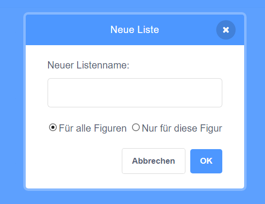
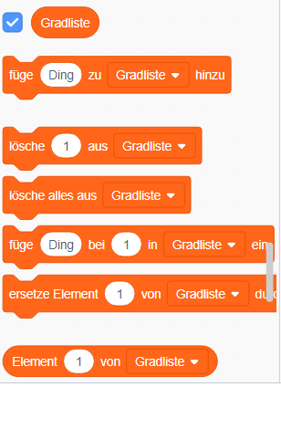
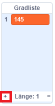

## Hilf dem Computer

Erinnerst du dich ein paar Schritte zurück, als ich dir sagte, dass du einige deiner Lieblingswerte für `erhöhen`{:class="block3variables"} und `Grad`{:class="block3variables"} notieren solltest, diejenigen die die am besten aussehenden Muster erzeugt haben? Wenn du das nicht getan hast, mach dir keine Sorgen: du kannst das zufällige Programm jetzt eine Weile laufen lassen und beobachten und die Kombinationen aufschreiben, die großartige Ergebnisse liefern.

Du wirst Scratch diese Kombinationen von Werten beibringen, damit diese nuzt um nur noch tolle Bilder zu machen!

Dazu benötigst du eine **Liste**. Du findest Listen zusammen mit den Variablen im **Variablen**-Bereich. Genau wie du es mit deinen Variablen getan hast, musst du deine Liste zuerst erstellen!

--- task ---

Klicke auf **neue Liste** und gib als Name `Gradliste`{:class="block3variables"} ein.



--- /task ---

Deine Liste, die im Moment leer ist, wird auf der Bühne angezeigt. Und du wirst eine ganze Menge Blöcke für sie im **Variablen**-Bereich sehen.



--- task ---

Erstelle eine weitere Liste, die du `erhöhen Liste`{:class="block3variables"} nennst

--- /task ---

--- task ---

Füge jetzt das erste Wertepaar von `erhöhen`{:class="block3variables"} und `Grad`{:class="block3variables"} Werten, die dir gefallen haben in die jeweils richtige Liste ein, indem du auf das kleine Pluszeichen (**+**) am Ende der Liste klickst. Wiederhole dies, um das zweite Wertepaar hinzuzufügen. Das reicht fürs Erste - du wirst die restlichen Wertepaare, die dir gefallen haben, später hinzufügen!



Stelle sicher, dass der `Grad`{:class="block3variables"}-Wert und der `erhöhen`{:class="block3variables"}-Wert, die gut zusammenarbeiten, in der `Gradliste`{:class="block3variables"} und in der `erhöhen Liste`{:class="block3variables"} jeweils an der gleichen Position stehen. Sie müssen dort sein, damit dein Programm sie anhand ihrer Position wieder zuordnen kann!

--- /task ---

Jetzt, da du die Listen hast, musst du nur deinen Code dazu bringen, sie zu lesen und sie zu durchlaufen! Um das zu tun, wirst du eine neue Variable, die als Zähler fungiert, einige **inkrementiert **- und einen `falls dann`{:class="block3control"}-**Steuerungs**-Block, verwenden.

--- collapse ---
---
title: Was bedeutet Inkrementieren?
---

Etwas inkrementieren bedeutet, etwas hinzuzufügen.

Du wirst eine Variable als Zähler verwenden, um zu verfolgen, an welcher Position du dich in deinen Listen befindest. Um dich durch die Listen zu bewegen, erhöhst du den Zähler ständig um `1` (fügst also `1` hinzu), bis du an das Ende der Liste gelangst.

--- /collapse ---

--- task ---

Erstelle eine neue Variable mit dem Namen `Zähler`{:class="block3variables"}, und aktualisiere deinen Code so, dass er wie folgt aussieht:

```blocks3
    Wenn die grüne Flagge angeklickt
    setze [Zähler v] auf [0]
    wiederhole fortlaufend 
+      falls <(Zähler) = (Länge von [erhöhen Liste v])> , dann 
+          setze [Zähler v] auf [0]
        end
+      ändere [Zähler v] um (1)
        setze [Schritte v] auf [0]
+      setze [erhöhen v] auf (Element (Zähler) von [erhöhen Liste v])
+      setze [Grad v] auf (Element (Zähler) von [Gradliste v])
        schalte Stift aus
        verstecke dich
        lösche alles
        gehe zu x: (0) y: (0)
        setze Stiftfarbe auf [#4a6cd4]
        schalte Stift ein
        wiederhole bis <wird [Rand v] berührt?> 
            gehe (Schritte) er Schritt
            drehe dich nach rechts um (Grad) Grad
            ändere [Schritte v] um (erhöhen)
        end
    end
```

--- /task ---

Beachte die neuen Blöcke, die:

1. Den `Zähler`{:class="block3variables"}, außerhalb aller Schleifen, auf `0` setzen.
2. Prüfen, ob die in `Zähler`{:class="block3variables"} gespeicherte Zahl, der Länge der Liste entspricht und, falls es so ist, `Zähler`{:class="block3variables"} auf `0` setzen. Das bedeutet, dass diese Variable immer die Nummer einer Position in den Listen ist und nicht größer wird, als die Listen lang sind.
3. `1` zu `Zähler`{:class="block3variables"} hinzufügen.
4. Das Element aus der `erhöhen Liste`{:class="block3variables"} auswählen, das sich an der Position befindet, die vom `Zähler`{:class="block3variables"} beschrieben wird, und geben es in die `erhöhen`{:class="block3variables"} Variable packen. Mache dasselbe für die `Gradliste`{:class"block3variables"} und die `Grad`{:class="block3variables"} Variable.

--- collapse ---
---
title: Wie funktioniert der Code?
---

Folgendes passiert, wenn du dein Programm ausführst:

1. Setze `Zähler`{:class="block3variables"} auf `0`.
2. Starte die `fortlaufend`{:class="block3control"}-Schleife.
3. Prüfe, ob `Zähler`{:class="block3variables"} (`0`) der Länge der `erhöhen Liste`{:class="block3variables"} (`2`) entspricht. Tut es nicht.
4. Ändere den `Zähler`{:class="block3variables"} um `1`. Nun ist `Zähler`{:class="block3variables"} = `1`.
5. Setze `Schritte`{:class="block3variables"} auf `0`.
6. Hole das Element an der, durch `Zähler`{:class="block3variables"} (`1`) angegebenen, Position aus der `erhöhen Liste`{:class="block3variables"} und packe es in `erhöhen`{:class="block3variables"}.
7. Hole das Element an der durch `Zähler`{:class="block3variables"} (`1`) angegebenen Position aus der `Gradliste`{:class="block3variables"} und packe es in `Grad`{:class="block3variables"}.
8. Mache all das Zeug, was mit dem Zeichnen der Muster zu tun hat.
9. Starte die `fortlaufend`{:class="block3control"}-Schleife neu:
10. Prüfe, ob `Zähler`{:class="block3variables"} (`1`) der Länge der `erhöhen Liste`{:class="block3variables"} (`2`) entspricht. Tut es nicht.
11. Ändere den `Zähler`{:class="block3variables"} um `1`. Nun ist `Zähler`{:class="block3variables"} = `1`.
12. Setze `Schritte`{:class="block3variables"} auf `0`.
13. Hole das Element an der, durch `Zähler`{:class="block3variables"} (`2`) angegebenen, Position aus der `erhöhen Liste`{:class="block3variables"} und packe es in `erhöhen`{:class="block3variables"}.
14. Hole das Element an der durch `Zähler`{:class="block3variables"} (`2`) angegebenen Position aus der `Gradliste`{:class="block3variables"} und packe es in `Grad`{:class="block3variables"}.
15. Mache all das Zeug, was mit dem Zeichnen der Muster zu tun hat.
16. Starte die `fortlaufend`{:class="block3control"}-Schleife neu:
17. Prüfe, ob `Zähler`{:class="block3variables"} (`2`) der Länge der `erhöhen Liste`{:class="block3variables"} (`2`) entspricht. Tut er!
18. Setze `Zähler`{:class="block3variables"} auf `0`.
19. Fahre von **Schritt 4** dieser Liste an, in einer Endlosschleife, fort!

--- /collapse ---

--- task ---

Sobald du mit dem Code zufrieden bist, füge die restlichen notierten Wertepaare der `Gradliste`{:class="block3variables"} und der `erhöhen Liste`{:class="block3variables"} hinzu.

--- /task ---

Das war's! Lehne dich zurück und beobachte, wie dein Programm in einer endlosen Schleife schöne Muster zeichnet! Wenn du weitere Muster hinzufügen möchtest, kannst du: den beiden Listen einfach weitere Zahlenpaare hinzufügen und das Programm neu starten.


***
Dieses Projekt wurde von freiwilligen Helfern übersetzt:

Tassilo Scherrer

Dennis Weber

Dank freiwilliger Helfer können wir Menschen auf der ganzen Welt die Möglichkeit geben, in ihrer eigenen Sprache zu lernen. Du kannst uns helfen, mehr Menschen zu erreichen, indem Du dich freiwillig zum Übersetzen meldest - weitere Informationen unter [rpf.io/translate](https://rpf.io/translate).