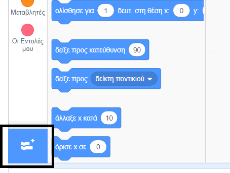
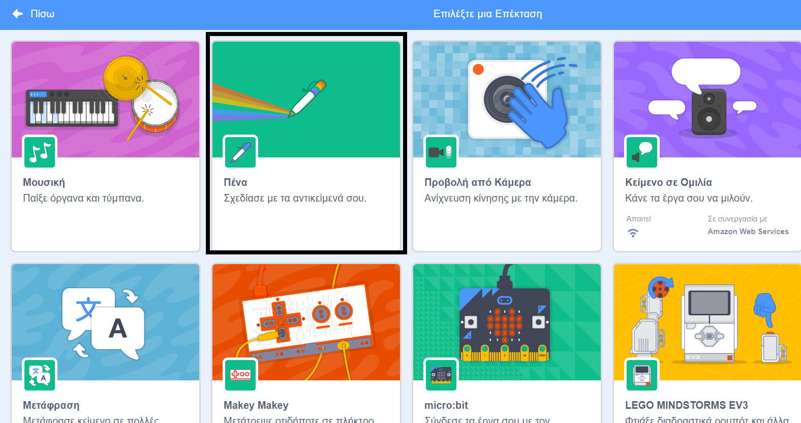
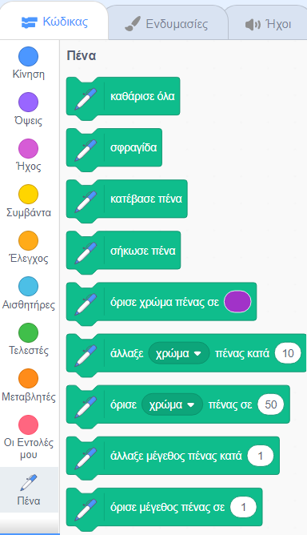

## Χρήση του εργαλείου πένας

Το έργο που πρόκειται να κάνεις βασίζεται στην **Πένα**, η οποία σχεδιάζει μια γραμμή κάτω από το κέντρο ενός αντικειμένου καθώς αυτό κινείται. Θα μάθεις να τη χρησιμοποιείς τώρα!

--- task ---

Άνοιξε ένα νέο αρχείο Scratch, επίλεξε το αντικείμενο της γάτας Scratch και σύρε μερικά μπλοκ που ίσως έχεις ήδη δει, μέχρι να μοιάζει με αυτό:

```blocks3
    when green flag clicked
    go to x: (0) y: (0)
    move (50) steps
    turn cw (15) degrees
```

--- /task ---

Είναι ώρα να δοκιμάσεις την πένα!

Για να χρησιμοποιήσεις τα μπλοκ Πένας στο Scratch, πρέπει να προσθέσεις την επέκταση **"Πένα"**.

--- task ---

Κάνε κλικ στην **Προσθήκη επέκτασης** στην κάτω αριστερή γωνία.



Κάνε κλικ στην επέκταση **"Πένα"** για να την προσθέσεις.



Στη συνέχεια, η ενότητα "Πένα" εμφανίζεται στο κάτω μέρος του μενού των μπλοκ.



Από το μενού **Πένα**, επίλεξε το μπλοκ `κατέβασε πένα`{:class="block3extensions"} και πρόσθεσε το στην αρχή του προγράμματος σου, όπως αυτό:

```blocks3
    when green flag clicked
+    pen down
    go to x: (0) y: (0)
```

--- /task ---

--- task ---

Τώρα κάνε κλικ στην πράσινη σημαία μερικές φορές και δες τι συμβαίνει.

--- /task ---

Εάν μπορείς να δεις τις γραμμές πίσω από το αντικείμενο γάτα, τότε η πένα λειτουργεί και μπορείς να αρχίσεις να σχεδιάζεις πραγματικά εντυπωσιακά σχέδια ή μοτίβα.

Πρώτον, πρέπει να απαλλαγείς από το αντικείμενο. Παρεμποδίζει τη σχεδίαση!

--- task ---

Πρόσθεσε ένα μπλοκ `εξαφανίσου`{:class="block3looks"} από τις **Όψεις** στην αρχή του προγράμματος και θα εξαφανιστεί.

```blocks3
    when green flag clicked
+    hide
    pen down
```

--- /task ---

Τώρα, μπορείς να αλλάξεις το χρώμα της πένας με ένα άλλο μπλοκ από το μενού **Πένα**, αλλά το μπλοκ είναι λίγο διαφορετικό από τα άλλα που έχεις δει. Είναι το μπλοκ `όρισε χρώμα πένας σε`{:class="block3extensions"} και μοιάζει με αυτό:

```blocks3
    set pen color to [#4a6cd4]
```

--- task ---

Σύρε ένα μπλοκ `όρισε χρώμα πένας σε`{:class="block3extensions"} στον πίνακα αντικειμένων σου και βάλε το πάνω από το μπλοκ `κατέβασε πένα`{:class="block3extensions"}.

```blocks3
    when green flag clicked
    hide
+    set pen color to [#4a6cd4]
    pen down
```

Τώρα, κάνε κλικ στο κουτί χρώματος (στον παραπάνω κώδικα είναι το μπλε) και επίλεξε ένα χρώμα.

--- /task ---

Εάν κάνεις κλικ στην πράσινη σημαία για να δοκιμάσεις το πρόγραμμά σου, θα παρατηρήσεις ότι τα σχέδια που δημιουργεί η πένα δεν εξαφανίζονται.

--- task ---

Πρόσθεσε ένα μπλοκ `καθάρισε`{:class="block3extensions"} από το μενού **Πένα** στην αρχή του κώδικά σου για να το φροντίσεις:

```blocks3
    when green flag clicked
+    clear
    hide
```

--- /task ---