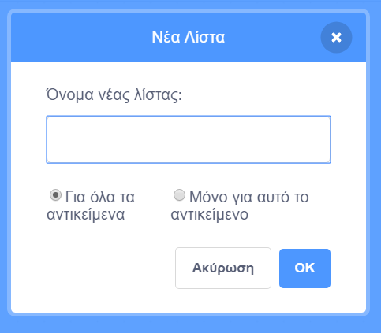
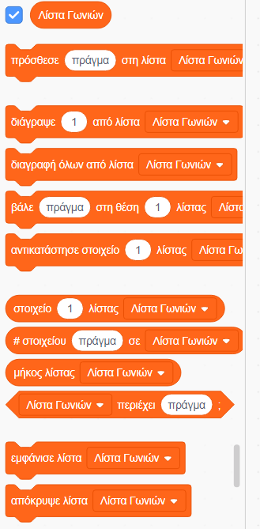
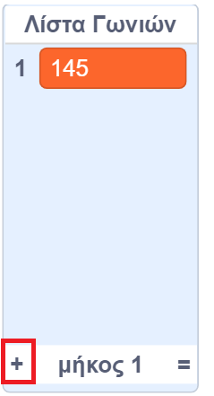

## Βοηθώντας τον υπολογιστή

Θυμάσαι μερικά βήματα πιο πριν, που σου είπα να καταγράψεις μερικές από τις αγαπημένες σου τιμές για την `αύξηση`{:class="block3variables"} και τις `μοίρες`{:class="block3variables"}, αυτές που σου έφτιαξαν τα καλύτερα μοτίβα; Εάν δεν το έκανες, μην ανησυχείς: μπορείς τώρα να παρακολουθήσεις το τυχαίο πρόγραμμα που εκτελείται για λίγο και να γράψεις τους συνδυασμούς που δίνουν εξαιρετικά αποτελέσματα.

Πρόκειται να παρέχεις στο Scratch αυτούς τους συνδυασμούς τιμών, ώστε να μπορεί να τους χρησιμοποιεί για να κάνει τις φοβερές αυτές εικόνες!

Για να το κάνεις αυτό, θα χρειαστείς μια **λίστα**. Θα βρεις λίστες με τις μεταβλητές στις **Μεταβλητές**. Όπως έκανες με τις μεταβλητές σας, έτσι θα πρέπει πρώτα να δημιουργήσεις τη λίστα σου!

--- task ---

Κάνε κλικ στο **Δημιουργία Λίστας** και ονόμασε τη λίστα σου `Λίστα Γωνιών`{:class="block3variables"}.



--- /task ---

Η λίστα σου, η οποία είναι κενή αυτή τη στιγμή, θα εμφανιστεί στη σκηνή και θα δεις πολλά μπλοκ για αυτήν στις **Μεταβλητές**.



--- task ---

Δημιούργησε μια άλλη λίστα με την ονομασία `Λίστα Αύξησης`{:class="block3variables"}

--- /task ---

--- task ---

Τώρα, κάνοντας κλικ στο σύμβολο «συν» (**+**) στο κάτω μέρος των λιστών, πρόσθεσε το πρώτο ζεύγος τιμών `αύξηση`{:class="block3variables"} και `μοίρες`{:class="block3variables"} που σου άρεσε, κάθε τιμή στην αντίστοιχη λίστα. Κάνε το ίδιο ξανά για να προσθέσεις το δεύτερο ζεύγος τιμών. Αυτό είναι αρκετό για την ώρα - θα προσθέσεις τα υπόλοιπα ζεύγη τιμών που σου αρέσουν αργότερα!



Βεβαιώσου ότι οι τιμές για τις `μοίρες`{:class="block3variables"} και την `αύξηση`{:class="block3variables"} που λειτούργησαν καλά είναι στην ίδια θέση στις λίστες `Λίστα Γωνιών`{:class="block3variables"} και `Λίστα Αύξησης`{:class="block3variables"}. Πρέπει να είναι εκεί, ώστε το πρόγραμμά σου να τα ταιριάζει πάλι χρησιμοποιώντας τη θέση τους!

--- /task ---

Τώρα έχεις τις λίστες, απλώς πρέπει να κάνεις τον κώδικα να τις διαβάζει και να τις επαναλαμβάνει! Για να το κάνεις αυτό, θα χρησιμοποιήσεις μια νέα μεταβλητή που θα λειτουργεί ως μετρητής με **προσαύξηση** και ένα μπλοκ `εάν τότε`{:class="block3control"} από τον **Έλεγχο**.

--- collapse ---
---
title: Τι σημαίνει προσαύξηση;
---

Το να προσαυξάνεις κάτι σημαίνει να προσθέτεις κάτι σε αυτό.

Θα χρησιμοποιήσεις μια μεταβλητή για να λειτουργεί ως μετρητής και να κρατάει την τρέχουσα θέση στις λίστες σου. Για να μετακινηθείς στις λίστες, θα συνεχίσεις να προσαυξάνεις τον μετρητή κατά `1` (δηλαδή προσθέτοντας `1` σε αυτόν) μέχρι να φτάσεις στο τέλος της λίστας.

--- /collapse ---

--- task ---

Δημιούργησε μια νέα μεταβλητή με όνομα `μετρητής`{:class="block3variables"} και ενημέρωσε το πρόγραμμα έτσι ώστε να έχει την εξής μορφή:

```blocks3
    when green flag clicked
    set [μετρητής v] to [0]
    forever 
+        if <(μετρητής) = (length of [Λίστα αυξήσεων v] :: list)> then 
+            set [μετρητής v] to [0]
        end
+        change [μετρητής v] by (1)
        set [βήματα v] to [0]
+        set [αύξηση v] to (item (μετρητής) of [Λίστα αυξήσεων v] :: list)
+        set [μοίρες v] to (item (μετρητής) of [Λίστα αυξήσεων v] :: list)
        pen up
        hide
        clear
        go to x: (0) y: (0)
        set pen color to [#4a6cd4]
        pen down
        repeat until <touching [edge v] ?> 
            move (βήματα) steps
            turn cw (μοίρες) degrees
            change [βήματα v] by (αύξηση)
        end
    end
```

--- /task ---

Παρατήρησε τα νέα μπλοκ που:

1. Όρισε τον `μετρητή`{:class="block3variables"} σε `0`, έξω από όλους τους βρόχους.
2. Έλεγξε εάν ο αριθμός που είναι αποθηκευμένος στον `μετρητή`{:class="block3variables"} είναι ίσος με το μέγεθος της λίστας και, εάν ναι, όρισε τον `μετρητή`{:class="block3variables"} σε `0`. Αυτό σημαίνει ότι αυτή η μεταβλητή θα είναι πάντα ο αριθμός μιας θέσης στις λίστες και δεν θα γίνει μεγαλύτερος από αυτήν.
3. Πρόσθεσε `1` στο `μετρητή`{:class="block3variables"}.
4. Επέλεξε το στοιχείο από τη `Λίστα Αύξησης`{:class="block3variables"} που βρίσκεται στη θέση που περιγράφεται από τον `μετρητή`{:class="block3variables"} και τοποθέτησέ το στη μεταβλητή `αύξηση`{:class="block3variables"}. Κάνε το ίδιο για τη `Λίστα Γωνιών`{:class="block3variables"} και τη μεταβλητή `μοίρες`{:class="block3variables"}.

--- collapse ---
---
title: Πώς λειτουργεί ο κώδικας;
---

Αυτά συμβαίνουν όταν εκτελείς το πρόγραμμά σου:

1. Όρισε το `μετρητή`{:class="block3variables"} σε `0`.
2. Ξεκίνησε το βρόχο `για πάντα`{:class="block3control"}.
3. Έλεγξε εάν ο `μετρητής`{:class="block3variables"} (`0`) είναι ίδιος με το μήκος της `Λίστας Αύξησης`{:class="block3variables"} (`2`). Δεν είναι.
4. Άλλαξε το `μετρητή`{:class="block3variables"} κατά `1`. Τ'ώρα ο `μετρητής`{:class="block3variables"} = `1`.
5. Όρισε τα `βήματα`{:class="block3variables"} σε `0`.
6. Πάρε το στοιχείο από τη θέση που δείχνει ο `μετρητής`{:class="block3variables"} (`1`) στη `Λίστα Αύξησης`{:class="block3variables"} και βάλε το στην `αύξηση`{:class="block3variables"}.
7. Πάρε το στοιχείο από τη θέση του `μετρητή`{:class="block3variables"} (`1`) στη `Λίστα Γωνιών`{:class="block3variables"}, και βάλε το στις `μοίρες`{:class="block3variables"}.
8. Εκτέλεσε όλες τις εντολές που σχετίζονται με τη σχεδίαση των μοτίβων.
9. Επανεκκίνησε το βρόχο `για πάντα`{:class="block3control"}:
10. Έλεγξε εάν ο `μετρητής`{:class="block3variables"} (`1`) είναι ίδιος με το μέγεθος της `Λίστας Αύξησης`{:class="block3variables"} (`2`). Δεν είναι.
11. Άλλαξε το `μετρητή`{:class="block3variables"} κατά `1`. Τώρα ο `μετρητής`{:class="block3variables"} = `2`.
12. Θέσε τα `βήματα`{:class="block3variables"} σε `0`.
13. Πάρε το στοιχείο από τη θέση που δείχνει ο `μετρητής`{:class="block3variables"} (`2`) στη `Λίστα Αύξησης`{:class="block3variables"}, και τοποθέτησέ το στην `αύξηση`{:class="block3variables"}.
14. Πάρε το στοιχείο από τη θέση που δείχνει ο `μετρητής`{:class="block3variables"} (`2`) στη `Λίστα Γωνιών`{:class="block3variables"}, και βάλε το στις `μοίρες`{:class="block3variables"}.
15. Εκτέλεσε όλες τις εντολές που σχετίζονται με τη σχεδίαση των μοτίβων.
16. Επανεκκίνησε το βρόχο `για πάντα`{:class="block3control"}:
17. Έλεγξε εάν ο `μετρητής`{:class="block3variables"} (`2`) είναι ίδιος με το μήκος της `Λίστας Αύξησης`{:class="block3variables"} (`2`). Είναι!
18. Όρισε το `μετρητή`{:class="block3variables"} σε `0`.
19. Συνέχισε από το **βήμα 4** αυτής της λίστας, σε έναν ατελείωτο βρόχο!

--- /collapse ---

--- task ---

Όταν είσαι ικανοποιημένος με τον κώδικα, προχώρησε και πρόσθεσε τα υπόλοιπα ζεύγη τιμών που σημείωσες στη `Λίστα Γωνιών`{:class="block3variables"} και στη `Λίστα Αύξησης`{:class="block3variables"}.

--- /task ---

Αυτό είναι! Κάθισε και παρακολούθησε το πρόγραμμά σου να σχεδιάζει υπέροχα μοτίβα σε έναν ατελείωτο βρόχο! Εάν θέλεις να προσθέσεις περισσότερα μοτίβα, μπορείς: απλώς πρόσθεσε περισσότερα ζεύγη αριθμών στις δύο λίστες και εκτέλεσε ξανά το πρόγραμμα.


***
Το έργο αυτό μεταφράστηκε από τους εθελοντές:

Αλέξανδρος Ρονιώτης (Σύλλογος ΨηφίΔα)

Ευστάθιος Ιωσηφίδης

Χάρη στους εθελοντές, μπορούμε να δώσουμε σε ανθρώπους σε όλο τον κόσμο την ευκαιρία να μάθουν στη γλώσσα τους. Μπορείτε να μας βοηθήσετε να προσεγγίσουμε περισσότερους ανθρώπους μεταφράζοντας εθελοντικά - περισσότερες πληροφορίες στο [rpf.io/translate](https://rpf.io/translate).