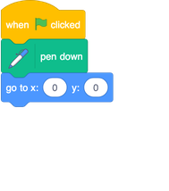
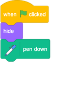
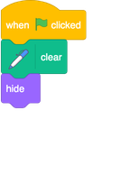

## Using the Pen tool

The project you're going to make relies on the **Pen** tool. These blocks draw a line behind the centre of a sprite as it moves. You’re going to learn to use it now!

+ Open a new Scratch file, select the Scratch Cat sprite, and drag in a few of the blocks you’re familiar with from the Beginner Sushi Cards, until it looks like this: 

Now, time to test out the pen!

To use the Pen blocks in Scratch, you need add the **Pen extension**.

+ Click on the **Add extension** button in the bottom left-hand corner.

+ Click on the **Pen** extension to add it.

+ The Pen section then appears at the bottom of the blocks menu.

+ From the **Pen** section, select the `pen down`{:class="block3extensions"} block and add it to the start of your program, like this: 

+ Now click the green flag a few times and watch what happens.

If you can see the lines behind the cat sprite, then the pen is working and you can start making it draw really cool patterns.

+ First, you should get rid of the sprite. It’s getting in the way of the drawing! Just add a `hide`{:class="block3looks"} block from **Looks** to the start of the program and it’ll disappear. 

Now, you can change the colour of the pen with another block from the **Pen** section, but the block is a little different to the others you’ve seen. It’s the `set pen color to `{:class="block3extensions"} block and looks like this: 

+ Drag one into your sprite panel, and snap it in above of the `pen down`{:class="block3extensions"} block. 

+ Now, click on the box of colour (in the code above it’s the blue one), and choose a colour.

If you’ve been clicking on the green flag to test your code, you’ll have noticed that the drawings the pen makes don’t go away. 

+ Add a `clear`{:class="block3extensions"} block from the **Pen** section to the start of your code to take care of that:

