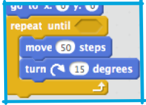
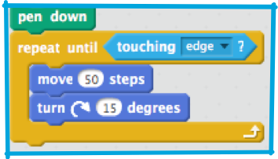
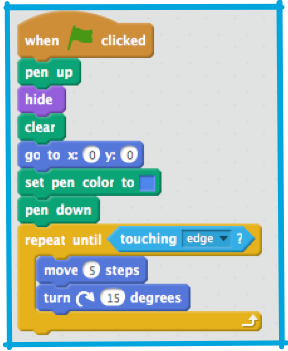
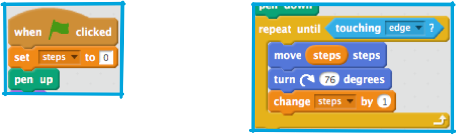

## Drawing loops

Now you’ve got a program that draws a line, but it only draws one line. That’s a bit dull! You can use a loop, like `"forever"`, to draw over and over again. Of course, if you just use `"forever"` then you’ll get drawings that go off the stage!

+ So you want to use a different loop, which you’ll also find in the **control** section, called `"repeat until"` which will do something over and over again, until a true/false condition becomes true. Wrap it around your `"move"` and `"turn"` blocks like so: 

+ Now click the green flag to run the program a few times and see what happens! You’ll notice two things: It always starts by drawing a line into the middle of the **stage** and it doesn’t stop at the edge .

The first is because the first **motion** block that runs after the `"pen down"` is `"go to x: 0 y: 0"`. You can fix this just by moving the `"go to x: 0 y: 0"` block before the `"pen down"` block and adding, from **pen**, a `"pen up"` block right at the start of your code.

The second is because you haven’t yet told it what it’s checking, so the answer will never be true. Basically, right now, it’s working like a `"forever"` loop.

+ Time to fix your `"repeat until"`. You’re looking to figure out if the (invisible) sprite is touching the edge of the **stage**, so you need a **sensing** block. In this case, the `"touching ?"` block. Snap it into your `"repeat until"` and select `"edge"`. 

+ Change the number of steps in your program to 5 and check that it matches this one: 

When you run the program now you’ll see that it has turned into a circle drawing program! At least it stays on the **stage**! The problem here is that those 15 degree turns eventually add up to 360 and you turn a full circle. What needs to happen is that you take slightly longer steps each time, so you spiral out. For this, you’re going to need a **variable**.

You’ve seen **variables** before, in the Beginner series. They're basically labeled places to store numbers that you care about. You can create them in the **data** blocks category and then find their associated blocks there too.

+ Make a **variable** called `steps` and use its value instead of the `5` in `"move 5 steps"`, then add `"set steps to 0"` at the start of your program and `"change steps by 1"` as part of your loop (does it matter where you put it?). 

+ Now run it, and try changing the number of degrees around (try `76` and `120`)!

