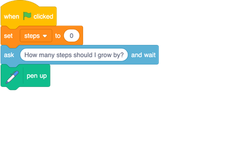
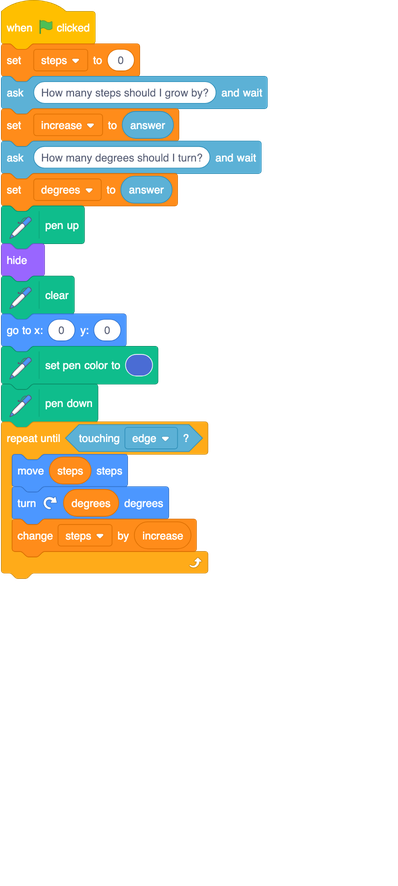

## Asking for input

Ok, this is getting pretty cool, but it’s a bit boring to have to edit your code every time you want to draw a different pattern. Wouldn’t it be good to get the program to ask you for values to use? You can do that!

+ First, go to the **Variables** section and create variables called `degrees`{:class="block3variables"} and `increase`{:class="block3variables"}.

+ Now add the new variables to your code like this: 

Now you need to ask for values for these two variables and store them. You do this using a **Sensing** block called `Ask and wait`{:class="block3sensing"}, which you can type a question into. 

+ Pull the `Ask and wait`{:class="block3sensing"} block into your sprite panel and change the question to `How many steps should I grow by?`{:class="block3sensing"}

+ Then add it to your program, just after you set `steps`{:class="block3variables"} to `0`, like this: 

Now you’ve got your program asking a question, you need it to remember the answer! It turns out that Scratch has a special variable called `answer`{:class="block3sensing"}, where it stores the most recent answer it has received. You can find this variable among the **Sensing** blocks. 

+ Using a `set to`{:class="block3variables"} block from **Variables**, take the value of `answer`{:class="block3sensing"} and store it in the `increase`{:class="block3variables"} variable like so: 

+ Now, do the same thing with `degrees`{:class="block3variables"}, asking `How many degrees should I turn?`{:class="block3sensing"} and storing the value of `answer`{:class="block3sensing"} in `degrees`{:class="block3variables"}: 

+ Check your program now looks like the one below, and run it a few times with different numbers. Write down the answers that make the coolest pictures. You’ll need them on a later card! 

