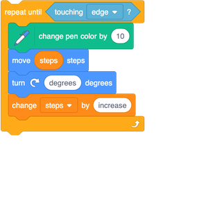
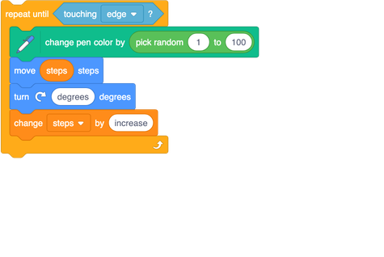

## Cooler lines

Time to add colour! Right now, your line is one colour, but the **Pen** has blocks that can change its colour. And with the right **Operator** block, you can even change the colour randomly!

The block for changing the **Pen** colour is `change pen color by `{:class="block3extensions"}: 

+ Grab one of those and put it into your `repeat until`{:class="block3control"} loop, like this: 

That’s cool, but a bit predictable. You can make it a bit more fun if you add a random number into it, so the colour changes randomly. 

+ Just put the random number **Operator** block into the `change pen color by `{:class="block3extensions"} block and pick some values to go in it. I'd try `1` and `100` to start. 

+ Try running it again, and watch the random rainbow!
