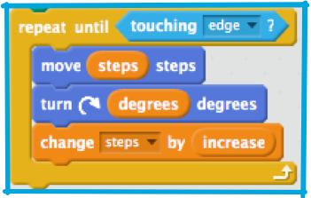
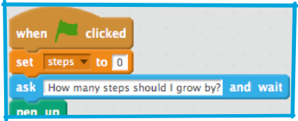
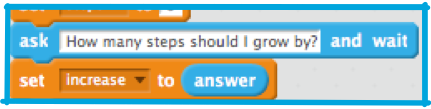
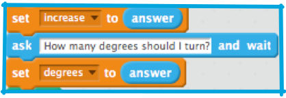
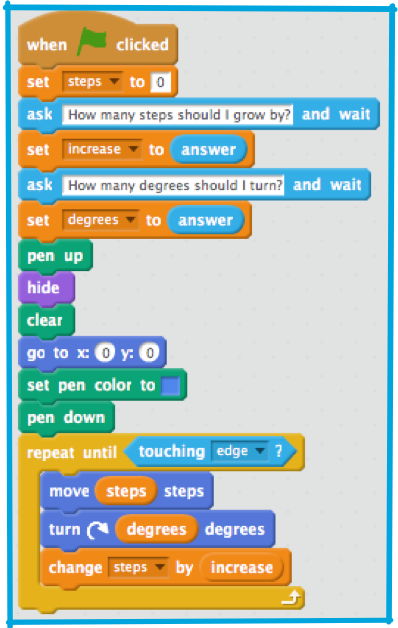

## Asking for input

Ok, this is getting pretty cool, but it’s a bit of a headache to have to edit your code every time you want to see a different pattern. Wouldn’t it be good to get the program to ask you for them? You can do that!

+ First, create **variables** in **data** for `degrees` and `increase` and add them to your code like this: 

+ Now you need to ask for values for these two **variables** and store them. You do this using a sensing block called `"Ask and wait"`, which you can type a question into. Pull one into your **sprite panel** and change the ques;on to `How many steps should I grow by?`, then add it to your program, just after you set steps to 0, like this: 

Once you’ve got Scratch asking a question, you need it to remember the answer! It turns out that Scratch has a special **variable**, called `"answer"`, where it puts the most recent answer it’s received. You can find it among the **sensing** blocks. 

+ Using a **data** `"set to "` block, take the value from `answer` and give it to `increase` like so: 

+ Now, do the same thing with `degrees`, asking `How many degrees should I turn?` and storing the `answer` in `degrees`. 

+ Check your program now looks like the one below and run it a few times, trying different numbers. Write down the answers that make the coolest pictures. You’ll need them on a later card! 

