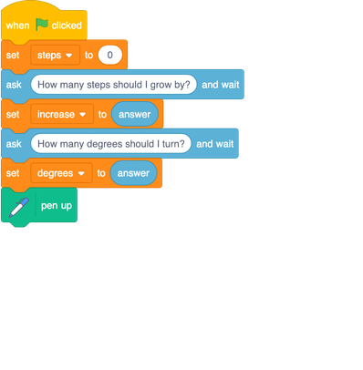
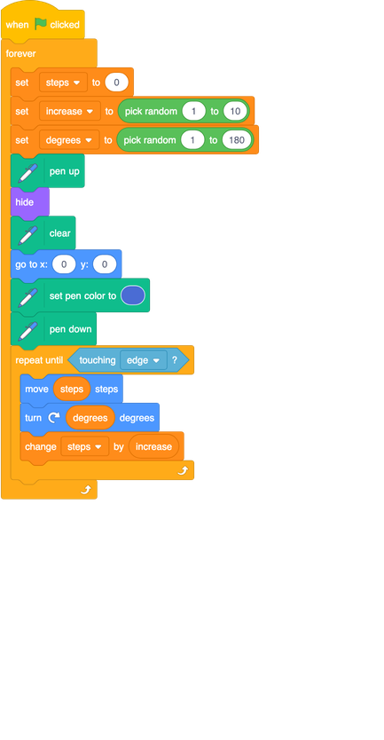

## Randomise the whole thing

You can actually use random numbers to make the whole program run over and over, changing the pattern each time! It'll look a bit like screen savers did in the 1990s...which you won't remember, but ask one of your Dojo mentors!

You need a few changes to make this happen. The first one is that you need to set the `increase`{:class="block3variables"} and `degrees`{:class="block3variables"} variables randomly rather than asking for them from the user. So you need to change some of your code blocks. 

+ Find this bit:

+ Change it to:

+ If you run your program now, you’ll find that it does draw a random pattern, but only once. Why do you think that is?

It’s because the loop only runs until it reaches the edge of the Stage. 

+ You need another loop that runs forever (so a `forever`{:class="block3control"} block then!) outside the current one to keep it going over and over! Just drag one out of the **Control** section, and add all your other code into it. 

Now you’ve really got something awesome to look at!

However, you may notice that, every now and then, the computer draws something that looks pretty...bad. This is because some numbers for some of those variables are just bad choices, and some **combinations of those numbers** are also bad choices.

On the next card, you'll help the computer to pick only good combinations!
