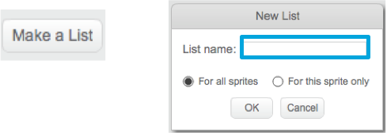
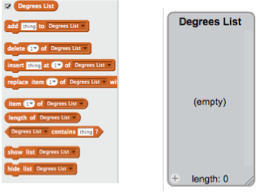

## Helping the computer

Now you’ve really got something awesome to look at! However, you may notice that, every now and then, the computer draws something that looks pretty... bad. This is because some numbers for some of those variables are just bad choices, and some **combinations of those numbers** are also bad choices.

Do you remember a few cards back when I told you to write down some of your favourite values for `increase`{:class="blockdata"} and `degrees`{:class="blockdata"}, the ones that gave the best looking pictures? If not, don’t worry, you can just watch the random program run for a while and write down the combinations that give great results.

You’re going to teach Scratch those combinations of values, so it can use them to make nothing but awesome pictures!

To do this, you’ll need a **list**. You’ll find them with **variables**, under **data**. Just like you did with the variables, you’ll need to create your list. 

+ Click **Make a List**



+ Enter `Degrees List` as the name




+ Make another one called `Increase List` and then, by clicking on the little plus (**+**) at the bottom of the lists, type in the pairs of numbers. 


+ Make sure that the degrees value at a position in the `Degrees List` matches the `increase` value at the same number position in the `Increase List`!

You have lists, now you just need to get your code to read them and loop over them! To do this, you’re going to use a new **variable** called "counter", some incrementing and an `if then`{:class="blockcontrol"} **control** block. 

+ Just update your code to look like this one and you’ll get it:
 
```blocks
    when green flag clicked
    set [counter v] to [0]
    forever 
        if <(counter) = (length of [Increase List v] :: list)> then 
            set [counter v] to [0]
        end
        change [counter v] by (1)
        set [steps v] to [0]
        set [increase v] to (item (counter) of [Increase List v] :: list)
        set [degrees v] to (item (counter) of [Degrees List v] :: list)
        pen up
        hide
        clear
        go to x: (0) y: (0)
        set pen color to [#4a6cd4]
        pen down
        repeat until <touching [edge v] ?> 
            move (steps) steps
            turn cw (degrees) degrees
            change [steps v] by (increase)
        end
    end
```

+ Notice the new blocks which:
 1. Set `counter` to `0`, outside all the loops
 2. Check if `counter` is the length of the list. If so, set it to 0. This means that counter will always be the number of an item on the list.
 3. Add `1` to `counter`
 4. Pick the `counter`-th item from `Increase List` and put it in the `increase` variable. Do the same for the `Degrees List` and `degrees` variable.

#### If you want to understand what's going on

Imagine your lists only have two pairs of values on them. This is what happens:
1. Set counter to 0
2. Start the forever loop
3. Check if counter (0) is the same as the length of Increase List (2). It isn’t
4. Change counter by 1. Now counter = 1
5. Set steps to 0
6. Get the get the item at position counter (1) in the Increase List and put it in increase 
7. Get the get the item at position counter (1) in the Degrees List and put it in degrees 
8. Do all the stuff related to drawing the patterns
9. Restart the forever loop
10. Check if counter (1) is the same as the length of Increase List (2). It isn’t
11. Change counter by 2. Now counter = 2
12. Set steps to 0
13. Get the get the item at position counter (2) in the Increase List and put it in increase 
14. Get the get the item at position counter (2) in the Degrees List and put it in degrees 
15. Do all the stuff related to drawing the patterns
16. Restart the forever loop
17. Check if counter (2) is the same as the length of the Increase List (2). It is!
18. Set counter to 0
19. Continue from **step 4** of this list, in a never-ending loop!


