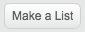
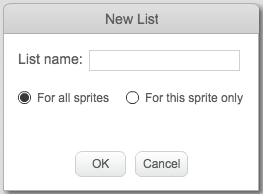
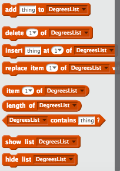
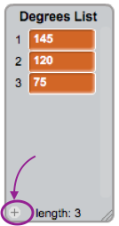

## Helping the computer

Do you remember a few cards back, where I told you to write down some of your favourite values for `increase`{:class="blockdata"} and `degrees`{:class="blockdata"}, the ones that gave the best-looking patterns? If you didn't to this, don’t worry: you can just watch the random program run for a while now and write down the combinations that give great results.

You’re going to teach Scratch those combinations of values, so it can use them to make nothing but awesome pictures!

To do this, you’ll need a **list**. You’ll find lists with the variables in the **Data** section. Just like you did with your variables, you’ll need to create your list first! 

+ Click **Make a List**, and enter `Degrees List` as the name.

 

Your list, which is empty at the moment, will appear on the Stage, and you'll see a bunch of blocks for it in **Data**.



+ Make another list called `Increase List`!

+ Now, by clicking on the little plus sign (**+**) at the bottom of the lists, add in the first pair of values of `increase`{:class="blockdata"} and `degrees`{:class="blockdata"} you liked, each value into the right list. Do this again to add the second pair of values. This will be enough for now — you'll add the rest of the value pairs you like later!



+ Make sure that the `degrees`{:class="blockdata"} value and the `increase`{:class="blockdata"} value that worked well together are at the same position in the `Degrees List`{:class="blockdata"} and the `Increase List`{:class="blockdata"}. They need to be there so your program can match them up again using their position!

You now have the lists, and you just need to get your code to read them and loop over them! To do this, you’re going to use a new variable to act as a counter, some **incrementing**, and an `if then`{:class="blockcontrol"} **Control** block. 

--- collapse ---
---
title: What does incrementing mean?
---

To increment something means to add something to it.

You will use a variable to act as a counter to keep track of what position you're at in your lists. To move through the lists, you'll keep incrementing the counter by `1` (so, adding `1` to it) until you get to the end of the list.

--- /collapse ---

+ Create a new variable called `counter`{:class="blockdata"}, and update your code to look like this:
 
```blocks
    when green flag clicked
    set [counter v] to [0]
    forever 
        if <(counter) = (length of [Increase List v] :: list)> then 
            set [counter v] to [0]
        end
        change [counter v] by (1)
        set [steps v] to [0]
        set [increase v] to (item (counter) of [Increase List v] :: list)
        set [degrees v] to (item (counter) of [Degrees List v] :: list)
        pen up
        hide
        clear
        go to x: (0) y: (0)
        set pen color to [#4a6cd4]
        pen down
        repeat until <touching [edge v] ?> 
            move (steps) steps
            turn cw (degrees) degrees
            change [steps v] by (increase)
        end
    end
```

+ Notice the new blocks that:
 1. Set `counter`{:class="blockdata"} to `0`, outside all the loops.
 2. Check if the number stored in `counter`{:class="blockdata"} is the length of the list, and if so, set `counter`{:class="blockdata"} to `0`. This means that this variable will always be the number of a position in the lists, and won't get any bigger than that.
 3. Add `1` to `counter`{:class="blockdata"}.
 4. Pick the item from `Increase List`{:class="blockdata"} that is at the position described by `counter`{:class="blockdata"}, and put it in the `increase`{:class="blockdata"} variable. Do the same for the `Degrees List`{:class="blockdata"} and `degrees`{:class="blockdata"} variable.

--- collapse ---
---
title: How does the code work?
---

This is what happens when you run your program:

1. Set `counter`{:class="blockdata"} to `0`.
2. Start the `forever`{:class="blockcontrol"} loop.
3. Check if `counter`{:class="blockdata"} (`0`) is the same as the length of `Increase List`{:class="blockdata"} (`2`). It isn’t.
4. Change `counter`{:class="blockdata"} by `1`. Now `counter`{:class="blockdata"} = `1`.
5. Set `steps`{:class="blockdata"} to `0`.
6. Get the item at the position named by `counter`{:class="blockdata"} (`1`) in the `Increase List`{:class="blockdata"}, and put it in `increase`{:class="blockdata"}.
7. Get the item at the position named by `counter`{:class="blockdata"} (`1`) in the `Degrees List`{:class="blockdata"}, and put it in `degrees`{:class="blockdata"}.
8. Do all the stuff related to drawing the patterns.
9. Restart the `forever`{:class="blockcontrol"} loop:
10. Check if `counter`{:class="blockdata"} (`1`) is the same as the length of `Increase List`{:class="blockdata"} (`2`). It isn’t.
11. Change `counter`{:class="blockdata"} by `1`. Now `counter`{:class="blockdata"} = `2`.
12. Set `steps`{:class="blockdata"} to `0`.
13. Get the item at the position named by `counter`{:class="blockdata"} (`2`) in the `Increase List`{:class="blockdata"}, and put it in `increase`{:class="blockdata"}.
14. Get the item at the position named by `counter`{:class="blockdata"} (`2`) in the `Degrees List`{:class="blockdata"}, and put it in `degrees`{:class="blockdata"}.
15. Do all the stuff related to drawing the patterns.
16. Restart the `forever`{:class="blockcontrol"} loop:
17. Check if `counter`{:class="blockdata"} (`2`) is the same as the length of the `Increase List`{:class="blockdata"} (`2`). It is!
18. Set `counter`{:class="blockdata"} to `0`.
19. Continue from **step 4** of this list, in a never-ending loop!

--- /collapse ---

+ Once you're happy with the code, go ahead and add the rest of the pairs of values you noted down to the `Degrees List`{:class="blockdata"} and the `Increase List`{:class="blockdata"}. 

And that's it! Sit back and watch your program keep drawing lovely patterns in a never-ending loop! And if you want to add more patterns, you can: just add more pairs of numbers to the two lists and restart the program.
