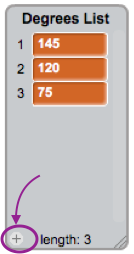

## Helping the computer

Do you remember a few cards back when I told you to write down some of your favourite values for `increase`{:class="blockdata"} and `degrees`{:class="blockdata"}, the ones that gave the best looking pictures? If not, don’t worry, you can just watch the random program run for a while and write down the combinations that give great results.

You’re going to teach Scratch those combinations of values, so it can use them to make nothing but awesome pictures!

To do this, you’ll need a **list**. You’ll find them with **variables**, under **data**. Just like you did with the variables, you’ll need to create your list. 

+ Click **Make a List** and enter `Degrees List` as the name.

 

Your list, which is empty at the moment, will appear on the stage, and you'll see a bunch of blocks for it in **data**.


+ Make another one called `Increase List` and then, by clicking on the little plus (**+**) at the bottom of the lists, type in the pairs of numbers. 



+ Make sure that the degrees value at a position in the `Degrees List` matches the `increase` value at the same number position in the `Increase List`.


You have lists, now you just need to get your code to read them and loop over them! To do this, you’re going to use a new **variable** to act as a counter, some incrementing and an `if then`{:class="blockcontrol"} **control** block. 

--- collapse ---
---
title: What does incrementing mean?
---

To **increment** something means to add something to it.

You will use a variable to act as a counter to keep track of what position you're at in the lists, and you'll keep **incrementing** the counter by `1` (so, adding `1` to it) until you get to the end of the list.

--- /collapse ---

+ Create a new **variable** called `counter`{:class="blockdata"} and update your code to look like this:
 
```blocks
    when green flag clicked
    set [counter v] to [0]
    forever 
        if <(counter) = (length of [Increase List v] :: list)> then 
            set [counter v] to [0]
        end
        change [counter v] by (1)
        set [steps v] to [0]
        set [increase v] to (item (counter) of [Increase List v] :: list)
        set [degrees v] to (item (counter) of [Degrees List v] :: list)
        pen up
        hide
        clear
        go to x: (0) y: (0)
        set pen color to [#4a6cd4]
        pen down
        repeat until <touching [edge v] ?> 
            move (steps) steps
            turn cw (degrees) degrees
            change [steps v] by (increase)
        end
    end
```

+ Notice the new blocks which:
 1. Set `counter`{:class="blockdata"} to `0`, outside all the loops
 2. Check if `counter`{:class="blockdata"} is the length of the list. If so, set it to `0`. This means that counter will always be the number of an item on the list.
 3. Add `1` to `counter`{:class="blockdata"}
 4. Pick the `counter`{:class="blockdata"}-th item from `Increase List`{:class="blockdata"} and put it in the `increase`{:class="blockdata"} variable. Do the same for the `Degrees List`{:class="blockdata"} and `degrees`{:class="blockdata"} variable.

--- collapse ---
---
title: How does the code work?
---

Imagine your lists only have two pairs of values on them. This is what happens:

1. Set `counter`{:class="blockdata"} to `0`.
2. Start the `forever`{:class="blockcontrol"} loop.
3. Check if `counter`{:class="blockdata"} (0) is the same as the length of `Increase List`{:class="blockdata"} (2). It isn’t.
4. Change `counter`{:class="blockdata"} by `1`. Now `counter`{:class="blockdata"} = `1`.
5. Set `steps`{:class="blockdata"} to `0`.
6. Get the get the item at position counter (1) in the `Increase List`{:class="blockdata"} and put it in `increase`{:class="blockdata"} .
7. Get the get the item at position `counter`{:class="blockdata"} (1) in the `Degrees List`{:class="blockdata"} and put it in `degrees`{:class="blockdata"}.
8. Do all the stuff related to drawing the patterns.
9. Restart the `forever`{:class="blockcontrol"} loop.
10. Check if `counter`{:class="blockdata"} (1) is the same as the length of `Increase List`{:class="blockdata"} (2). It isn’t.
11. Change `counter`{:class="blockdata"} by 2. Now `counter`{:class="blockdata"} = `2`.
12. Set `steps`{:class="blockdata"} to `0`.
13. Get the get the item at position counter (2) in the Increase List and put it in `increase`{:class="blockdata"}. 
14. Get the get the item at position `counter`{:class="blockdata"} (2) in the `Degrees List`{:class="blockdata"} and put it in `degrees`{:class="blockdata"} 
15. Do all the stuff related to drawing the patterns.
16. Restart the `forever`{:class="blockcontrol"} loop.
17. Check if `counter`{:class="blockdata"} (2) is the same as the length of the `Increase List`{:class="blockdata"} (2). It is!
18. Set `counter`{:class="blockdata"} to `0`.
19. Continue from **step 4** of this list, in a never-ending loop!

--- /collapse ---

And that's it! Sit back and watch your program keep drawing lovely patterns in a neverending loop! If you want to add more patterns, you can: just add more pairs of numbers to the two lists and restart the program.
