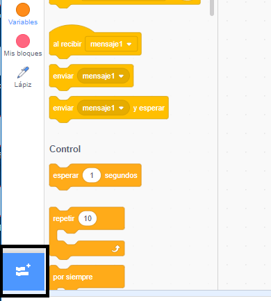
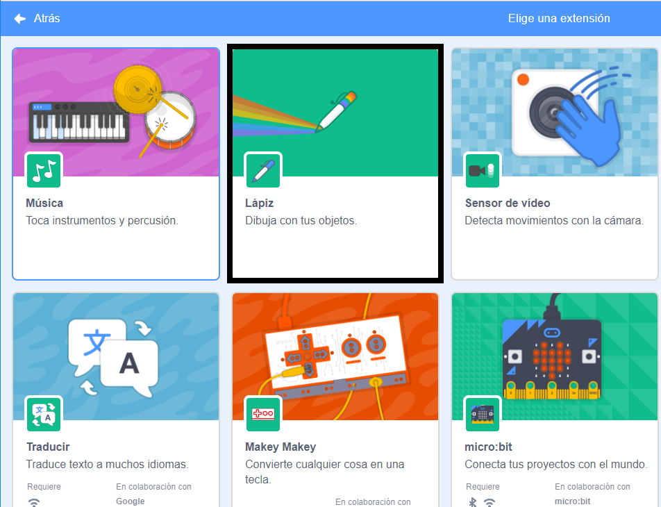
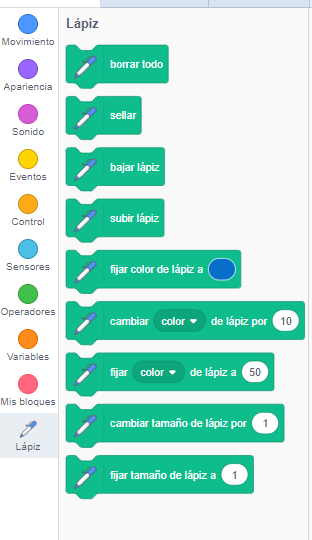

## Cómo utilizar la herramienta Lápiz

El proyecto que vas a realizar se basa en la herramienta **Lápiz**, que dibuja una línea detrás del centro de un objeto a medida que se mueve. ¡Aprenderás a usarla ahora!

\--- task \---

Crea un archivo nuevo en Scratch, selecciona el gato Scratch (nota: el gato anaranjado u Objeto1) y arrastra dentro algunos bloques que posiblemente ya hayas visto, hasta que se vea así:

```blocks3
    when green flag clicked
    go to x: (0) y: (0)
    move (50) steps
    turn cw (15) degrees
```

\--- /task \---

Ahora, ¡es hora de probar el lápiz!

Para usar los bloques lápiz en Scratch, necesitarás añadir la **Extensión Lápiz**.

\--- task \---

Haz click en el botón **Añadir Extensión** en la esquina inferior izquierda.



Haz click en la extensión **Lápiz** para añadirla.



La sección Lápiz aparecerá en la parte inferior del menú de bloques.



En la sección **lápiz**, selecciona el bloque `bajar lápiz`{:class="block3extensions"} y agrégalo al inicio del programa, de esta manera:

```blocks3
    when green flag clicked
+    pen down
    go to x: (0) y: (0)
```

\--- /task \---

\--- task \---

Ahora haz clic en la bandera verde unas cuantas veces y observa lo que sucede.

\--- /task \---

Si puedes ver las líneas detrás del gato, entonces el lápiz está funcionando y puedes comenzar a dibujar patrones realmente geniales.

Primero, debes deshacerte del objeto. ¡Se está interponiendo en el camino del dibujo!

\--- task \---

Agrega un bloque `esconder`{:class="block3looks"} desde **Apariencia** al inicio del programa y desaparecerá.

```blocks3
    when green flag clicked
+    hide
    pen down
```

\--- /task \---

Ahora, puedes cambiar el color del lápiz con otro bloque de la sección **Lápiz**, pero el bloque es un poco diferente a los otros que has visto. Es el bloque `fijar color de lápiz a`{:class="block3extensions"} y se ve así:

```blocks3
    set pen color to [#4a6cd4]
```

\--- task \---

Arrastra un bloque `fijar color de lápiz a `{:class="block3extensions"} a tu panel de objetos, y pégalo por encima del bloque `bajar lápiz`{:class="block3extensions"}.

```blocks3
    when green flag clicked
    hide
+    set pen color to [#4a6cd4]
    pen down
```

Ahora, haz clic en el cuadro de color (en el código de arriba es el azul) y elije un color.

\--- /task \---

Si has hecho clic en la bandera verde para probar tu código, te habrás dado cuenta de que los dibujos que hace el lápiz no desaparecen.

\--- task \---

Agrega un bloque `borrar todo`{:class="block3extensions"} de la sección **lápiz** al principio de tu código para que se encargue de eso:

```blocks3
    when green flag clicked
+    clear
    hide
```

\--- /task \---