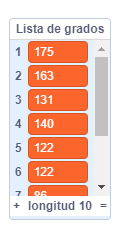

## Ayudando al ordenador

¿Recuerdas unos pasos atrás, donde te dije que escribieras algunos de tus valores favoritos para `aumento`{:class="block3variables"} y `grados`{:class="block3variables"}?, ¿los que dieron los patrones más bonitos? Si no lo hiciste, no te preocupes: puedes ver el programa al azar ejecutarse por un tiempo y escribir las combinaciones que dan los mejores resultados.

¡Le enseñarás a Scratch esas combinaciones de valores, para que pueda usarlas para hacer solamente imágenes increíbles!

Para hacer esto, necesitarás una **lista**. Encontrará listas con las variables en la sección **Variables**. ¡Al igual que hiciste con tus variables, primero deberás crear tu lista!

--- task ---

Haz clic en **Crear una lista**, e ingresa `Lista de grados`{:class="block3variables"} como el nombre.


--- /task ---

Tu lista, que está vacía por el momento, aparecerá en el escenario, y verás un montón de bloques para ella en **Variables**.


--- task ---

Crea otra lista llamada `Lista de aumentos`{:class="block3variables"}

--- /task ---

--- task ---

Ahora, haciendo clic en el pequeño signo de más (**+**) en la parte inferior de las listas, agrega el primer par de valores de `aumento`{:class="block3variables"} y `grados`{:class="block3variables"} que te gustara, cada valor en la lista que corresponde. Repite esto para añadir el segundo par de valores. Esto será suficiente por ahora, ¡agregarás el resto de pares de valor que te gusten más tarde!



Asegúrate de que el valor `grados`{:class="block3variables"} y el valor `aumento`{:class="block3variables"} que funcionaban bien juntos se encuentran en la misma posición en la `Lista de grados`{:class="block3variables"} y en la `Lista de aumentos`{:class="block3variables"}. ¡Necesitan estar ahí para que tu programa pueda emparejarlos de nuevo usando su posición!

--- /task ---

¡Ahora que tienes las listas, sólo necesitas conseguir que tu código las lea y ejecute el bucle usándolas! Para hacer esto, vas a utilizar una nueva variable que actúe como un contador, algunos **incrementos**, y un bloque `si entonces`{:class="block3control"} de **Control**.

--- collapse ---
---
title: ¿Qué significa incremento?
---

Incrementar algo significa agregarle algo.

Utilizarás una variable actuando como contador para realizar un seguimiento de la posición en la que se encuentra en tus listas. Para moverte a través de las listas, seguirás incrementando el contador por `1` (así, añadiendo `1` a él) hasta que llegues al final de la lista.

--- /collapse ---

--- task ---

Crea una nueva variable llamada `contador`{:class="block3variables"}, y actualiza tu código para que se vea así:

```blocks3
    when green flag clicked
    set [contador v] to [0]
    forever 
+        if <(contador) = (length of [Lista de aumentos v] :: list)> then 
+            set [contador v] to [0]
        end
+        change [contador v] by (1)
        set [pasos v] to [0]
+        set [aumento v] to (item (contador) of [Lista de aumentos v] :: list)
+        set [grados v] to (item (contador) of [Lista de grados v] :: list)
        pen up
        hide
        clear
        go to x: (0) y: (0)
        set pen color to [#4a6cd4]
        pen down
        repeat until <touching [edge v] ?> 
            move (pasos) steps
            turn cw (grados) degrees
            change [pasos v] by (aumento)
        end
    end
```

--- /task ---

Observa los nuevos bloques que:

1. Da a `contador`{:class="block3variables"} el valor `0`, está fuera de todos los bucles.
2. Comprueba si el número almacenado en `contador`{:class="block3variables"} es la longitud de la lista, y si es así, da a `contador`{:class="block3variables"} el valor `0`. Esto significa que esta variable siempre será el número de una posición en las listas, y no será mayor que eso.
3. Sumar a `contador` `1`{:class="block3variables"}.
4. Elije el elemento de `Lista de aumentos`{:class="block3variables"} que está en la posición descrita por el `contador`{:class="block3variables"}, y lo pone en la variable `aumento`{:class="block3variables"}. Haz lo mismo para la `Lista de Grados`{:class="block3variables"} y la variable `grados`{:class="block3variables"}.

--- collapse ---
---
title: ¿Cómo funciona el código?
---

Esto es lo que ocurre cuando ejecutas tu programa:

1. Da a `contador`{:class="block3variables"} el valor `0`.
2. Inicia el bucle `por siempre`{:class="block3control"}.
3. Comprueba si el `contador`{:class="block3variables"} (`0`) es igual a la longitud de la `Lista de aumentos`{:class="block3variables"} (`2`). No lo es.
4. Suma a `contador`{:class="block3variables"} `1`. Ahora `contador`{:class="block3variables"} = `1`.
5. Da a `pasos`{:class="block3variables"} el valor `0`.
6. Obtiene el elemento en la posición nombrada por el `contador`{:class="block3variables"} (`1`) en la `Lista de aumentos`{:class="block3variables"}, y lo pone en `aumento`{:class="block3variables"}.
7. Obtiene el elemento en la posición nombrada por el `contador`{:class="block3variables"} (`1`) en la `Lista de grados`{:class="block3variables"}, y lo pone en `grados`{:class="block3variables"}.
8. Hace todas las cosas relacionadas con el dibujo de los patrones.
9. Reinicia el bucle `para siempre`{:class="block3control"}:
10. Comprueba si el `contador`{:class="block3variables"} (`1`) es igual a la longitud de la `Lista de aumentos`{:class="block3variables"} (`2`). No lo es.
11. Suma a `contador`{:class="block3variables"} `1`. Ahora `contador`{:class="block3variables"} = `2`.
12. Da a `pasos`{:class="block3variables"} el valor `0`.
13. Obtiene el elemento en la posición nombrada por el `contador`{:class="block3variables"} (`2`) en la `Lista de aumentos`{:class="block3variables"}, y lo pone en `aumento`{:class="block3variables"}.
14. Obtiene el elemento en la posición nombrada por el `contador`{:class="block3variables"} (`2`) en la `Lista de grados`{:class="block3variables"}, y lo pone en `grados`{:class="block3variables"}.
15. Hace todas las cosas relacionadas con el dibujo de los patrones.
16. Reinicia el bucle `para siempre`{:class="block3control"}:
17. Comprueba si el `contador`{:class="block3variables"} (`2`) es igual a la longitud de la `Lista de aumentos`{:class="block3variables"} (`2`). ¡Lo es!
18. Da a `contador`{:class="block3variables"} el valor `0`.
19. ¡Continúa desde **paso 4** de esta lista, en un bucle interminable!

--- /collapse ---

--- task ---

Una vez que estés contento con el código, continúa y añade el resto de los pares de valores que anotaste en la `Lista de grados`{:class="block3variables"} y la `Lista de aumentos`{:class="block3variables"}.

--- /task ---

¡Eso es todo! ¡Siéntate y observa cómo tu programa sigue dibujando hermosos patrones en un ciclo interminable! Si deseas añadir más patrones, sólo tienes que añadir más pares de números a las dos listas y reiniciar el programa.


***
Este proyecto fue traducido por voluntarios:

Laura Lurati

José María Honrado

Gracias a los voluntarios, podemos dar a las personas de todo el mundo la oportunidad de aprender en su propio idioma. Puede ayudarnos a llegar a más personas ofreciéndose como voluntario para traducir; más información en [rpf.io/translate](https://rpf.io/translate).