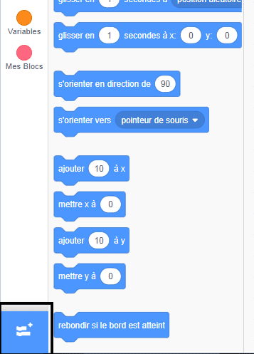
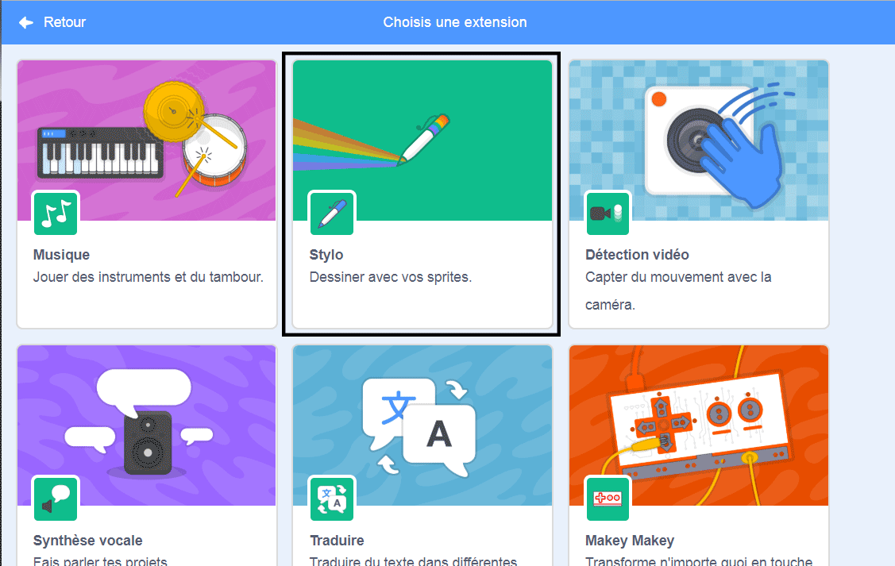
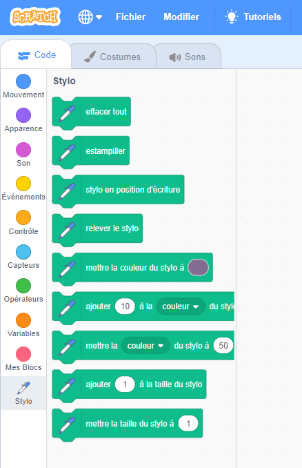

## Utiliser l'outil Stylo

Le projet que tu vas réaliser repose sur l'outil **Stylo** , qui trace une ligne derrière le centre d'un sprite lors de son déplacement. Tu vas apprendre à l'utiliser maintenant!

\--- task \--- Ouvre un nouveau fichier Scratch, sélectionne le sprite Chat de Scratch et fais glisser quelques blocs que tu aurais déjà vus jusqu'à ce qu'il ressemble à ceci:

```blocks3
    lorsque le drapeau vert est cliqué
    aller à x: (0) y: (0)
    déplacer de (50) pas
    tourner de cw (15) degrés
```

\--- /task \---

Maintenant, il est temps de tester le stylo!

Pour utiliser les blocs de Stylo dans Scratch, tu dois ajouter l’extension **Stylo**.

\--- task \--- Clique sur le bouton **Ajouter une extension** dans le coin inférieur gauche.



Clique sur l'extension **Stylo** pour l'ajouter.



La section Stylo apparaît alors au bas du menu des blocs.



Dans la section **Stylo** , sélectionne le bloc `stylo en position d'écriture`{:class="block3extensions"} et ajoute-le au début de ton programme, comme suit:

```blocks3
    lorsque le drapeau vert est cliqué
+ stylo en position d'écriture
    aller à x: (0) y: (0)
```

\--- /task \---

\--- task \--- Maintenant, clique plusieurs fois sur le drapeau vert et observe ce qui se passe. \--- /task \---

Si tu peux voir les lignes derrière le sprite du chat, le stylo fonctionne et tu peux commencer à le faire dessiner des motifs vraiment cool.

Tout d'abord, tu devrais te débarrasser du sprite. Ça gêne le dessin!

\--- task \--- Ajoute un bloc `cacher`{:class="block3looks"} de **Attendre** au début du programme et il va disparaître.

```blocks3
    lorsque le drapeau vert est cliqué 
+ masquer
    stylo en position d'écriture
```

\--- /task \---

Maintenant, tu peux changer la couleur du stylo avec un autre bloc de la section **Stylo** , mais le bloc est un peu différent des autres que tu as vus. C'est le bloc `définir la couleur du stylo sur`{:class="block3extensions"} et qui ressemble à ceci:

```blocks3
    définir la couleur du stylo sur [# 4a6cd4]
```

\--- task \--- Fais glisser un bloc `définir la couleur du stylo sur`{:class="block3extensions"} dans ton panneau de sprite et clipse le au- dessus du bloc `stylo en position d'écriture`{:class="block3extensions"}.

```blocks3
    lorsque le drapeau vert est cliqué
    masquer
+ définir la couleur du stylo sur [# 4a6cd4]
    stylo en position d'écriture
```

Maintenant, clique sur la case de couleur (dans le code ci-dessus, c'est la bleue), et choisis une couleur. \--- /task \---

Si tu as cliqué sur le drapeau vert pour tester ton code, tu auras remarqué que les dessins du stylo ne disparaissent pas.

\--- tâche \--- Ajoute un ` effacer ` Bloc {: class = "block3extensions"} du stylo ** ** section au début de ton code pour s’occuper de cela:

```blocks3
    lorsque le drapeau vert est cliqué
+ effacer
    cacher
```

\--- /task \---