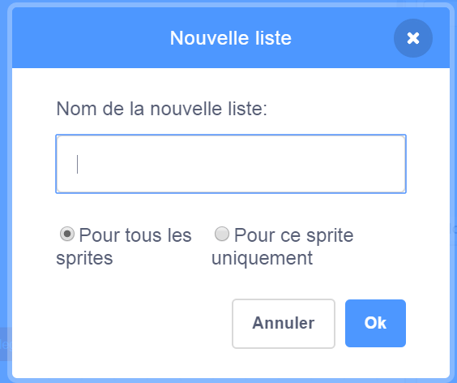
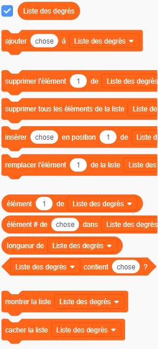
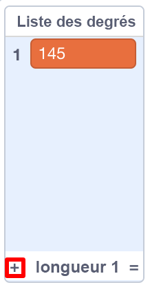

## Aider l'ordinateur

Te rappelles-tu quelques étapes en arrière, où je t'ai dit d'écrire certaines de tes valeurs préférées pour `augmenter`{:class="block3variables"} et `degrés`{:class="block3variables"}, celles qui ont donnés de meilleurs motifs? Si tu ne l'as pas fait, ne t’inquiètes pas: tu peux simplement regarder le programme aléatoire s'exécuter pendant un moment et note les combinaisons qui donnent d'excellents résultats.

Tu vas apprendre à Scratch ces combinaisons de valeurs, de sorte qu'il puisse les utiliser pour créer des images fantastiques!

Pour ce faire, tu auras besoin d'une **liste**. Tu trouveras les listes de variables dans la section **Variables**. Comme tu l'as fait avec tes variables, tu devras d'abord créer ta liste!

\--- task \---

Click **Make a List**, and enter `Degrees List`{:class="block3variables"} as the name.



\--- /task \---

Your list, which is empty at the moment, will appear on the Stage, and you'll see a bunch of blocks for it in **Variables**.



\--- task \---

Make another list called `Increase List`{:class="block3variables"}

\--- /task \---

\--- task \---

Now, by clicking on the little plus sign (**+**) at the bottom of the lists, add in the first pair of values of `increase`{:class="block3variables"} and `degrees`{:class="block3variables"} you liked, each value into the right list. Do this again to add the second pair of values. This will be enough for now — you'll add the rest of the value pairs you like later!



Make sure that the `degrees`{:class="block3variables"} value and the `increase`{:class="block3variables"} value that worked well together are at the same position in the `Degrees List`{:class="block3variables"} and the `Increase List`{:class="block3variables"}. They need to be there so your program can match them up again using their position!

\--- /task \---

Now you have the lists, you just need to get your code to read them and loop over them! To do this, you’re going to use a new variable to act as a counter, some **incrementing**, and an `if then`{:class="block3control"} **Control** block.

## \--- collapse \---

## title: Que signifie incrémenter?

To increment something means to add something to it.

You will use a variable to act as a counter to keep track of what position you're at in your lists. To move through the lists, you'll keep incrementing the counter by `1` (so, adding `1` to it) until you get to the end of the list.

\--- /collapse \---

\--- task \---

Create a new variable called `counter`{:class="block3variables"}, and update your code to look like this:

```blocks3
    lorsque le drapeau vert est cliqué 
    définir [compteur v] sur [0]
    répéter indéfiniment 
+ si <(compteur) = (longueur de [Liste d'augmentation v] :: liste)> alors
+ définir [compteur v] sur [0]
        fin
+      changer [compteur v] par (1)
        définir [étapes v] sur [0]
+ définir [augmenter v] sur (élément (compteur) de [List d'augmentation v] :: liste)
+ définir [degrés v] sur (élément ( compteur) de [Liste des degrés v] :: liste)
        relever le stylo 
        masquer
        effacer
        aller à x: (0) y: (0)
        définir la couleur du stylo sur [# 4a6cd4]
        stylo en position d'écriture
        répéter jusqu'à <touching [edge v] ?> 
            déplacer (étapes) pas
            tourner cw (degrés) degrés
            changer [étapes v] par (augmenter)
        fin
    fin
```

\--- /task \---

Notice the new blocks that:

1. Définis `compteur`{:class="block3variables"} à `0`, en dehors de toutes les boucles.
2. Vérifie si le nombre stocké dans le `compteur`{:class="block3variables"} est la longueur de la liste et, dans ce cas, définis le compteur ``: {:class="block3variables"} sur `0`. Cela signifie que cette variable sera toujours le numéro d'une position dans les listes et ne deviendra pas plus grande que cela.
3. Ajoute `1` au `compteur`{:class="block3variables"}.
4. Choisis l'élément de `Liste d'augmentation`{:class="block3variables"} qui est à la position décrite par `compteur`{:class="block3variables"}, et mets le dans la variable `augmenter`{:class="block3variables"}. Fais la même chose pour la variable`Liste des degrés`{:class="block3variables"} et `degrés`{:class="block3variables"}.

## \--- collapse \---

## title: Comment fonctionne le code?

This is what happens when you run your program:

1. Définis `compteur`{:class="block3variables"} sur `0`.
2. Commence la boucle `répéter indéfiniment`{:class="block3control"}.
3. Vérifie si `compteur`{: class = "block3variables"} (`0`) est identique à la longueur de `Liste d'augmenter`{:class="block3variables"} (`2`). Ce n’est pas le cas.
4. Change `compteur`{:class="block3variables"} par `1`. Maintenant, `compteur`{:class="block3variables"} = `1`.
5. Définis `étapes`{:class="block3variables"} sur `0`.
6. Récupère l'élément à la position nommée par `compteur`{:class="block3variables"} (`1`) dans la `Liste d'augmentations`{:class="block3variables"}, et mets le dans `augmenter`{:class="block3variables"}.
7. Récupère l'élément à la position nommée par `compteur`{:class="block3variables"} (`1`) dans la `liste des degrés`{:class="block3variables"}, et mets-le à `degrés`{:class="block3variables"}.
8. Fais tous les trucs liés au dessin des motifs.
9. Redémarre la boucle `répéter indéfiniment`{:class="block3control"}:
10. Vérifie si `compteur`{:class="block3variables"} (`1`) est identique à la longueur de `Liste d'augmentation`{:class="block3variables"} (`2`). Ce n’est pas le cas.
11. Change `compteur`{:class="block3variables"} par `1`. Maintenant, `compteur`{:class="block3variables"} = `2`.
12. Définis `étapes`{:class="block3variables"} sur `0`.
13. Récupère l'élément à la position nommée par `compteur`{:class="block3variables"} (`2`) dans la `liste de augmentations`{:class="block3variables"}, et mets le dans `augmenter`{:class="block3variables"}.
14. Récupère l'élément à la position nommée par `compteur`{:class="block3variables"} (`2`) dans la `liste des degrés`{:class="block3variables"}, et mets-le dans `degrés`{:class="block3variables"}.
15. Fais tous les trucs liés au dessin des motifs.
16. Redémarre la boucle `répéter indéfiniment`{:class="block3control"}:
17. Vérifie si `compteur`{:class="block3variables"} (`2`) est identique à la longueur de la ` liste de augmentations`{:class="block3variables"} (`2`). C'est ça!
18. Définis `compteur`{:class="block3variables"} sur `0`.
19. Continue à partir de **étape 4** de cette liste, dans une boucle sans fin!

\--- /collapse \---

\--- task \---

Once you're happy with the code, go ahead and add the rest of the pairs of values you noted down to the `Degrees List`{:class="block3variables"} and the `Increase List`{:class="block3variables"}.

\--- /task \---

That's it! Sit back and watch your program keep drawing lovely patterns in a never-ending loop! If you want to add more patterns, you can: just add more pairs of numbers to the two lists and restart the program.