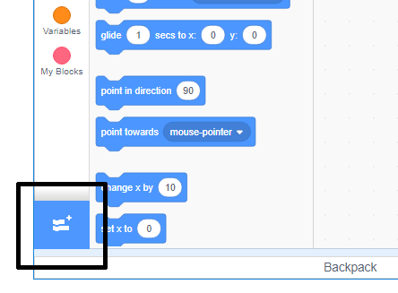

## पेन टूल का उपयोग करना

आप जिस प्रोजेक्ट को बनाने जा रहे हैं, वह **पेन** टूल पर निर्भर करता है, जो चलते हुए स्प्राइट के केंद्र के पीछे एक रेखा खींचता है। अब आप इसका उपयोग करना सीखेंगे!

--- task ---

एक नई स्क्रैच फ़ाइल खोलें, स्क्रैच कैट स्प्राइट का चयन करें, और कुछ ब्लॉकों में खींचें जिन्हें आपने पहले ही देखा होगा, जब तक कि यह पसंद न हो:

```blocks3
    when green flag clicked
    go to x: (0) y: (0)
    move (50) steps
    turn cw (15) degrees
```

--- /task ---

अब, कलम का परीक्षण करने का समय!

Scratch में पेन ब्लॉक्स का उपयोग करने के लिए, आपको **Pen extension** जोड़ना होगा।

--- task ---

नीचे बाएँ हाथ के कोने में **Add extension** (एड एक्सटेंशन) बटन पर क्लिक करें।



इसे जोड़ने के लिए **Pen** (पेन) एक्सटेंशन पर क्लिक करें।


Pen (पेन) खंड तब ब्लॉक्स मेनू के नीचे दिखाई देता है ।


**कलम से** अनुभाग, नीचे `पेन का चयन करें`{:class="block3extensions"} ब्लॉक करें और इसे अपने प्रोग्राम की शुरुआत में जोड़ें, जैसे:

```blocks3
when green flag clicked
+    pen down
    go to x: (0) y: (0)
```

--- /task ---

--- task ---

अब हरे झंडे को कुछ बार क्लिक करें और देखें कि क्या होता है।

--- /task ---

यदि आप बिल्ली के पीछे की पंक्तियों को देख सकते हैं, तो कलम काम कर रही है और आप इसे वास्तव में अच्छा पैटर्न बनाना शुरू कर सकते हैं।

सबसे पहले, आपको स्प्राइट से छुटकारा पाना चाहिए। यह ड्राइंग के रास्ते में हो रही है!

--- task ---

`छिपाएँ`{:class="block3looks"} जोड़ें ब्लॉक से **लगता है** कार्यक्रम की शुरुआत और यह गायब हो जाएगा।

```blocks3
when green flag clicked
+    hide
    pen down
```

--- /task ---

अब, आप **पेन** से दूसरे ब्लॉक के साथ पेन का रंग बदल सकते हैं अनुभाग, लेकिन ब्लॉक आपके द्वारा देखे गए अन्य लोगों से थोड़ा अलग है। यह `सेट पेन कलर है`{:class="block3extensions"} ब्लॉक और इस तरह दिखता है:

```blocks3
    set pen color to [#4a6cd4]
```

--- task ---

पेन कलर को `सेट करें`{:class="block3extensions"} अपने स्प्राइट पैनल में ब्लॉक करें, और `पेन डाउन के ऊपर इसे स्नैप करें`{:class="block3extensions"} ब्लॉक।

```blocks3
when green flag clicked
    hide
+    set pen color to [#4a6cd4]
    pen down
```

अब, रंग के बॉक्स पर क्लिक करें (ऊपर कोड में यह नीला एक है), और एक रंग चुनें।

--- /task ---

यदि आप अपने कोड का परीक्षण करने के लिए हरे झंडे पर क्लिक कर रहे हैं, तो आपने देखा होगा कि पेन जो चित्र बनाता है वह दूर नहीं जाता है।

--- task ---

इसका ध्यान रखने के लिये `स्पष्ट(clear)`{:class="block3extensions"} ब्लॉक **पेन** सेक्शन् से कोड (code) ​के प्रारंभ तक जोडइए

```blocks3
when green flag clicked
+    clear
    hide
```

--- /task ---