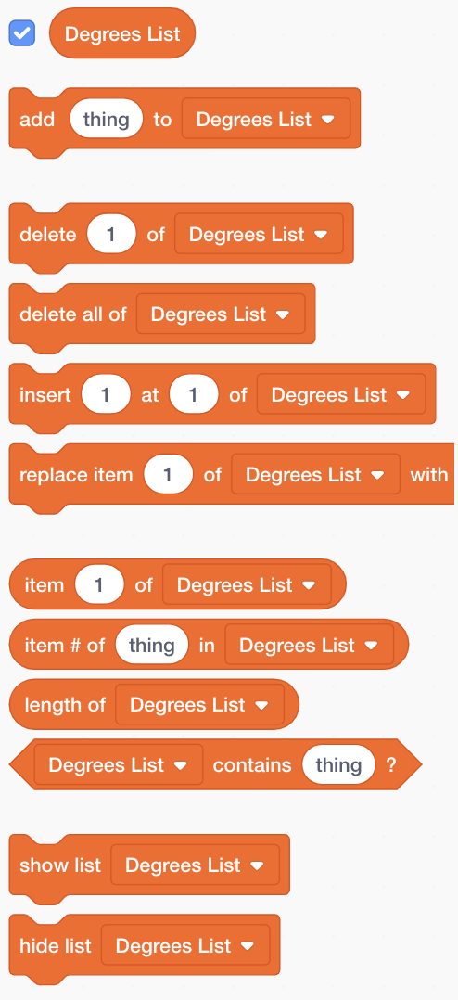

## कंप्यूटर की मदद करना

क्या आपको कुछ कदम पीछे की बात याद है, जहां मैंने आपसे `वृद्धि के लिए अपने कुछ पसंदीदा मूल्यों को लिखने के लिए कहा था`{:class="block3variables"} और `डिग्री`{:class="block3variables"}, जो सबसे अच्छे दिखने वाले पैटर्न देते हैं? यदि आपने ऐसा नहीं किया है, तो चिंता न करें: आप अभी कुछ समय के लिए रैंडम प्रोग्राम चला सकते हैं और शानदार परिणाम देने वाले संयोजनों को लिख सकते हैं।

आप मानों के उन संयोजनों को स्क्रैच करना सिखाने जा रहे हैं, इसलिए यह उनका उपयोग भयानक चित्रों के अलावा कुछ नहीं कर सकता है!

ऐसा करने के लिए, आपको **सूची की आवश्यकता होगी** । आपको वेरिअबलस् की सूचीयाँ **वेरिअबलस्** अनुभाग मे मिलेंगी जैसे आपने अपने चरों के साथ किया, आपको पहले अपनी सूची बनानी होगी!

--- task ---

**सूची बनाएं पर क्लिक करें**, और दर्ज करें `डिग्री सूची`{:class="block3variables"} नाम के रूप में ।


--- /task ---

आपकी सूची, जो इस समय खाली है, स्टेज पर दिखाई देगी, और आपको इसके लिए ब्लॉक का एक गुच्छा दिखाई देगा **चर** ।



--- task ---

`Increase List`{:class="block3variables"} नामक एक और सूची बनाएँ।

--- /task ---

--- task ---

अब, थोड़ा प्लस चिह्न (**+ पर क्लिक करके** ) सूचियों के निचले भाग में, `वृद्धि के मूल्यों की पहली जोड़ी में जोड़ें`{:class="block3variables"} और `डिग्री`{:class="block3variables"} आपको पसंद आया, प्रत्येक मान सही सूची में। मूल्यों की दूसरी जोड़ी को जोड़ने के लिए इसे फिर से करें। यह अब के लिए पर्याप्त होगा - आप बाद में अपने पसंद के बाकी जोड़े जोड़ देंगे!


सुनिश्चित करें कि `डिग्री`{:class="block3variables"} मान और `वृद्धि`{:class="block3variables"} मान जो एक साथ अच्छी तरह से काम करता है, उसी स्थिति में `डिग्री सूची में है`{:class="block3variables"} और `सूची बढ़ाएँ`{:class="block3variables"}। उन्हें वहां रहने की आवश्यकता है ताकि आपका कार्यक्रम उनकी स्थिति का उपयोग करके उन्हें फिर से मेल कर सके!

--- /task ---

अब आपके पास सूचियां हैं, आपको बस उन्हें पढ़ने के लिए अपना कोड प्राप्त करने और उन पर लूप करने की आवश्यकता है! ऐसा करने के लिए, आप काउंटर के रूप में कार्य करने के लिए एक नए चर का उपयोग करने जा रहे हैं, कुछ **वेतन वृद्धि**, और फिर `यदि`{:class="block3control"} **नियंत्रण** खंड मैथा।

--- collapse ---
---
title: वेतन वृद्धि का क्या मतलब है?
---

कुछ बढ़ाने के लिए कुछ जोड़ने का मतलब है।

आप अपनी सूची में किस स्थान पर हैं, इसका ट्रैक रखने के लिए एक काउंटर के रूप में कार्य करने के लिए एक चर का उपयोग करेंगे। सूचियों के माध्यम से आगे बढ़ने के लिए, आप `1 द्वारा काउंटर बढ़ाते रहेंगे` (इसलिए, `1 जोड़ना` तब तक) जब तक आप सूची के अंत तक नहीं पहुंच जाते।

--- /collapse ---

--- task ---

एक नया चर बनाएं `काउंटर`{:class="block3variables"}, और इस तरह दिखने के लिए अपना कोड अपडेट करें:

```blocks3
    when green flag clicked
    set [counter v] to [0]
    forever 
+        if <(counter) = (length of [Increase List v] :: list)> then 
+            set [counter v] to [0]
        end
+        change [counter v] by (1)
        set [steps v] to [0]
+        set [increase v] to (item (counter) of [Increase List v] :: list)
+        set [degrees v] to (item (counter) of [Degrees List v] :: list)
        pen up
        hide
        clear
        go to x: (0) y: (0)
        set pen color to [#4a6cd4]
        pen down
        repeat until <touching [edge v] ?> 
            move (steps) steps
            turn cw (degrees) degrees
            change [steps v] by (increase)
        end
    end
```

--- /task ---

ध्यान दें कि नए ब्लॉक:

1. सेट करें `काउंटर`{:class="block3variables"} से `0 तक`, सभी छोरों के बाहर।
2. जांचें कि क्या संख्या `काउंटर में संग्रहीत है`{:class="block3variables"} सूची की लंबाई है, और यदि ऐसा है, तो `काउंटर सेट करें`{:class="block3variables"} से `0 तक` । इसका मतलब यह है कि यह चर हमेशा सूचियों में एक स्थान की संख्या होगी, और इससे बड़ा कोई नहीं मिलेगा।
3. जोड़ें `1` को `काउंटर`{:class="block3variables"}।
4. आइटम को `सूची से बढ़ाएं`{:class="block3variables"} जो `काउंटर द्वारा वर्णित स्थिति में है`{:class="block3variables"}, और इसे `वृद्धि में डालें`{:class="block3variables"} चर। `डिग्री सूची के लिए भी यही करें` और `डिग्री`{:class="block3variables"} चर।

--- collapse ---
---
title: यह कैसे काम करता है?
---

जब आप अपना प्रोग्राम चलाते हैं तो यही होता है:

1. सेट करें `काउंटर`{:class="block3variables"} से `0 तक`, सभी छोरों के बाहर।
2. `हमेशा के लिए`{:class="block3control"} लूप का उपयोग करना
3. जांचें कि `काउंटर`{:class="block3variables"} (`0`) की लंबाई `की सूची के समान है`{:class="block3variables"} (`2`)। यह नहीं है।
4. सेट करें `काउंटर`{:class="block3variables"} से `1 तक`, सभी छोरों के बाहर। सेट करें `काउंटर`{:class="block3variables"} से `1 तक`, सभी छोरों के बाहर।
5. सेट करें `काउंटर`{:class="block3variables"} से `0 तक`, सभी छोरों के बाहर।
6. आइटम को `काउंटर द्वारा नामित स्थिति में प्राप्त करें`{:class="block3variables"} (`1`) में `सूची बढ़ाएँ`{:class="block3variables"}, और इसे `वृद्धि में डालें`{:class="block3variables"}।
7. आइटम को `काउंटर द्वारा नामित स्थिति में प्राप्त करें`{:class="block3variables"} (`1` ) में `सूची बढ़ाएँ`{:class="block3variables"}, और इसे `वृद्धि में डालें`{:class="block3variables"}।
8. पैटर्न खींचने से संबंधित सभी चीजें करें।
9. `हमेशा के लिए`{:class="block3control"} लूप का उपयोग करना
10. जांचें कि `काउंटर`{:class="block3variables"} (`1`) की लंबाई `की सूची के समान है`{:class="block3variables"} (`2`)। यह नहीं है।
11. सेट करें `काउंटर`{:class="block3variables"} से `1 तक`, सभी छोरों के बाहर। सेट करें `काउंटर`{:class="block3variables"} से `2 तक`, सभी छोरों के बाहर।
12. सेट करें `काउंटर`{:class="block3variables"} से `0 तक`, सभी छोरों के बाहर।
13. आइटम को `काउंटर द्वारा नामित स्थिति में प्राप्त करें`{:class="block3variables"} (`2`) में `सूची बढ़ाएँ`{":class="block3variables"}, और इसे `वृद्धि में डालें`{:class="block3variables"}।
14. आइटम को `काउंटर द्वारा नामित स्थिति में प्राप्त करें`{:class="block3variables"} (`2` ) में `सूची बढ़ाएँ`{:class="block3variables"}, और इसे `वृद्धि में डालें`{:class="block3variables"}।
15. पैटर्न खींचने से संबंधित सभी चीजें करें।
16. `हमेशा के लिए`{:class="block3control"} लूप का उपयोग करना
17. जांचें कि `काउंटर`{:class="block3variables"} (`2`) की लंबाई `की सूची के समान है`{:class="block3variables"} (`2`)। यह है
18. सेट करें `काउंटर`{:class="block3variables"} से `0 तक`, सभी छोरों के बाहर।
19. **चरण 4 से जारी रखें** इस सूची में, कभी न खत्म होने वाले पाश में!

--- /collapse ---

--- task ---

एक बार जब आप कोड से खुश हो जाते हैं, तो आगे बढ़ें और बाकी मूल्यों को जोड़ दें जिन्हें आपने नीचे उल्लिखित किया है `डिग्री सूची`{:class="block3variables"} और `सूची बढ़ाएँ`{:class="block3variables"}।

--- /task ---

बस! वापस बैठो और अपने कार्यक्रम देखो एक कभी न खत्म होने वाले पाश में सुंदर पैटर्न ड्राइंग! यदि आप अधिक पैटर्न जोड़ना चाहते हैं, तो आप कर सकते हैं: बस दो सूचियों में संख्याओं के अधिक जोड़े जोड़ें और कार्यक्रम को पुनरारंभ करें।


***
समुदाय के योगदान से किया गया अनुवाद

इस परियोजना का अनुवाद Salim Abkani ने किया है और समीक्षा Shashank Rao द्वारा कि गयी  है।

हमारे अद्भुत अनुवाद स्वयंसेवक हमारी मदद करते है ताकि हम दुनिया भर के बच्चों को कोड करना सीखने का मौका प्रदान कर सके।. आप हमारी परियोजनाओं का अनुवाद करके और अधिक बच्चों तक पहुंचने में हमारी सहायता कर सकते हैं - [rpf.io/translate](https://rpf.io/translate) पर जाकर अधिक जानकारी हासिल करे