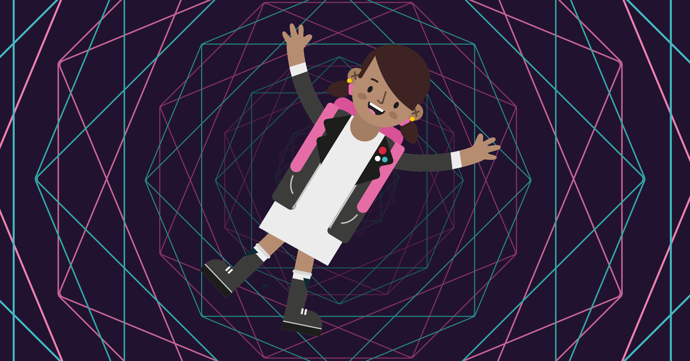

--- no-print ---

Questa è la versione **Scratch 3** del progetto. C'è anche una versione [Scratch 2 del progetto](https://projects.raspberrypi.org/it-IT/projects/cd-intermediate-scratch-sushi-scratch2).

--- /no-print ---

## Introduzione

Hai già imparato le basi di Scratch (e se non l'hai fatto, dai un'occhiata alle Beginner Scratch Sushi Cards) per fare il tuo primo gioco Scratch. Qui imparerai qualche trucco più interessante e realizzerai uno dei miei progetti di Scratch preferiti: disegnerai modelli colorati e, se li imposterai correttamente, potranno essere davvero interessanti da guardare.

### Che cosa creerai

Ecco un progetto che ho preparato:

  <iframe allowtransparency="true" width="485" height="402" src="https://scratch.mit.edu/projects/embed/205355399/?autostart=false" frameborder="0"></iframe>

--- collapse ---
---
title: Cosa imparerai
---

Nell'Intermediate Scratch Sushi Cards, imparerai come:

+ Usare lo strumento Penna
+ Usare e aggiornare le variabili nei cicli
+ Usare i cicli "Repeat Until"
+ Ottenere valori di input con i blocchi ask
+ Utilizzo di più elenchi con proprietà correlate per indice

--- /collapse ---

--- collapse ---
---
title: Di cosa avrai bisogno
---

### Hardware

+ Un computer in grado di eseguire Scratch 3

### Software

+ Scratch 3 ([online](https://scratch.mit.edu/projects/editor/){:target="_blank"} o [offline](https://scratch.mit.edu/download/){:target="_blank"}"})

--- /collapse ---