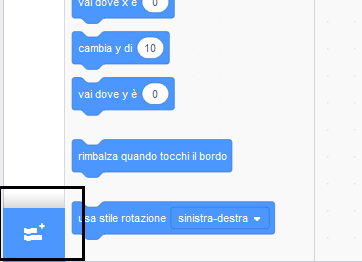

## Usare lo strumento Penna

Il progetto che farai si basa sullo strumento **Penna**, che disegna una linea dietro il centro di uno sprite mentre si muove. Imparerai ad usarlo ora!

\--- task \---

Apri un nuovo file di Scratch, seleziona lo sprite del gatto e trascina alcuni blocchi che potresti aver già visto, fino a quando non appare così:

```blocks3
    when green flag clicked
    go to x: (0) y: (0)
    move (50) steps
    turn cw (15) degrees
```

\--- /task \---

Ed ora, è tempo di testare la penna!

Per utilizzare i blocchi penna in Scratch, è necessario aggiungere **l'estensione Penna**.

\--- task \---

Fai clic sul pulsante **Aggiungi estensione** nell'angolo in basso a sinistra.



Fare clic sull'estensione **Penna** per aggiungerla.


La sezione Penna viene visualizzata nella parte inferiore del menu dei blocchi.


Dalla sezione **Penna**, seleziona il blocco `penna giù`{: class = "block3extensions"} e aggiungilo all'inizio del tuo programma, in questo modo:

```blocks3
    when green flag clicked
+    pen down
    go to x: (0) y: (0)
```

\--- /task \---

\--- task \---

Ora fai clic sulla bandiera verde alcune volte e guarda cosa succede.

\--- /task \---

Se riesci a vedere le linee dietro al gatto, allora la penna sta funzionando e puoi iniziare a creare disegni davvero fantastici.

Innanzitutto, dovresti sbarazzarti dello sprite. Sta ostacolando il disegno!

\--- task \---

Aggiungi un blocco ` nascondi ` {: class = "block3looks"} dal gruppo ** Aspetto ** all'inizio del programma e scomparirà.

```blocks3
    when green flag clicked
+    hide
    pen down
```

\--- /task \---

Ora puoi cambiare il colore della penna con un altro blocco dalla sezione **Penna**, ma il blocco è leggermente diverso dagli altri che hai visto. È il blocco `porta colore penna a`{: class = "block3extensions"} e assomiglia a questo:

```blocks3
    imposta il colore della penna su [# 4a6cd4]
```

\--- task \---

Trascina un `porta colore penna a`{: class = "block3extensions"} nel tuo pannello sprite, e aggancialo al di sopra del blocco `penna giù`{: class = "block3extensions"}.

```blocks3
    when green flag clicked
    hide
+    set pen color to [#4a6cd4]
    pen down
```

Ora, fai clic sulla casella del colore (nel codice sopra è blu) e scegli un colore.

\--- /task \---

Se hai fatto clic sulla bandiera verde per testare il tuo codice, avrai notato che i disegni realizzati dalla penna non spariscono.

\--- task \---

Aggiungi un blocco `pulisci`{: class = "block3extensions"} dalla sezione **Penna** all'inizio del tuo codice:

```blocks3
    when green flag clicked
+    clear
    hide
```

\--- /task \---