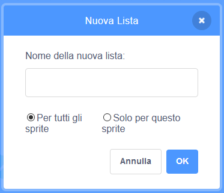
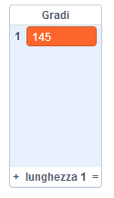

## Aiutare il computer

Ti ricordi alcuni passi indietro, in cui ti ho detto di scrivere alcuni dei tuoi valori preferiti per `incrementa`{:class="block3variables"} e `Gradi`{:class="block3variables"}, quelli che hanno dato i modelli più belli? Se non l'hai fatto, non ti preoccupare: puoi solo guardare il programma random per un po' di tempo e annotare le combinazioni che danno ottimi risultati.

Insegnerai a Scratch quelle combinazioni di valori, in modo che possa usarli per creare solo immagini fantastiche!

Per fare ciò, avrai bisogno di una **lista**. Troverai le liste con le variabili nella sezione **Variabili**. Proprio come hai fatto con le tue variabili, devi prima creare la tua lista!

--- task ---

Fai clic su **Crea una lista** e immetti come nome `Lista Gradi`{:class="block3variables"}.



--- /task ---

La tua lista, che al momento è vuota, apparirà sullo schermo, e vedrai un mucchio di blocchi **Variabili**.


--- task ---

Crea un'altra lista chiamata `Lista Incrementi`{:class="block3variables"}

--- /task ---

--- task ---

Ora, facendo clic sul piccolo segno più (**+**) nella parte inferiore degli elenchi, aggiungi la prima coppia di valori di `incrementa`{:class="block3variables"} e `Gradi`{:class="block3variables"} che ti è piaciuta, ogni valore nella giusta lista. Ripeti questa operazione per aggiungere la seconda coppia di valori. Questo per ora sarà sufficiente - aggiungerai il resto delle coppie di valori che ti piacciono più tardi!



Assicurati che il valore `Gradi`{:class="block3variables"} e il valore `incrementa`{:class="block3variables"} che hanno funzionato bene insieme siano nella stessa posizione nella lista `Lista Gradi`{:class="block3variables"} e nella `Lista Incrementi`{:class="block3variables"}. Devono essere lì in modo che il tuo programma possa abbinarli di nuovo usando la loro posizione!

--- /task ---

Ora hai le liste, devi solo ottenere il tuo codice per leggerle e ripetere il ciclo! Per fare questo, utilizzerai una nuova variabile per agire come un contatore, alcuni **incrementando**e un `se allora`{:class="block3control"} da **Controllo**.

--- collapse ---
---
title: Cosa significa incremento?
---

Aumentare qualcosa significa aggiungervi qualcosa.

Utilizzerai una variabile per fungere da contatore e tenere traccia della posizione in cui ti trovi nei tuoi elenchi. Per spostarti tra gli elenchi, continuerai ad incrementare il contatore di `1` (quindi aggiungendo `1` ad esso) fino a raggiungere la fine dell'elenco.

--- /collapse ---

--- task ---

Crea una nuova variabile chiamata `contatore`{:class="block3variables"} e aggiorna il codice in questo modo:

```blocks3
    when green flag clicked
    set [contatore v] to [0]
    forever 
+        if <(contatore) = (length of [Lista Incrementi v] :: list)> then 
+            set [contatore v] to [0]
        end
+        change [contatore v] by (1)
        set [passi v] to [0]
+        set [incrementa v] to (item (contatore) of [Lista Incrementi v] :: list)
+        set [Gradi v] to (item (contatore) of [Lista Gradi v] :: list)
        pen up
        hide
        clear
        go to x: (0) y: (0)
        set pen color to [#4a6cd4]
        pen down
        repeat until <touching [edge v] ?> 
            move (passi) steps
            turn cw (Gradi ) degrees
            change [passi v] by (incrementa)
        end
    end
```

--- /task ---

Notare i nuovi blocchi che:

1. Imposta `contatore`{:class="block3variables"} a `0`, fuori da tutti i loop.
2. Verifica se il numero memorizzato in `contatore`{:class="block3variables"} è pari alla lunghezza dell'elenco e, in tal caso, imposta `contatore`{:class="block3variables"} a `0`. Ciò significa che questa variabile sarà sempre al massimo pari al numero di posizioni negli elenchi e non più grande.
3. Aggiungi `1` a `contatore`{:class="block3variables"}.
4. Scegli l'oggetto da `Lista Incrementi`{:class="block3variables"} che è nella posizione descritta da `contatore`{:class="block3variables"}, e inseriscilo nella variabile `incrementa`{:class="block3variables"}. Fai lo stesso per `Lista Gradi`{:class="block3variables"} e la variabile `Gradi`{:class="block3variables"}.

--- collapse ---
---
title: Come funziona il codice?
---

Questo è quello che succede quando esegui il tuo programma:

1. Imposta `contatore`{:class="block3variables"} a `0`.
2. Avvia il ciclo `per sempre`{:class="block3control"}.
3. Controlla se `contatore`{:class="block3variables"} (`0`) è uguale alla lunghezza di `Lista Incrementi`{:class="block3variables"} (`2`). Non lo è.
4. Cambia `contatore`{:class="block3variables"} di `1`. Ora `contatore`{:class="block3variables"} = `1`.
5. Imposta `passi`{:class="block3variables"} a `0`.
6. Ottieni l'oggetto nella posizione indicata dal `contatore`{:class="block3variables"} (`1`) nel `Lista Incrementi`{:class="block3variables"}, e mettilo in `incrementa`{:class="block3variables"}.
7. Ottieni l'oggetto nella posizione indicata da `contatore`{:class="block3variables"} (`1`) nella `Lista Gradi`{:class="block3variables"}, e inseriscilo in `Gradi`{:class="block3variables"}.
8. Fai tutte le cose relative al disegno delle forme.
9. Riavvia il ciclo `per sempre`{:class="block3control"}:
10. Controlla se `contatore`{:class="block3variables"} (`1`) è uguale alla lunghezza di `Lista Incrementi`{:class="block3variables"} (`2`). Non lo è.
11. Cambia `contatore`{:class="block3variables"} di `1`. Ora `contatore`{:class="block3variables"} = `2`.
12. Imposta `passi`{:class="block3variables"} a `0`.
13. Ottieni l'oggetto nella posizione denominata da `contatore`{:class="block3variables"} (`2`) nella `Lista Incrementi`{:class="block3variables"}, e mettilo in `incrementa`{:class="block3variables"}.
14. Ottieni l'oggetto nella posizione indicata da `contatore`{:class="block3variables"} (`2`) nella `Lista Gradi`{:class="block3variables"}, e inseriscilo in `Gradi`{:class="block3variables"}.
15. Fai tutte le cose relative al disegno delle forme.
16. Riavvia il ciclo `per sempre`{:class="block3control"}:
17. Controlla se `contatore`{:class="block3variables"} (`2`) è uguale alla lunghezza del `Lista Incrementi`{:class="block3variables"} (`2`). Lo è!
18. Imposta `contatore`{:class="block3variables"} a `0`.
19. Continua dal **passo 4** di questa lista, in un ciclo senza fine!

--- /collapse ---

--- task ---

Una volta che sei soddisfatto del codice, vai avanti e aggiungi il resto delle coppie di valori che hai annotato in `Lista Gradi`{:class="block3variables"} e la `Lista Incrementi`{:class="block3variables"}.

--- /task ---

Questo è tutto! Siediti e guarda il tuo programma che continua a disegnare deliziosi disegni in un ciclo senza fine! Se vuoi aggiungere altre forme, puoi: basta aggiungere più coppie di numeri ai due elenchi e riavviare il programma.


***
Questo progetto è stato tradotto da volontari:

Antonio Borriello

Grazie ai volontari, possiamo offrire alle persone di tutto il mondo la possibilità di imparare nella loro lingua. Puoi aiutarci a raggiungere più persone offrendoti come volontario per la traduzione - puoi trovare maggiori informazioni su [rpf.io/translate](https://rpf.io/translate).