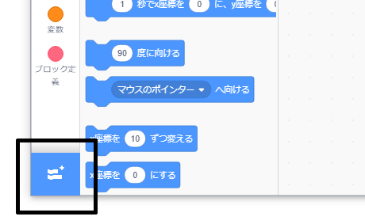
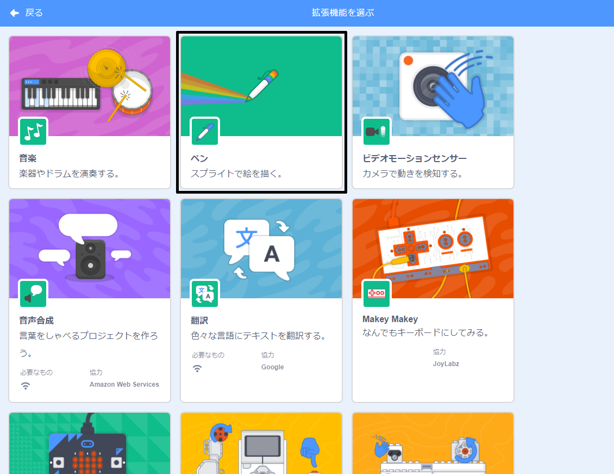
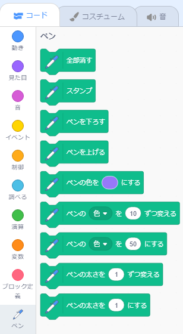

## ペンツールを使用する

これから作るプロジェクトは、 **ペン** ツールを使います。このツールは、スプライトの中心点が移動 (いどう) した跡 (あと) を線として表示 (ひょうじ) するものです。 このプロジェクトで、その使いかたをおぼえましょう！

\--- task \---

Open a new Scratch project.

**Online:** open a new online Scratch project at [rpf.io/scratch-new](http://rpf.io/scratch-new){:target="_blank"}.

**Offline:** open a new project in the offline editor.

If you need to download and install the Scratch offline editor, you can find it at [rpf.io/scratchoff](http://rpf.io/scratchoff){:target="_blank"}.

\--- /task \---

\--- task \---

Select the Scratch Cat sprite, and drag in a few blocks you may have already seen, until it looks like this:

```blocks3
    緑色の旗が押されたとき
    x座標を (0) 、y座標を (0) にする
    (50) 歩動かす
    cw (15) 度回す
```

\--- /task \---

Now, time to test out the pen!

To use the Pen blocks in Scratch, you need add the **Pen extension**.

\--- task \---

Click on the **Add extension** button in the bottom left-hand corner.



Click on the **Pen** extension to add it.



The Pen section then appears at the bottom of the blocks menu.



From the **Pen** section, select the `pen down`{:class="block3extensions"} block and add it to the start of your program, like this:

```blocks3
    緑色の旗が押されたとき
+ ペンを下ろす
    x座標を (0) 、y座標を (0) にする
```

\--- /task \---

\--- task \---

Now click the green flag a few times and watch what happens.

\--- /task \---

If you can see the lines behind the cat sprite, then the pen is working and you can start making it draw really cool patterns.

First, you should get rid of the sprite. It’s getting in the way of the drawing!

\--- task \---

Add a `hide`{:class="block3looks"} block from **Looks** to the start of the program and it’ll disappear.

```blocks3
    緑色の旗が押されたとき
+ 隠す
    ペンを下ろす
```

\--- /task \---

Now, you can change the colour of the pen with another block from the **Pen** section, but the block is a little different to the others you’ve seen. It’s the `set pen color to`{:class="block3extensions"} block and looks like this:

```blocks3
    ペンの色を [#4a6cd4] にする
```

\--- task \---

Drag a `set pen color to`{:class="block3extensions"} block into your sprite panel, and snap it in above the `pen down`{:class="block3extensions"} block.

```blocks3
    緑色の旗が押されたとき
    隠す
+ペンの色を [#4a6cd4] にする
    ペンを下ろす
```

Now, click on the box of colour (in the code above it’s the blue one), and choose a colour.

\--- /task \---

If you’ve been clicking on the green flag to test your code, you’ll have noticed that the drawings the pen makes don’t go away.

\--- task \---

Add a `clear`{:class="block3extensions"} block from the **Pen** section to the start of your code to take care of that:

```blocks3
    緑色の旗が押されたとき
+ 全部消す
    隠す
```

\--- /task \---