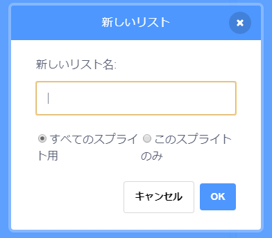
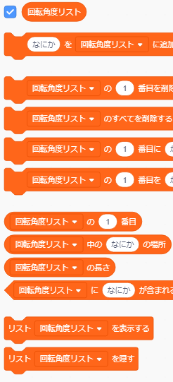
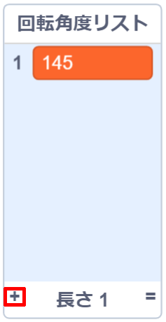

## コンピューターを手助けする

何ステップか前に、カッコいいもようができる`ふやす量`{:class="block3variables"}と`回転角度`{:class="block3variables"}の値を書きとめるように言ったことをおぼえていますか? もし書きとめていなくてもだいじょうぶです。 プログラムがランダムにえがくのをしばらく見て、すてきな結果をもたらす組み合わせを書きとめればよいのです。

Scratch にその値の組み合わせを教えてあげれば、それを使ってすてきな図形だけをえがきます！

これを行うには、**リスト**が必要です。 **変数**セクションに変数のリストがあります。 変数と同じように、最初にリストを作成する必要があります！

--- task ---

**リストを作る**をクリックし、名前として`回転角度リスト`{:class="block3variables"}と入力します。



--- /task ---

あなたのリストは、現在空になっていますが、ステージ上に表示されます。リストが使えるブロックが**変数**セクションにたくさんあります。



--- task ---

`ふやす量リスト`{:class="block3variables"}というべつのリストを作ります。

--- /task ---

--- task ---

リストの下部にある小さなプラス記号 (**+**) をクリックして、`ふやす量`{:class="block3variables"}と`回転角度`{:class="block3variables"}に好きな値の最初の組み合わせを追加します。それぞれの値を適切 (てきせつ) なリストに追加します。 同じように、2番目の値の組み合わせも追加します。 今のところこれで十分です。後でのこりの好きな値の組み合わせを追加します。



うまくかけた`回転角度`{:class="block3variables"}の値と`ふやす量`{:class="block3variables"}の値は、`回転角度リスト`{:class="block3variables"}および`増やす量リスト`{:class="block3variables"}の中で同じ位置 (いち) にあることをたしかめましょう。 プログラムがリスト内の位置を使ってまた組み合わせられるように、同じ位置にある必要があるのです！

--- /task ---

これでリストができました。あとはコードでリスト内の値を繰り返して読みこむだけです！ これを行うには、カウンターとして使う新しい変数、**インクリメント**処理 (しょり) 、および`もし(・・・)なら`{:class="block3control"} **制御** (せいぎょ) ブロックを使います。

--- collapse ---
---
title: インクリメントとは何を意味するのですか？
---

何かをインクリメントするとは、それに何かを追加することです。

リスト内のどの位置にあるかを知るために、変数をカウンターとして使用します。 リスト内を移動するには、リストの最後までカウンターを`1`ずつインクリメントします (つまり、`1`を追加します)。

--- /collapse ---

--- task ---

`カウンター`{:class="block3variables"}という新しい変数を作成し、次のようにコードを変えます。

```blocks3
    when green flag clicked
    set [カウンター v] to [0]
    forever 
+        if <(カウンター) = (length of [ふやす量リスト v] :: list)> then 
+            set [カウンター v] to [0]
        end
+        change [カウンター v] by (1)
        set [ステップ数 v] to [0]
+        set [ふやす量 v] to (item (カウンター) of [ふやす量リスト v] :: list)
+        set [回転角度 v] to (item (カウンター) of [回転角度リスト v] :: list)
        pen up
        hide
        clear
        go to x: (0) y: (0)
        set pen color to [#4a6cd4]
        pen down
        repeat until <touching [edge v] ?> 
            move (ステップ数) steps
            turn cw (回転角度) degrees
            change [ステップ数 v] by (ふやす量)
        end
    end
```

--- /task ---

新しいブロックは次のことを行っていることに注意してください。

1. すべてのループの外で`カウンター`{:class="block3variables"}を`0`に設定します。
2. `カウンター`{:class="block3variables"}に保存されている値がリストの長さと同じであるかどうかを確認し、もしそうなら、`カウンター`{:class="block3variables"}を`0`に設定します。 つまり、この変数はいつもリスト内の位置の番号であり、それより大きくなることはありません。
3. `カウンター`{:class="block3variables"}に`1`を追加します。
4. `ふやす量リスト`{:class="block3variables"}の`カウンター`{:class="block3variables"}の値の位置にある数値を取り出し、`ふやす量`{:class="block3variables"}変数に入れます。 `回転角度リスト`{:class="block3variables"}と`回転角度`{:class="block3variables"}変数についても同じことをします。

--- collapse ---
---
title: コードはどのように動作しますか?
---

プログラムを実行すると次のようなことが起こります。

1. `カウンター`{:class="block3variables"}を`0`に設定します。
2. `ずっと`{:class="block3control"}ループを開始します。
3. `カウンター`{:class="block3variables"}の値(`0`)が`ふやす量リスト`{:class="block3variables"}の長さ(`2`)と同じかどうかをたしかめます。 同じではありません。
4. `カウンター`{:class="block3variables"}を`1`だけ変えます。 これで `カウンター`{:class="block3variables"} = `1`になりました。
5. `ステップ数`{:class="block3variables"} を `0`に設定します。
6. `ふやす量リスト`{:class="block3variables"}の`カウンター`{:class="block3variables"}の値(`1`)の位置にある数値を取得 (しゅとく) し、`ふやす量`{:class="block3variables"}に入れます。
7. `回転角度リスト`{:class="block3variables"}の`カウンター`{:class="block3variables"}の値(`1`)の位置にある数値を取得し、`回転角度`{:class="block3variables"}に入れます。
8. もようをかくことに関連するすべてのことを行います。
9. `ずっと`{:class="block3control"}ループの最初にもどります。
10. `カウンター`{:class="block3variables"}の値(`1`)が`ふやす量リスト`{:class="block3variables"}の長さ(`2`)と同じかどうかをたしかめます。 同じではありません。
11. `カウンター`{:class="block3variables"}を`1`だけ変えます。 これで `カウンター`{:class="block3variables"} = `2`になりました。
12. `ステップ数`{:class="block3variables"} を `0`に設定します。
13. `ふやす量リスト`{:class="block3variables"}の`カウンター`{:class="block3variables"}の値(`2`)の位置にある数値を取得し、`ふやす量`{:class="block3variables"}に入れます。
14. `回転角度リスト`{:class="block3variables"}の`カウンター`{:class="block3variables"}の値(`2`)の位置にある数値を取得し、`回転角度`{:class="block3variables"}に入れます。
15. もようをかくことに関連するすべてのことを行います。
16. `ずっと`{:class="block3control"}ループの最初にもどります。
17. `カウンター`{:class="block3variables"}の値(`2`)が`ふやす量リスト`{:class="block3variables"}の長さ(`2`)と同じかどうかをたしかめます。 同じです！
18. `カウンター`{:class="block3variables"}を`0`に設定します。
19. このリストの**ステップ4**から、終わりのないループでつづきます！

--- /collapse ---

--- task ---

コードに満足 (まんぞく) したら 先に進んで、メモしたのこりの値の組み合わせを`回転角度リスト`{:class="block3variables"}と`ふやす量リスト`{:class="block3variables"}に追加してください。

--- /task ---

以上で終わりです！ くつろいで、プログラムが終わりのないループですてきなもようをかきつづけるのを見ましょう！ さらにもようを追加したい場合は、2つのリストに数値の組み合わせを追加して、プログラムを再起動するだけでOKです。


***
このプロジェクトは以下のボランティアによって翻訳されました。

大野 雅利

松原慧子

ボランティアのおかげで、世界中の人々に母国語で学ぶ機会を与えることができます。翻訳を引き受けていただくことで、より多くの人々に手を差し伸べることができます。詳しくは [rpf.io/translate](https://rpf.io/translate) をご覧ください。