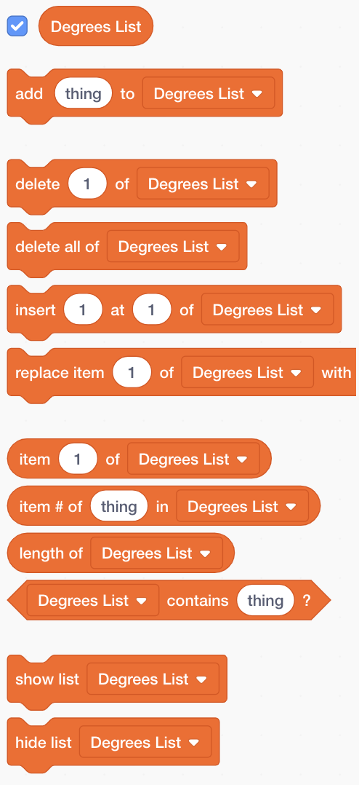
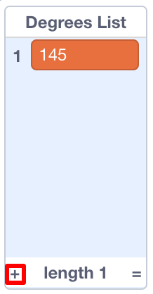

## ಕಂಪ್ಯೂಟರ್ಗೆ ಸಹಾಯ ಮಾಡುವುದು

`increase`{:class="block3variables"} ಮತ್ತು `degrees`{:class="block3variables"} ಗೋಸ್ಕರ ನಿಮ್ಮ ನೆಚ್ಚಿನ ಕೆಲವು ಮೌಲ್ಯಗಳನ್ನು ಬರೆಯಲು ನಾನು ಹೇಳಿದ ಕೆಲವು ಹೆಜ್ಜೆಗಳನ್ನು ನೀವು ನೆನಪಿಸುತ್ತೀರಾ? ಯಾವುಗಳೆಂದರೆ ಉತ್ತಮವಾಗಿ ಕಾಣುವ ನಮೂನೆಗಳನ್ನು ನೀಡಿದವುಗಳು? ನೀವು ಇದನ್ನು ಮಾಡದಿದ್ದರೆ, ಚಿಂತಿಸಬೇಡಿ: ನೀವು ಈಗ ಸ್ವಲ್ಪ ಸಮಯದವರೆಗೆ ಯಾದೃಚ್ಕ ಪ್ರೋಗ್ರಾಂ ಚಾಲನೆಯನ್ನು ವೀಕ್ಷಿಸಬಹುದು ಮತ್ತು ಉತ್ತಮ ಫಲಿತಾಂಶಗಳನ್ನು ನೀಡುವ ಸಂಯೋಜನೆಗಳನ್ನು ಬರೆಯಬಹುದು.

ಮೌಲ್ಯಗಳ ಸಂಯೋಜನೆಯನ್ನು ನೀವು Scratch ಕಲಿಸಲಿದ್ದೀರಿ, ಆದ್ದರಿಂದ ಇದು ಅದ್ಭುತವಾದ ಚಿತ್ರಗಳನ್ನು ಮಾಡಲು ಅವುಗಳನ್ನು ಬಳಸಬಹುದು!

ಇದನ್ನು ಮಾಡಲು, ನಿಮಗೆ **list** ಅಗತ್ಯವಿದೆ. **Variables** ವಿಭಾಗದಲ್ಲಿ ನೀವು ವೇರಿಯಬಲ್ಸ್ ಹೊಂದಿರುವ ಪಟ್ಟಿಗಳನ್ನು ಕಾಣಬಹುದು. ನಿಮ್ಮ ವೇರಿಯಬಲ್ಸ್ಒಂದಿಗೆ ನೀವು ಮಾಡಿದಂತೆಯೇ, ನೀವು ಮೊದಲು ನಿಮ್ಮ ಪಟ್ಟಿಯನ್ನು ರಚಿಸಬೇಕಾಗುತ್ತದೆ!

--- task ---

**Make a List** ಮೇಲೆ ಕ್ಲಿಕ್ ಮಾಡಿ, ಮತ್ತು `Degrees List`{:class="block3variables"} ಹೆಸರಾಗಿ ನಮೂದಿಸಿ.


--- /task ---

ಈ ಸಮಯದಲ್ಲಿ ಖಾಲಿಯಾಗಿರುವ ನಿಮ್ಮ ಪಟ್ಟಿ ಹಂತದಲ್ಲಿ ಗೋಚರಿಸುತ್ತದೆ, ಮತ್ತು **Variables** ನಲ್ಲಿ ನೀವು ಇದಕ್ಕಾಗಿ ಒಂದು ಗುಂಪನ್ನು ನೋಡುತ್ತೀರಿ.



--- task ---

`Increase List`{:class="block3variables"}ಎಂಬ ಇನ್ನೊಂದು ಪಟ್ಟಿಯನ್ನು ರಚಿಸಿ

--- /task ---

--- task ---

ಈಗ, ಚಿಕ್ಕ ಕೂಡಿಸು ಚಿಹ್ನೆಯನ್ನು ಕ್ಲಿಕ್ ಮಾಡುವ ಮೂಲಕ (**+**) ಪಟ್ಟಿಗಳ ಕೆಳಭಾಗದಲ್ಲಿ, `increase`{:class="block3variables"} ಮತ್ತು `degrees`{:class="block3variables"} ಗಳಲ್ಲಿ ನಿಮಗೆ ಇಷ್ಟ ಬಂದ ಮೊದಲ ಜೋಡಿ ಮೌಲ್ಯಗಳನ್ನು, ಪ್ರತಿ ಮೌಲ್ಯವು ಸರಿಯಾದ ಪಟ್ಟಿಗೆ ಸೇರುತ್ತದೆ. ಎರಡನೇ ಜೋಡಿ ಮೌಲ್ಯಗಳನ್ನು ಸೇರಿಸಲು ಇದನ್ನು ಮತ್ತೆ ಮಾಡಿ. ಇದೀಗ ಇದು ಸಾಕಾಗುತ್ತದೆ - ನೀವು ಇಷ್ಟಪಡುವ ಉಳಿದ ಮೌಲ್ಯ ಜೋಡಿಗಳನ್ನು ನಂತರ ಸೇರಿಸುತ್ತೀರಿ!



ಸರಿಯಾಗಿ ಕೆಲಸ ಮಾಡಿದ `degrees`{:class="block3variables"} ಮತ್ತು `increase`{:class="block3variables"} ಗಳ ಮೌಲ್ಯಗಳು, `Degrees List`{:class="block3variables"} ಮತ್ತು `Increase List`{:class="block3variables"} ಗಳಲ್ಲಿ ಸರಿಯಾದ ಸ್ಥಾನದಲ್ಲಿ ಇದೆ ಎಂದು ಖಚಿತಪಡಿಸಿಕೊಳ್ಳಿ. ಅವರು ಅಲ್ಲಿರಬೇಕು ಆದ್ದರಿಂದ ನಿಮ್ಮ ಪ್ರೋಗ್ರಾಂ ಅವರ ಸ್ಥಾನವನ್ನು ಬಳಸಿಕೊಂಡು ಅವುಗಳನ್ನು ಮತ್ತೆ ಹೊಂದಿಸಬಹುದು!

--- /task ---

ಈಗ ನೀವು ಪಟ್ಟಿಗಳನ್ನು ಹೊಂದಿದ್ದೀರಿ, ಅವುಗಳನ್ನು ಓದಲು ಮತ್ತು ಅವುಗಳ ಮೇಲೆ ಲೂಪ್ ಮಾಡಲು ನಿಮ್ಮ ಕೋಡ್ ಅನ್ನು ನೀವು ಹೊಂದಬೇಕು! ಇದನ್ನು ಮಾಡಲು, ನೀವು ಕೌಂಟರ್ ಆಗಿ ಕಾರ್ಯನಿರ್ವಹಿಸಲು ಹೊಸ ವೇರಿಯಬಲ್ ಅನ್ನು, ಕೆಲವು **incrementing** ಮತ್ತು `if then`{:class="block3control"} ಎಂಬ **Control** ಬ್ಲಾಕ್ ಬಳಸಲಿದ್ದೀರಿ.

--- collapse ---
---
title: ಹೆಚ್ಚಿಸುವುದರ ಅರ್ಥವೇನು?
---

ಏನನ್ನಾದರೂ ಹೆಚ್ಚಿಸಲು ಎಂದರೆ ಅದಕ್ಕೆ ಏನನ್ನಾದರೂ ಸೇರಿಸುವುದು.

ನಿಮ್ಮ ಪಟ್ಟಿಗಳಲ್ಲಿ ನೀವು ಯಾವ ಸ್ಥಾನದಲ್ಲಿದ್ದೀರಿ ಎಂಬುದನ್ನು ಗಮನದಲ್ಲಿರಿಸಿಕೊಳ್ಳಲು ಕೌಂಟರ್ ಆಗಿ ಕಾರ್ಯನಿರ್ವಹಿಸಲು ನೀವು ವೇರಿಯಬಲ್ ಅನ್ನು ಬಳಸುತ್ತೀರಿ. ಪಟ್ಟಿಗಳ ಮೂಲಕ ಚಲಿಸಲು, ನೀವು ಕೌಂಟರ್ ಅನ್ನು `1` ರಷ್ಟು ಹೆಚ್ಚಿಸುತ್ತೀರಿ (ಆದ್ದರಿಂದ, `1` ಅನ್ನು ಸೇರಿಸಲಾಗುತ್ತಿದೆ ಅದಕ್ಕೆ) ನೀವು ಪಟ್ಟಿಯ ಕೊನೆಯಲ್ಲಿ ಬರುವವರೆಗೆ.

--- /collapse ---

--- task ---

`counter`{:class="block3variables"} ಎಂಬ ಹೊಸ ವೇರಿಯಬಲ್ ಅನ್ನು ರಚಿಸಿ, ಮತ್ತು ಈ ರೀತಿ ಕಾಣಲು ನಿಮ್ಮ ಕೋಡ್ ಅನ್ನು ಬದಲಾಯಿಸಿ:

```blocks3
    when green flag clicked
    set [counter v] to [0]
    forever 
+        if <(counter) = (length of [Increase List v] :: list)> then 
+            set [counter v] to [0]
        end
+        change [counter v] by (1)
        set [steps v] to [0]
+        set [increase v] to (item (counter) of [Increase List v] :: list)
+        set [degrees v] to (item (counter) of [Degrees List v] :: list)
        pen up
        hide
        clear
        go to x: (0) y: (0)
        set pen color to [#4a6cd4]
        pen down
        repeat until <touching [edge v] ?> 
            move (steps) steps
            turn cw (degrees) degrees
            change [steps v] by (increase)
        end
    end
```

--- /task ---

ಹೊಸ ಬ್ಲಾಕ್ಗಳನ್ನು ಗಮನಿಸಿ:

1. ಎಲ್ಲಾ ಲೂಪ್ಗಳ ಹೊರಗೆ, `counter`{:class="block3variables"} ಅನ್ನು `0` ಗೆ ಹೊಂದಿಸಿ.
2. `counter`{:class="block3variables"} ಸಂಗ್ರಹವಾಗಿರುವ ಸಂಖ್ಯೆಯನ್ನು ಪಟ್ಟಿಯ ಉದ್ದವಾಗಿದೆ ಎಂಬುವುದನ್ನು ಪರಿಶೀಲಿಸಿ, ಮತ್ತು ಹಾಗಿದ್ದಲ್ಲಿ, `counter`{:class="block3variables"} ಅನ್ನು `0` ಗೆ ಹೊಂದಿಸಿ. ಇದರರ್ಥ ಈ ವೇರಿಯೇಬಲ್ ಯಾವಾಗಲೂ ಪಟ್ಟಿಗಳಲ್ಲಿ ಸ್ಥಾನದ ಸಂಖ್ಯೆಯಾಗಿರುತ್ತದೆ ಮತ್ತು ಅದಕ್ಕಿಂತ ದೊಡ್ಡದನ್ನು ಆಗುವುದಿಲ್ಲ.
3. `1` ಅನ್ನು `counter`{:class="block3variables"} ಗೆ ಸೇರಿಸಿ.
4. `Increase List`{:class="block3variables"} ನಿಂದ ಐಟಂ ಒಂದನ್ನು ಆರಿಸಿ ಅದು `counter`{:class="block3variables"} ವಿವರಿಸಿದ ಸ್ಥಾನದಲ್ಲಿದೆ, ಮತ್ತು ಅದನ್ನು `increase`{:class="block3variables"} ವೇರಿಯಬಲ್ನಲ್ಲಿ ಇರಿಸಿ. `Degrees List`{:class="block3variables"} ಮತ್ತು `degrees`{:class="block3variables"} ವೇರಿಯಬಲ್ಗೆ ಅದೇ ರೀತಿ ಮಾಡಿ.

--- collapse ---
---
title: ಕೋಡ್ ಹೇಗೆ ಕಾರ್ಯನಿರ್ವಹಿಸುತ್ತದೆ?
---

ನಿಮ್ಮ ಪ್ರೋಗ್ರಾಂ ಅನ್ನು ನೀವು ಚಲಾಯಿಸಿದಾಗ ಇದು ಸಂಭವಿಸುತ್ತದೆ:

1. `counter`{:class="block3variables"} ಅನ್ನು `0` ಗೆ ಹೊಂದಿಸುವುದು.
2. `forever`{:class="block3control"} ಲೂಪ್ ಅನ್ನು ಶುರು ಮಾಡುವುದು.
3. `counter`{:class="block3variables"} (`0`) `Increase List`{:class="block3variables"} (`2`) ಉದ್ದಕ್ಕೆ ಸಮನಾಗಿರುತ್ತದೆ ಎಂದು ಪರಿಶೀಲಿಸುವುದು. ಅದು ಅಲ್ಲ.
4. `counter`{:class="block3variables"} ಅನ್ನು `1` ಆಗಿ ಬದಲಾಯಿಸುವುದು. ಈಗ `counter`{:class="block3variables"} = `1`.
5. `steps`{:class="block3variables"}ಗಳನ್ನು `0`ಗೆ ಹೊಂದಿಸುವುದು.
6. `Increase List`{:class="block3variables"}ನಲ್ಲಿ `counter`{:class="block3variables"} (`1`)ನ ಬೆಲೆಯ ಸ್ಥಾನದಲ್ಲಿ ಐಟಂ ಪಡೆದು, ಅದನ್ನು `increase`{:class="block3variables"} ಇರಿಸುವುದು.
7. `Degrees List`{:class="block3variables"}ನಲ್ಲಿ `counter`{:class="block3variables"}(`1`)ನ ಬೆಲೆಯ ಸ್ಥಾನದಲ್ಲಿ ಐಟಂ ಪಡೆದು, `degrees`{:class="block3variables"} ನಲ್ಲಿ ಇರಿಸುವುದು.
8. ನಮೂನೆಯನ್ನು ಚಿತ್ರಿಸಲು ಸಂಬಂಧಿಸಿದ ಎಲ್ಲಾ ವಿಷಯವನ್ನು ಮಾಡುವುದು.
9. `forever`{:class="block3control"} ಲೂಪ್ ಅನ್ನು ಮತ್ತೆ ಶುರು ಮಾಡುವುದು:
10. `counter`{:class="block3variables"} (`0`) `Increase List`{:class="block3variables"} (`2`) ಉದ್ದಕ್ಕೆ ಸಮನಾಗಿರುತ್ತದೆ ಎಂದು ಪರಿಶೀಲಿಸುವುದು. ಅದು ಅಲ್ಲ.
11. `counter`{:class="block3variables"} ಅನ್ನು `1` ಆಗಿ ಬದಲಾಯಿಸುವುದು. ಈಗ `counter`{:class="block3variables"} = `2`.
12. `steps`{:class="block3variables"}ನ್ನು `0`ಗೆ ಹೊಂದಿಸುವುದು.
13. `Increase List`{:class="block3variables"}ಯಲ್ಲಿ `counter`{:class="block3variables"} (`2`) ನ ಬೆಲೆಯಸ್ಥಾನದಲ್ಲಿ ಐಟಂ ಪಡೆದು{:class= "block3variables"}, ಮತ್ತು ಅದನ್ನು `increase`{:class="block3variables"}ಗೆ ಇರಿಸುವುದು.
14. `Degrees List`{:class="block3variables"}ನಲ್ಲಿ `counter`{:class="block3variables"} (`2`)ನ ಬೆಲೆಯ ಸ್ಥಾನದಲ್ಲಿ ಐಟಂ ಪಡೆದು, ಅದನ್ನು `degrees`{:class="block3variables"} ನಲ್ಲಿ ಇರಿಸುವುದು.
15. ನಮೂನೆಗಳನ್ನು ಚಿತ್ರಿಸಲು ಸಂಬಂಧಿಸಿದ ಎಲ್ಲಾ ವಿಷಯವನ್ನು ಮಾಡುವುದು.
16. `forever`{:class="block3control"} ಲೂಪ್ ಅನ್ನು ಮತ್ತೆ ಶುರು ಮಾಡುವುದು:
17. `counter`{:class="block3variables"} (`0`) `Increase List`{:class="block3variables"}ನ ಉದ್ದಕ್ಕೆ(`2`) ಉದ್ದಕ್ಕೆ ಸಮನಾಗಿರುತ್ತದೆ ಎಂದು ಪರಿಶೀಲಿಸುವುದು. ಹೌದು!
18. `counter`{:class="block3variables"} ಅನ್ನು `0` ಗೆ ಹೊಂದಿಸುವುದು.
19. ಈ ಪಟ್ಟಿಯ **ಹಂತ 4** ರಿಂದ ಮುಂದುವರಿಸಿ, ಎಂದಿಗೂ ಮುಗಿಯದ ಲೂಪ್‌ನಲ್ಲಿ!

--- /collapse ---

--- task ---

ಒಮ್ಮೆ ನೀವು ಕೋಡ್‌ನೊಂದಿಗೆ ಸಂತೋಷಪಟ್ಟರೆ, ಮುಂದುವರಿಯಿರಿ ಮತ್ತು ನೀವು ಗಮನಿಸಿದ ಉಳಿದ ಜೋಡಿ ಮೌಲ್ಯಗಳನ್ನು `Degrees List`{:class="block3variables"} ಮತ್ತು `Increase List`{:class="block3variables"}ಗೆ ಸೇರಿಸಿ.

--- /task ---

ಅಷ್ಟೇ! ಕುಳಿತುಕೊಳ್ಳಿ ಮತ್ತು ನಿಮ್ಮ ಪ್ರೋಗ್ರಾಂ ಅನ್ನು ಎಂದಿಗೂ ಮುಗಿಯದ ಲೂಪ್‌ನಲ್ಲಿ ಸುಂದರವಾದ ನಮೂನೆಗಳನ್ನು ಚಿತ್ರಿಸುವುದನ್ನು ನೋಡಿ! ನೀವು ಹೆಚ್ಚಿನ ನಮೂನೆಗಳನ್ನು ಸೇರಿಸಲು ಬಯಸಿದರೆ, ನೀವು ಹೀಗೆ ಮಾಡಬಹುದು: ಎರಡು ಪಟ್ಟಿಗಳಿಗೆ ಹೆಚ್ಚಿನ ಜೋಡಿ ಸಂಖ್ಯೆಗಳನ್ನು ಸೇರಿಸಿ ಮತ್ತು ಪ್ರೋಗ್ರಾಂ ಅನ್ನು ಮರುಪ್ರಾರಂಭಿಸಿ.


***
ಈ ಯೋಜನೆಯನ್ನು ಸ್ವಯಂಸೇವಕರು ಅನುವಾದಿಸಿದ್ದಾರೆ:

Akhila K

V Manish

वसुंधरा

ಸ್ವಯಂಸೇವಕರಿಗೆ ಧನ್ಯವಾದಗಳು, ನಾವು ಪ್ರಪಂಚದಾದ್ಯಂತದ ಜನರಿಗೆ ತಮ್ಮ ಸ್ವಂತ ಭಾಷೆಯಲ್ಲೇ ಕಲಿಯಲು ಅವಕಾಶ ನೀಡಬಹುದು. ಹೆಚ್ಚಿನ ಜನರನ್ನು ತಲುಪಲು, ನೀವು ಅನುವಾದಿಸಲು ಸ್ವಯಂಸೇವಕರಾಗಿ, ನಮಗೆ ಸಹಾಯ ಮಾಡಬಹುದು - [rpf.io/translate](https://rpf.io/translate ನಲ್ಲಿ ಹೆಚ್ಚಿನ ಮಾಹಿತಿ.