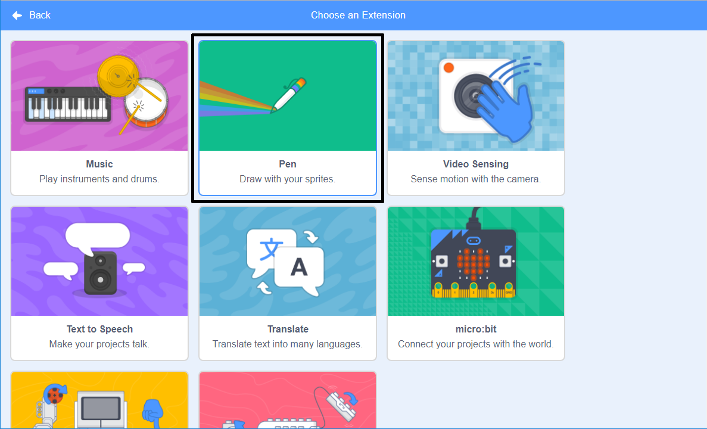

## 펜 도구 사용

여러분이 제작할 이 프로젝트는 **펜** 도구를 사용합니다. 이 도구는 스프라이트가 움직일 때 그 중심에 선을 그립니다. 당신은 지금 이 도구를 사용하는 법을 배울 것입니다!

\--- task \---

새로운 스크래치 프로젝트를 엽니다.

**온라인:** [rpf.io/scratch-new](http://rpf.io/scratch-new){:target="_ blank"}에서 새로운 온라인 스크래치 프로젝트 열기

**오프라인:** 오프라인 편집기에서 새 프로젝트를 엽니다.

스크래치 오프라인 편집기를 다운로드하여 설치해야 하는 경우 [rpf.io/scratchoff](http://rpf.io/scratchoff){: target = "_ blank"}에서 찾을 수 있습니다.

\--- /task \---

\--- task \---

새 스크래치 파일을 열고 스크래치 고양이 스프라이트를 선택한 다음, 이미 배웠던 몇 가지 블록을 드래그하여 다음과 같이 완성합니다.

```blocks3
    녹색 깃발이 클릭되었을 때
    x: (0) y: (0) 로 이동하기
    (50) 만큼 움직이기
    cw 방향으로 (15) 도 회전하기
```

\--- /task \---

이제 펜을 테스트 해 볼 시간입니다!

스크래치에서 펜 블록을 사용하려면 **펜 확장**을 추가해야 합니다.

\--- /task \---

왼쪽 하단에 **추가 확장** 버튼을 클릭 하십시오.


**펜** 확장명을 클릭하여 추가합니다.



이제 블록 메뉴 하단에 펜 메뉴가 보일 것입니다.


**펜** 카테고리에서 `펜 내리기`{:class="block3extensions"} 블록을 선택하고 다음과 같이 프로그램 시작 부분에 추가하십시오.

```blocks3
    녹색 깃발이 클릭되었을 때
+    펜 내리기
    x: (0) y: (0) 로 이동하기
```

\--- /task \---

\--- task \---

이제 녹색 깃발을 몇 번 클릭하고 어떻게 되는지 보십시오.

\--- /task \---

고양이 스프라이트 뒤에 선이 보이면 펜이 동작하고 있음을 확인할 수 있으며, 정말 멋진 패턴을 그릴 수 있습니다.

그 전에 스프라이트를 제거해야 합니다. 스프라이트가 그림 그리는 것을 방해하고 있습니다.

\--- task \---

`숨기기`{:class="block3looks"} 블록을 **형태** 카테고리에서 찾아, 프로그램을 시작하자마자 스프라이트가 제거되도록 하세요.

```blocks3
    녹색 깃발이 클릭되었을 때
+ 숨기기
    펜 내리기
```

\--- /task \---

이제 **펜** 카테고리에서 다른 블록을 사용하여 펜의 색상을 변경하겠습니다. 이 블록은 다른 블록과 사용이 조금 다릅니다. `펜 색깔을 으로 정하기`{:class="block3extensions"} 블록이고 아래와 같이 보입니다:

```blocks3
    펜 색깔을 [#4a6cd4] (으) 로 정하기
```

\--- task \---

위에서 작성한 코드에 `펜 색깔을 으로 정하기`{:class="block3extensions"} 블록을 드래그하여, `펜 내리기`{:class="block3extensions"} 블록 위쪽에 결합합니다.

```blocks3
    녹색 깃발이 클릭되었을 때
    숨기기
+ 펜 색깔을 [# 4a6cd4] 으로 정하기
    펜 내리기
```

이제 색상 상자를 클릭하고 (위의 코드에서 파란색 상자) 색상을 선택하십시오.

\--- /task \---

녹색 깃발을 클릭하여 코드를 테스트를 해 보세요. 그러면, 위에서 테스트한 펜으로 만든 그림이 사라지지 않는 것을 알 수 있습니다.

\--- task \---

**펜** 블록으로 작성한 코드 시작 부분에 `모두 지우기`{:class="block3extensions"} 블록을 추가합니다.

```blocks3
    녹색 깃발이 클릭되었을 때
+ 모두 지우기
    숨기기
```

\--- /task \---