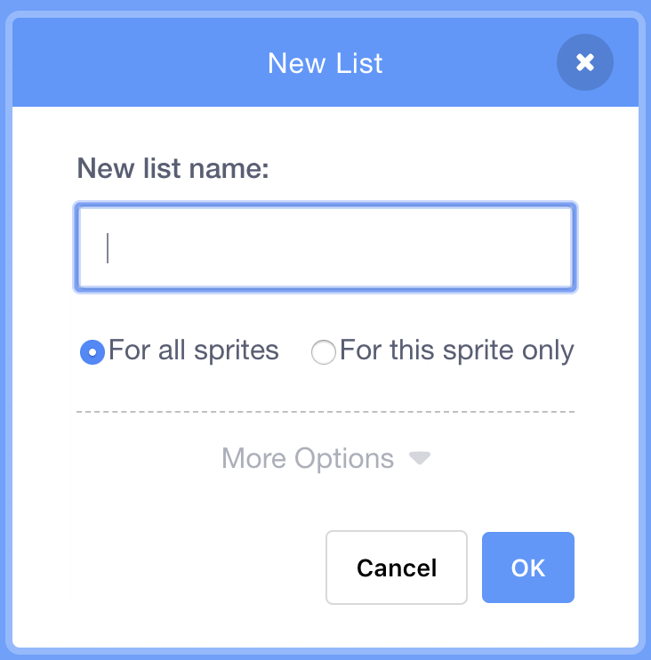

## 컴퓨터를 도와주기

이번 단계에서 우리는 `increase`{:class="block3variables"} 변수와 `degrees`{:class="block3variables"} 변수의 적절한 조합을 찾아내야 합니다. 이 작업을 수행하지 않았다면 걱정하지 마십시오. 지금 잠시동안 무작위 프로그램이 실행되는 것을 보고 좋은 결과를 도출하는 조합을 적어 두십시오.

스크래치에게 값 조합을 알려주어 멋진 그림만 만들 수 있습니다!

이렇게 하려면 **리스트가 필요합니다.** 리스트는 **변수** 카테고리에서 찾을 수 있습니다. 변수와 마찬가지로, 먼저 리스트를 만들어야합니다!

\--- task \---

Click **Make a List**, and enter `Degrees List`{:class="block3variables"} as the name.



\--- /task \---

Your list, which is empty at the moment, will appear on the Stage, and you'll see a bunch of blocks for it in **Variables**.


\--- task \---

Make another list called `Increase List`{:class="block3variables"}

\--- /task \---

\--- task \---

Now, by clicking on the little plus sign (**+**) at the bottom of the lists, add in the first pair of values of `increase`{:class="block3variables"} and `degrees`{:class="block3variables"} you liked, each value into the right list. Do this again to add the second pair of values. This will be enough for now — you'll add the rest of the value pairs you like later!


Make sure that the `degrees`{:class="block3variables"} value and the `increase`{:class="block3variables"} value that worked well together are at the same position in the `Degrees List`{:class="block3variables"} and the `Increase List`{:class="block3variables"}. They need to be there so your program can match them up again using their position!

\--- /task \---

Now you have the lists, you just need to get your code to read them and loop over them! To do this, you’re going to use a new variable to act as a counter, some **incrementing**, and an `if then`{:class="block3control"} **Control** block.

## \--- collapse \---

## 제목: 증가하는 것은 무엇을 의미합니까?

To increment something means to add something to it.

You will use a variable to act as a counter to keep track of what position you're at in your lists. To move through the lists, you'll keep incrementing the counter by `1` (so, adding `1` to it) until you get to the end of the list.

\--- /collapse \---

\--- task \---

Create a new variable called `counter`{:class="block3variables"}, and update your code to look like this:

```blocks3
    녹색 깃발이 클릭되었을 때
   [counter v] 를 [0] 로 정하기
    무한 반복
+        만약 <(counter) = (length of [Increase List v] :: list)> 이라면 
+           [counter v] 를 [0] 로 정하기
        끝
+       [counter v] 를 (1) 로 정하기
       [steps v] 를 [0] 로 정하기
+        [increase v] 를 (item (counter) of [Increase List v] :: list) 로 정하기
+        [degrees v] 를 (item (counter) of [Degrees List v] :: list) 로 정하기
        펜 올리기
        숨기기
        모두 지우기
        x: (0) y: (0) 로 이동
        펜 색깔을 [#4a6cd4] 로 정하기
        펜 내리기
        <touching [edge v] ?> 까지 반복하기
            (steps) 만큼 움직이기
            cw 방향으로 (degrees) 도 회전하기
            [steps v] 를 (increase) 만큼 바꾸기
        끝
    끝
```

\--- /task \---

Notice the new blocks that:

1. `counter`{:class="block3variables"} 를 `0`으로 설정.
2. `counter`{:class="block3variables"} 에 저장된 수를 확인. 이 변수는 리스트의 길이이고, `counter`{:class="block3variables"} 변수를 `0`으로 정함. 즉, 이 변수는 항상 리스트의 위치 번호가 되며 그보다 더 커지지는 않습니다.
3. `counter`{:class="block3variables"} 에 `1` 추가
4. `Increase List`{:class="block3variables"}에서 자료 추출하기. 자료 추출 인덱스는 `counter`{:class="block3variables"} 변수에 의함. 꺼낸 자료는 `increase`{:class="block3variables"} 변수에 저장. 이 작업을 `Degrees List`{:class="block3variables"} 에서도 반복하는데, `degrees`{:class="block3variables"} 변수에 저장.

## \--- collapse \---

## title: 어떻게 동작하나요?

This is what happens when you run your program:

1. `counter`{:class="block3variables"} 를 `0`으로 설정.
2. 이 작업을 `무한 반복하기`{:class="block3control"}로 설정
3. `counter`{:class="block3variables"} (`0`) 가 `Increase List`{:class="block3variables"} (`2`)와 같은 값을 가지고 있는지 확인 그렇지 않다면
4. `counter`{:class="block3variables"} 를 `1` 로 변경. 이제 `counter`{:class="block3variables"} = `1`이 됩니다.
5. `steps`{:class="block3variables"} 를 `0`으로 설정.
6. `counter`{:class="block3variables"} (`1`) 위치의`Increase List`{:class="block3variables"} 값을 추출해 `increase`{:class="block3variables"}에 저장.
7. `counter`{:class="block3variables"} (`1`) 위치의 `Degrees List`{:class="block3variables"} 값을 추출해 `degrees`{:class="block3variables"}에 저장.
8. 패턴 그리기와 관련된 모든 작업을 수행하십시오.
9. 다시 `무한 반복`{:class="block3control"}
10. `counter`{:class="block3variables"} (`1`) 가 `Increase List`{:class="block3variables"} (`2`)와 같은 값을 가지고 있는지 확인 그렇지 않다면
11. `counter`{:class="block3variables"} 를 `1` 로 변경. 이제 `counter`{:class="block3variables"} = `2`가 됩니다.
12. `steps`{:class="block3variables"} 를 `0`으로 설정.
13. `counter`{:class="block3variables"} (`2`) 위치의 `Increase List`{:class="block3variables"} 값을 추출해 `increase`{:class="block3variables"}에 저장.
14. `counter`{:class="block3variables"} (`2`) 위치의 `Degrees List`{:class="block3variables"} 값을 추출해 `degrees`{:class="block3variables"}에 저장.
15. 패턴 그리기와 관련된 모든 작업을 수행하십시오.
16. 다시 `무한 반복`{:class="block3control"}
17. `counter`{:class="block3variables"} (`2`) 가 `Increase List`{:class="block3variables"} (`2`)와 같은 값을 가지고 있는지 확인 그것은
18. `counter`{:class="block3variables"} 를 `0`으로 설정.
19. **4단계** 반복!

\--- /collapse \---

\--- task \---

Once you're happy with the code, go ahead and add the rest of the pairs of values you noted down to the `Degrees List`{:class="block3variables"} and the `Increase List`{:class="block3variables"}.

\--- /task \---

That's it! Sit back and watch your program keep drawing lovely patterns in a never-ending loop! If you want to add more patterns, you can: just add more pairs of numbers to the two lists and restart the program.