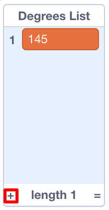

## 컴퓨터를 도와주기

이번 단계에서 우리는 `increase`{:class="block3variables"} 변수와 `degrees`{:class="block3variables"} 변수의 적절한 조합을 찾아내야 합니다. 이 작업을 수행하지 않았다면 걱정하지 마십시오. 지금 잠시동안 무작위 프로그램이 실행되는 것을 보고 좋은 결과를 도출하는 조합을 적어 두십시오.

스크래치에게 값 조합을 알려주어 멋진 그림만 만들 수 있습니다!

이렇게 하려면 **리스트가 필요합니다.** 리스트는 **변수** 카테고리에서 찾을 수 있습니다. 변수와 마찬가지로, 먼저 리스트를 만들어야합니다!

--- task --- **리스트 만들기**를 클릭하고, `Degrees List`{:class="block3variables"} 를 이름으로 정하세요.


--- /task ---

현재 비어있는 목록이 스테이지에 표시되며 **변수에 여러 개의 블록이 표시됩니다**.


--- task --- `Increase List`{:class="block3variables"} 라는 이름을 가진 또 다른 리스트를 만드세요. --- /task ---

--- task --- 이제, 왼쪽 하단에 있는 더하기 기호 (**+**) 를 클릭하여, `increase`{:class="block3variables"} 와 `degrees`{:class="block3variables"} 리스트에 적절한 값을 넣으세요. 두 번째 값을 추가하려면 이 작업을 다시 수행하십시오. 지금은 이것으로 충분할 것입니다. 나중에 당신이 좋아하는 나머지 값을 추가하면 됩니다!



`degrees`{:class="block3variables"} 의 값과 `increase`{:class="block3variables"} 의 값은 항상 `Degrees List`{:class="block3variables"} 과 `Increase List`{:class="block3variables"} 리스트 둘 다 같은 위치에 있어야 합니다. 이렇게 해야만 프로그램이 위치를 정확히 파악할 수 있습니다.

--- /task ---

이제 리스트가 생기면 코드를 읽고 루프를 반복하면 됩니다. 이렇게 하려면 새 변수를 사용하여 카운터 역할을 수행하도록 합니다. **증가하는 변수를 만들고**, **제어** 블록의 `만약 이라면`{:class="block3control"} 블록으로 판별합니다.

--- collapse ---
---
title: 증가하는 것은 무엇을 의미합니까?
---

무언가를 증가시키는 것은 그것에 무언가를 추가하는 것을 의미합니다.

변수를 사용하여 카운터 역할을하면 목록에서 어떤 위치에 있는지 알아낼 수 있습니다. 리스트 인덱스를 이동하려면 리스트의 끝까지 도달할 때까지 카운터를 `1` 씩 증가합니다. (변수에 `1` 을 추가)

--- /collapse ---

--- task --- `counter`{:class="block3variables"}, 변수를 추가하고 아래와 같이 코드를 업데이트 하세요.

```blocks3
    녹색 깃발이 클릭되었을 때
   [counter v] 를 [0] 로 정하기
    무한 반복
+        만약 <(counter) = (length of [Increase List v] :: list)> 이라면 
+           [counter v] 를 [0] 로 정하기
        끝
+       [counter v] 를 (1) 로 정하기
       [steps v] 를 [0] 로 정하기
+        [increase v] 를 (item (counter) of [Increase List v] :: list) 로 정하기
+        [degrees v] 를 (item (counter) of [Degrees List v] :: list) 로 정하기
        펜 올리기
        숨기기
        모두 지우기
        x: (0) y: (0) 로 이동
        펜 색깔을 [#4a6cd4] 로 정하기
        펜 내리기
        <touching [edge v] ?> 까지 반복하기
            (steps) 만큼 움직이기
            cw 방향으로 (degrees) 도 회전하기
            [steps v] 를 (increase) 만큼 바꾸기
        끝
    끝
```

--- /task ---

새로운 블록은 다음과 같습니다:

1. `counter`{:class="block3variables"} 를 `0`으로 설정.
2. `counter`{:class="block3variables"} 에 저장된 수를 확인. 이 변수는 리스트의 길이이고, `counter`{:class="block3variables"} 변수를 `0`으로 정함. 즉, 이 변수는 항상 리스트의 위치 번호가 되며 그보다 더 커지지는 않습니다.
3. `counter`{:class="block3variables"} 에 `1` 추가
4. `Increase List`{:class="block3variables"}에서 자료 추출하기. 자료 추출 인덱스는 `counter`{:class="block3variables"} 변수에 의함. 꺼낸 자료는 `increase`{:class="block3variables"} 변수에 저장. 이 작업을 `Degrees List`{:class="block3variables"} 에서도 반복하는데, `degrees`{:class="block3variables"} 변수에 저장.

--- collapse ---
---
title: 어떻게 동작하나요?
---

이것은 프로그램을 실행할 때 일어나는 일입니다:

1. `counter`{:class="block3variables"} 를 `0`으로 설정.
2. 이 작업을 `무한 반복하기`{:class="block3control"}로 설정
3. `counter`{:class="block3variables"} (`0`) 가 `Increase List`{:class="block3variables"} (`2`)와 같은 값을 가지고 있는지 확인 그렇지 않다면
4. `counter`{:class="block3variables"} 를 `1` 로 변경. 이제 `counter`{:class="block3variables"} = `1`이 됩니다.
5. `steps`{:class="block3variables"} 를 `0`으로 설정.
6. `counter`{:class="block3variables"} (`1`) 위치의`Increase List`{:class="block3variables"} 값을 추출해 `increase`{:class="block3variables"}에 저장.
7. `counter`{:class="block3variables"} (`1`) 위치의 `Degrees List`{:class="block3variables"} 값을 추출해 `degrees`{:class="block3variables"}에 저장.
8. 패턴 그리기와 관련된 모든 작업을 수행하십시오.
9. 다시 `무한 반복`{:class="block3control"}
10. `counter`{:class="block3variables"} (`1`) 가 `Increase List`{:class="block3variables"} (`2`)와 같은 값을 가지고 있는지 확인 그렇지 않다면
11. `counter`{:class="block3variables"} 를 `1` 로 변경. 이제 `counter`{:class="block3variables"} = `2`가 됩니다.
12. `steps`{:class="block3variables"} 를 `0`으로 설정.
13. `counter`{:class="block3variables"} (`2`) 위치의 `Increase List`{:class="block3variables"} 값을 추출해 `increase`{:class="block3variables"}에 저장.
14. `counter`{:class="block3variables"} (`2`) 위치의 `Degrees List`{:class="block3variables"} 값을 추출해 `degrees`{:class="block3variables"}에 저장.
15. 패턴 그리기와 관련된 모든 작업을 수행하십시오.
16. 다시 `무한 반복`{:class="block3control"}
17. `counter`{:class="block3variables"} (`2`) 가 `Increase List`{:class="block3variables"} (`2`)와 같은 값을 가지고 있는지 확인 그것은
18. `counter`{:class="block3variables"} 를 `0`으로 설정.
19. **4단계** 반복!

--- /collapse ---

--- task --- 이 코드에 만족한다면 `Degrees List`{:class="block3variables"} 과 `Increase List`{:class="block3variables"} 에 값을 추가하세요. --- /task ---

끝났습니다! 이제 프로그램이 끝이 없는 무한루프에서 멋진 패턴을 그리는 것을 지켜보십시오! 더 많은 패턴을 추가하려면 다음과 같이 할 수 있습니다. 두 개의 목록에 숫자를 더 추가하고 프로그램을 다시 시작하십시오.


커뮤니티 기여 번역

이 프로젝트는 강태원 가 번역하였고 서유경 가 검토하였습니다.

우리의 놀라운 번역 자원 봉사자들은 전 세계의 어린이들에게 코딩을 배울 수 있는 기회를 제공합니다. 우리 프로젝트 번역에 참여하여 더 많은 아이들에게 도움을 줄 수 있습니다. 자세한 내용은 [rpf.io/translate](https://rpf.io/translate)에서 확인하세요.