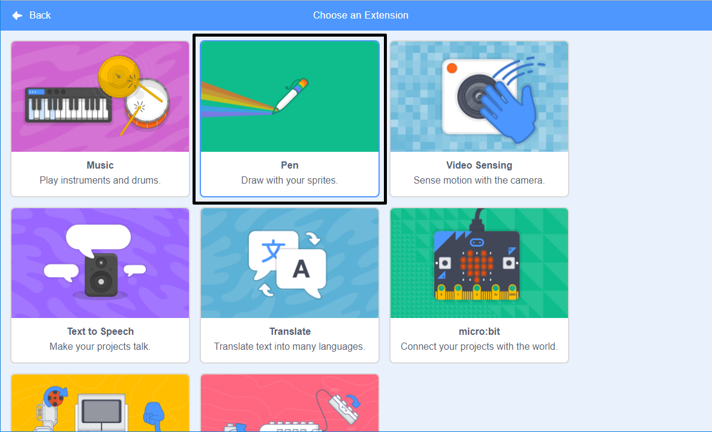
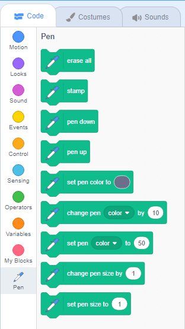

## पेन (Pen) टूल वापरणे

आपण ज्या प्रकल्पात काम करणार आहात ते **Pen** टूलवर अवलंबून आहे, जे फिरणाऱ्या sprite च्या, मध्यभागाच्या मागील बाजूस, रेष रेखाटते. आपण आता हे वापरायला शिकणार आहोत!

--- task ---

एक नवीन रिक्त Scratch प्रोजेक्ट उघडा.

**ऑनलाईन:** [rpf.io/scratch-new](http://rpf.io/scratch-new){:target="_blank"} वर एक नवीन ऑनलाइन scratch प्रकल्प उघडा.

**ऑफलाइन:** ऑफलाइन संपादकात एक नवीन प्रकल्प उघडा.

आपल्याला Scratch ऑफलाइन संपादक डाउनलोड आणि स्थापित करण्याची आवश्यकता असल्यास, आपण [rpf.io/scratchoff](http://rpf.io/scratchoff){:target="_blank"} वर शोधू शकता.

--- /task ---

--- task ---

एक नवीन Scratch फाइल उघडा, Scratch मांजर sprite निवडा, आणि जोपर्यंत हे असे दिसत नाही तो पर्यन्त आपण आधी पाहिलेले काही ब्लॉक्स ओढा:

```blocks3
    when green flag clicked
    go to x: (0) y: (0)
    move (50) steps
    turn cw (15) degrees
```

--- /task ---

आता तुमचा पेन तपासण्याची वेळ आली आहे!

Scratch मधील पेन ब्लॉक्स वापरण्यासाठी आपल्याला **Pen extension** जोडावा लागेल.

--- task ---

तळाशी डाव्या हाताच्या कोपर्यात असलेल्या **Add extension** बटण क्लिक करा.


जोडण्यासाठी **pen** विस्तारावर क्लिक करा.



पेन विभाग नंतर ब्लॉक मेनूच्या तळाशी दिसतो.



**Pen** विभागातून, `Pen down`{:class="block3extensions"} ब्लॉक निवडा आणि आपल्या प्रोग्रामच्या सुरुवातीस अश्या प्रकारे जोडा:

```blocks3
    when green flag clicked
+    pen down
    go to x: (0) y: (0)
```

--- /task ---

--- task ---

आता काही वेळा हिरव्या झेंड्यावर क्लिक करा आणि काय होते ते पहा.

--- /task ---

जर आपण sprite मांजरीच्या मागे रेषा पाहू शकत असाल तर पेन काम करत आहे आणि आपण छान नमुने तयार करण्यास सुरु करू शकता.

प्रथम, आपण sprite पासून सुटका करून घेऊया. हे चित्र काढण्याच्या मार्गात अडथळा आहे!

--- task ---

ह्याकरिता **Looks** मधून `hide`{:class="block3looks"} ब्लॉक प्रोग्रॅमच्या सुरुवातीला जोडा आणि ते अद्रुश्य होईल.

```blocks3
    when green flag clicked
+    hide
    pen down
```

--- /task ---

आता आपण **Pen** विभागा मधून दुसर्‍या ब्लॉकसह पेनचा रंग बदलू शकतो, परंतु आपण पाहिलेल्या इतरांपेक्षा हा ब्लॉक थोडा वेगळा आहे. ह्या करीता `set pen color to`{:class="block3extensions"} हा ब्लॉक निवडा जो असा दिसेल:

```blocks3
    set pen color to [#4a6cd4]
```

--- task ---

हा `set pen color to`{:class="block3extensions"} ब्लॉक आपल्या स्प्राइट पॅनेलमध्ये `pen down`{:class="block3extensions"} ह्या ब्लॉक वर जोडा.

```blocks3
    when green flag clicked
    hide
+    set pen color to [#4a6cd4]
    pen down
```

आता, रंगाच्या बॉक्सवर क्लिक करा (वरील कोडमध्ये तो निळा आहे), आणि एक रंग निवडा.

--- /task ---

आपल्या कोडची चाचणी करण्यासाठी आपण हिरव्या झेंड्यावर क्लिक करत असाल तर आपल्या लक्षात आले असेल की पेनने काढलेले रेखाचित्र निघत नाहीत.

--- task ---

ह्याकरीता **Pen** विभागातून `clear`{:class="block3extensions"} ब्लॉक कोडच्या सुरुवातीला जोडा:

```blocks3
    when green flag clicked
+    clear
    hide
```

--- /task ---