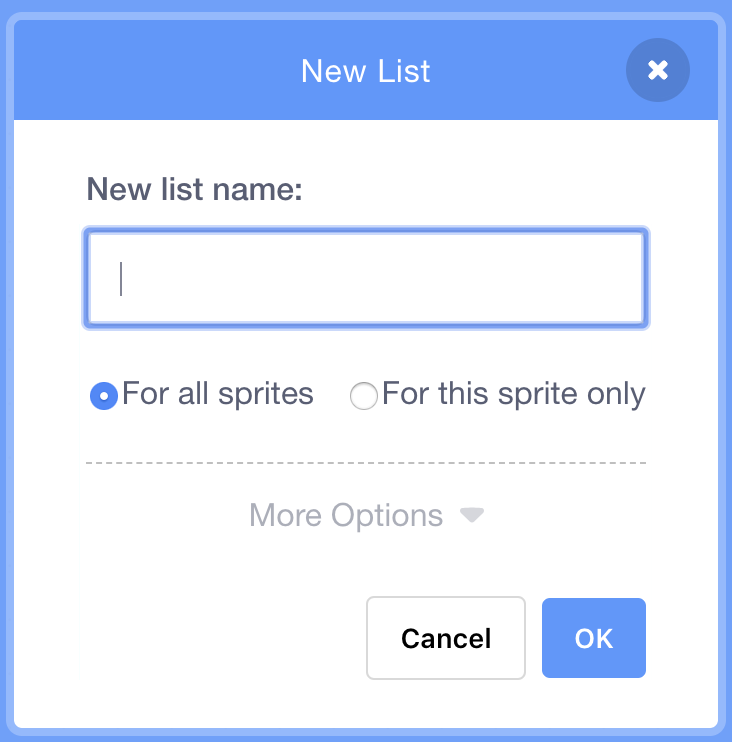

## संगणकास मदत करणे

तुम्हाला आठवते का, थोडं आधी मी तुम्हाला तुमच्या आवडीच्या काही व्हॅल्यूएस, ज्याने सर्वात चांगले दिसणारे नमुने तयार होतील, त्यांना `increase`{:class="block3variables"} आणि `degrees`{:class="block3variables"} साठी लिहायला सांगितले होते? आपण हे केले नसल्यास काळजी करू नका: आपण आता थोडा वेळ वेगवेगळे प्रोग्रॅम चालू करून पाहू शकता आणि चांगले परिणाम देणारी संयोजने लिहू शकता.

आपण त्या मूल्यांचे संयोजन Scratch ला शिकवणार आहोत, जेणेकरून त्यांचा उपयोग छान चित्र रेखाटायला होऊ शकेल!

हे करण्यासाठी, आपल्याला **list** ची आवश्यकता भासेल. आपणास व्हेरिएबल्स ची सूची **Variables** विभागात सापडेल. जसे आपण आपल्या व्हेरिएबल्स साठी केले, त्याचप्रमाणे आपल्याला प्रथम आपली सूची तयार करण्याची आवश्यकता आहे!

\--- task \---

**Make a List** वर क्लिक करा, आणि `Degrees List`{:class="block3variables"} असे नाव लिहा.



\--- /task \---

तुमची यादी, जी याक्षणी रिक्त आहे ती स्टेजवर दिसून येईल आणि त्यासाठी तुम्हाला **Variables** मध्ये ब्लॉक्सचा एक समूह दिसेल.


\--- task \---

`Increase List`{:class="block3variables"} नावाचीअजून एक सूची तयार करा

\--- /task \---

\--- task \---

आता, सूचीच्या तळाशी असलेल्या छोट्या अधिक चिन्हावर क्लिक करून (** + **), आपल्याला आवडलेली, `increase`{:class="block3variables"} आणि `degrees`{:class="block3variables"} ह्याची पहिली जोडी, उजव्या बाजूच्या सूचीमध्ये जोडा. व्हॅल्यूएस ची दुसरी जोडी जोडण्यासाठी हे पुन्हा करा. हे आता पुरेसे आहे - आपण नंतर आपल्याला आवडलेल्या व्हॅल्यूएस च्या जोड्या वापरूया!


`degrees`{:class="block3variables"} आणि `increase`{:class="block3variables"} च्या ज्या व्हॅल्यूएस एकत्र सुरळीत काम करत होत्या त्या `Degrees List`{:class="block3variables"} आणि `Increase List`{:class="block3variables"} मध्ये समान स्थानावर आहेत ह्याची खात्री घ्या. आपला प्रोग्राम त्यांची स्थिती तपासून पुन्हा त्यांना एकत्र वापरू शकेल या साठी त्यांना तिथे असणे आवश्यक आहे!

\--- /task \---

आपल्याकडे सूची तयार आहेत, आता फक्त आपल्या कोडला ते वाचून त्यावर लूप घ्यायला लावावे लागेल! हे करण्यासाठी, काही **incrementing**, आणि एक `if then`{:class="block3control"} **Control** ब्लॉक वापरुन, आपण काउंटर म्हणून कार्य करण्यासाठी नवीन व्हेरिएबल वापरणार आहोत.

## \--- collapse \---

## title: वाढीचा (incrementing) अर्थ काय?

काहीतरी वाढविणे (increment) म्हणजे आहे त्यामध्ये काहीतरी जोडणे.

आपण आपल्या सूचीमध्ये कोणत्या स्थानावर आहोत, ह्याचा मागोवा घेण्यासाठी, काउंटर म्हणून कार्य करणारा एक व्हेरिएबल वापरणार आहोत. सूचीतून जाण्यासाठी आपण काउंटर `1` ने वाढवत रहाल (`1` जोडत रहाल) जोपर्यंत आपण सूचीच्या शेवट पर्यंत पोहोचत नाही.

\--- /collapse \---

\--- task \---

`counter`{:class="block3variables"} नावाचे एक नवीन व्हेरिएबल तयार करा आणि आपला कोड पुढील प्रमाणे तयार करा:

```blocks3
    when green flag clicked
    set [counter v] to [0]
    forever 
+        if <(counter) = (length of [Increase List v] :: list)> then 
+            set [counter v] to [0]
        end
+        change [counter v] by (1)
        set [steps v] to [0]
+        set [increase v] to (item (counter) of [Increase List v] :: list)
+        set [degrees v] to (item (counter) of [Degrees List v] :: list)
        pen up
        hide
        clear
        go to x: (0) y: (0)
        set pen color to [#4a6cd4]
        pen down
        repeat until <touching [edge v] ?> 
            move (steps) steps
            turn cw (degrees) degrees
            change [steps v] by (increase)
        end
    end
```

\--- /task \---

नवीन ब्लॉक्स लक्षात घ्या:

1. सर्व लूप्स बाहेर `counter`{:class="block3variables"} ला `0` सेट करा.
2. `counter`{:class="block3variables"} मध्ये संचयित केलेली संख्या आणि सूचीची लांबी, दोन्ही समान आहेत का हे तपासा, आणि तसे असल्यास, `counter`{:class="block3variables"} ला `0` असे अंकित करा. याचा अर्थ असा की हा व्हेरिएबल, सूचीमधील एखाद्या संख्येच्या जागेचे प्रतिनिधित्व करेल आणि त्यापेक्षा मोठा होणार नाही.
3. `counter`{:class="block3variables"} ला `1` जोडा.
4. `counter`{:class="block3variables"} मध्ये वर्णन केलेल्या स्थिती मधून `Increase List`{:class="block3variables"} द्वारे आयटम निवडा आणि `increase`{:class="block3variables"} व्हेरिएबल मध्ये जोडा. `Degrees List`{:class="block3variables"} आणि `degrees`{:class="block3variables"} व्हेरिएबल साठी देखील असेच करा.

## \--- collapse \---

## title: कोड कार्य कसे करतो?

आपण आपला प्रोग्राम चालविता तेव्हा पुढील होते:

1. `counter`{:class="block3variables"} ला `0` वर सेट करा.
2. `forever`{:class="block3control"} लूप सुरु करा.
3. `counter`{:class="block3variables"} (`0`) ची लांबी `Increase List`{:class="block3variables"} (`2`) एवढीच आहे कि नाही ते तपासून घ्या. लांबी समान नाही.
4. `counter`{:class="block3variables"} ला `1` नि बदला. आता `counter`{:class="block3variables"} = `1`.
5. `steps`{:class="block3variables"} ला `0` वर सेट करा.
6. `Increase List`{:class="block3variables"} मधील `counter`{:class="block3variables"} (`1`) जागेवरील आयटमला `increase`{:class="block3variables"} मध्ये ठेवा.
7. `Degrees List`{:class="block3variables"} मधील `counter`{:class="block3variables"} (`1`) जागेवरील आयटमला `degrees`{:class="block3variables"} मध्ये ठेवा.
8. नमुन्यांच्या रेखांकन संबंधित सर्व गोष्टी करा.
9. `forever`{:class="block3control"} लूप परत सुरु करा:
10. `counter`{:class="block3variables"} (`1`) ची लांबी `Increase List`{:class="block3variables"} (`2`) एवढीच आहे कि नाही ते तपासून घ्या. लांबी समान नाही.
11. `counter`{:class="block3variables"} ला `1` नि बदला. आता `counter`{:class="block3variables"} = `2`.
12. `steps`{:class="block3variables"} ला `0` सेट करा.
13. `Increase List`{:class="block3variables"} मधील `counter`{:class="block3variables"} (`2`) नावाच्या आयटमला `increase`{:class="block3variables"} मध्ये ठेवा.
14. `Degrees List`{:class="block3variables"} मधील `counter`{:class="block3variables"} (`2`) या जागेवरील आयटमला `degrees`{:class="block3variables"} मध्ये ठेवा.
15. नमुन्यांच्या रेखांकन संबंधित सर्व गोष्टी करा.
16. `forever`{:class="block3control"} लूप परत सुरु करा:
17. `counter`{:class="block3variables"} (`2`) ची लांबी `Increase List`{:class="block3variables"} (`2`) एवढीच आहे कि नाही ते तपासून घ्या. लांबी समान आहे!
18. `counter`{:class="block3variables"} ला `0` वर सेट करा.
19. कधीही न संपणार्‍या लूपमध्ये जाण्यासाठी, ह्या सूचीमधील **step 4** पासून चालू ठेवा!

\--- /collapse \---

\--- task \---

एकदा आपण कोड बघून समाधानी असाल तर पुढे जा आणि यादीमध्ये नमूद केलेल्या उर्वरित व्हेल्यूस च्या जोड्या `Degrees List`{:class="block3variables"} आणि `Increase List`{:class="block3variables"} ला जोडा.

\--- /task \---

बस एवढेच! निवांत बसा आणि आपला प्रोग्राम कधीही न संपणार्‍या लूपमध्ये सुंदर नमुने रेखाटताना पहा! आपण अधिक नमुने जोडू इच्छित असल्यास, आपण हे करू शकता: फक्त दोन सूचीमध्ये अधिक जोड्या जोडा आणि प्रोग्राम पुन्हा सुरू करा.