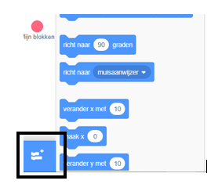

## De Pen gebruiken

Het project dat je gaat maken gebruikt de **Pen**, die een lijn tekent achter het midden van een sprite terwijl die beweegt. We gaan je leren hoe je het gebruikt!

--- task --- Open een nieuw Scratch bestand, selecteer de Kat sprite en codeer hem met blokken die je al kent, tot het er zo uit ziet:

```blocks3
    wanneer op groene vlag wordt geklikt
ga naar x: (0) y: (0)
neem (50) stappen
draai (15) graden naar rechts
```

--- /task ---

Nu gaan we de pen uittesten!

Om de Pen blokken in Scratch te gebruiken, moet je de **Pen uitbreiding** toevoegen.

--- task --- Klik op de **Voeg een uitbreiding toe** knop linksonder in de hoek.



Klik op de **Pen** uitbreiding om het toe te voegen.


De Pen blokken verschijnen dan onderaan het blokkenmenu.


Uit het **Pen** gedeelte, kies het `pen neer`{:class="block3extensions"} blok en voeg het aan het begin van je code toe:

```blocks3
    wanneer groene vlag wordt aangeklikt
+    pen neer
ga naar x: (0) y: (0)
```

--- /task ---

--- task --- Klik nu een paar keer op de groene vlag en kijk wat er gebeurt. --- /task ---

Als je lijnen achter de kat ziet, dan werkt de pen en kun je beginnen met het maken van gave patronen.

Eerst moet je de sprite verwijderen. Het zit de tekening in de weg!

--- task --- Voeg een `verdwijn`{:class="block3looks"} blok toe uit **Uiterlijken** aan het begin van de code en de kat zal verdwijnen.

```blocks3
    wanneer groene vlag wordt aangeklikt
+   verdwijn
pen neer
```

--- /task ---

Nu kun je de kleur van de pen veranderen met een ander blok uit het **Pen** gedeelte, maar het ziet er anders uit dan andere blokken die je gezien hebt. Het is het `maak penkleur`{:class="blocks3extensions} blok en ziet er zo uit:

```blocks3
    maak penkleur [#4a6cd4]
```

--- task --- Sleep een `maak penkleur`{:class="blocks3extensions"} blok naar je werkgebied en zet het vast boven het `pen neer`{:class="blocks3extensions"} blok.

```blocks3
    wanneer groene vlag wordt aangeklikt
verdwijn
+ maak penkleur [#4a6cd4]
pen neer
```

Klik nu in het vak met de kleur (in onze code is het blauw) en kies een kleur. --- /task ---

Als je de code hebt getest door op de groene vlag te klikken, zul je gezien hebben dat de gemaakte tekeningen niet verdwijnen.

--- task --- Voeg een `wis alles`{:class="block3extensions"} blok uit het **Pen** gedeelte toe aan het begin van je code om dat op te lossen:

```blocks3
    wanneer groene vlag wordt aangeklikt
+   wis alles
verdwijn
```

--- /task ---