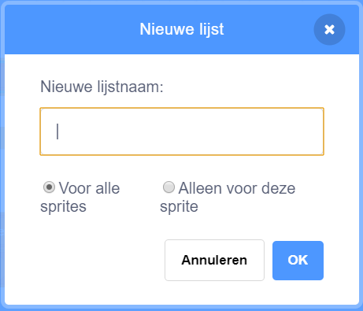

## De computer helpen

Weet je nog, een paar stappen terug, waar ik je vroeg om een paar van je favoriete getallen op te schrijven voor `toename`{:class="block3variables"} en `graden`{:class="block3variables"}, de getallen met de mooiste patronen? Als je dit niet gedaan hebt, geen paniek: je kunt het willekeurige programma een tijdje laten lopen en die combinaties opschrijven die mooie resultaten geven.

Je gaat Scratch een aantal van deze getallen combinaties aanleren, zodat het die gebruikt om alleen maar geweldige tekeningen te maken!

Hiervoor heb je een **lijst** nodig. Je vindt lijsten bij de variabelen in het **Variabelen** gedeelte. Net zoals je deed bij de variabelen, moet je eerst je eigen lijst maken!

--- task --- Klik **Maak een lijst**, en typ `Gradenlijst`{:class="block3variables"} als de naam.



--- /task ---

Jouw lijst, die nu leeg is, komt tevoorschijn op het Speelveld, en je ziet een aantal blokken ervoor in **Variabelen**.


--- task --- Maak nog een lijst genaamd `Toenamelijst`{:class="block3variables"}

--- task --- Door op het kleine plustekentje (**+**) onderaan de lijst te klikken voeg je de eerste getallencombinatie toe voor `toename`{:class="block3variables"} en `graden`{:class="block3variables"}, elk getal in de juiste lijst. Doe dit ook met de tweede getallen combinatie. Dat is eerst wel even genoeg - je andere favoriete getallen combinaties voeg je later toe!


Zorg dat het `graden`{:class="block3variables"} getal en het `toename`{:class="block3variables"} getal dat goed werkte op dezelfde positie staan in de `Gradenlijst`{:class="block3variables"} en de `Toenamelijst`{:class="block3variables"}. Ze moeten daar staan zodat je programma ze weer kan laten overeenkomen met behulp van hun positie!

--- /task ---

Nu je de lijsten hebt moet je zorgen dat de code ze leest en ze blijft herhalen! Hiervoor ga je een nieuwe variabele gebruiken die als teller werkt, wat **ophogingen** en een `als dan`{:class="block3control"} **Besturen** blok.

--- collapse ---
---
title: Wat betekent ophogen?
---

Iets ophogen betekent iets toevoegen.

Je gaat een variabele gebruiken die als teller werkt en die bijhoudt op welke positie in de lijst je staat. Om door de lijst heen te gaan, hoog je de teller steeds met `1` op (dus je telt er `1` bij op) tot je aan het eind van de lijst bent.

--- /collapse ---

--- task --- Maak een nieuwe variabele genaamd `teller`{:class="block3variables"} en pas je code als volgt aan:

```blocks3
    wanneer op groene vlag wordt geklikt
maak [teller v] [0]
herhaal
+ als <(teller) = (lengte van [Toenamelijst v] :: list)> dan
+ maak [teller v] [0]
end
+ verander [teller v] met (1)
maak [stappen v] [0]
+ maak [toename v] (item (teller) van [Toenamelijst v] :: list)
+ maak [graden v] (item (teller) van [Gradenlijst v] :: list)
pen op
verdwijn
wis alles
ga naar x: (0) y: (0)
maak pen kleur [#4a6cd4]
pen neer
herhaal tot <touching [edge v] ?>
neem (stappen) stappen
draai cw (graden) graden
verander [stappen v] met (toename)
end
end
```

--- /task ---

Merk op dat de nieuwe blokken:

1. De `teller`{:class="block3variables"} op `0` zetten, buiten alle lussen om.
2. Controleer of het getal dat opgeslagen is in `teller`{:class="block3variables"} de lengte van de lijst is, en zo ja, zet de `teller`{:class="block3variables"} op `0`. Dit betekent dat deze variabele altijd het getal van een positie in de lijsten is, en ook niet groter zal worden.
3. `1` bij `teller`{:class="block3variables"} optellen.
4. Neem het item uit de `Toenamelijst`{:class="block3variables"} waarvan de `teller`{:class="block3variables"} de positie aangeeft, en stop het in de `toename`{:class="block3variables"} variabele. Doe hetzelfde voor de `Gradenlijst`{:class="block3variables"} en de `graden`{:class="block3variables"} variabele.

--- collapse ---
---
title: Hoe werkt de code?
---

Dit is wat er gebeurt als je je programma uitvoert:

1. Maak `teller`{:class="block3variables"} `0`.
2. Begin de `herhaal`{:class="block3control"} lus.
3. Kijk of `teller`{:class="block3variables"} (`0`) hetzelfde is als de lengte van de `Toenamelijst`{:class="block3variables"} (`2`). Dat is niet zo.
4. Verander `teller`{:class="block3variables"} met `1`. Nu `teller`{:class="block3variables"} = `1`.
5. Maak `stappen`{:class="block3variables"} `0`.
6. Pak het item in de positie die `teller`{:class="block3variables"} (`1`) in de `Toenamelijst`{:class="block3variables"} aangeeft, en zet het in `toename`{:class="block3variables"}.
7. Pak het item in de positie die `teller`{:class="block3variables"} (`1`) in de `Gradenlijst`{:class="block3variables"} aangeeft, en zet het in `graden`{:class="block3variables"}.
8. Doe alles wat met het tekenen van patronen te maken heeft.
9. Begin de `herhaal`{:class="block3control"} lus opnieuw:
10. Kijk of `teller`{:class="block3variables"} (`1`) hetzelfde is als de lengte van de `Toenamelijst`{:class="block3variables"} (`2`). Dat is niet zo.
11. Verander `teller`{:class="block3variables"} met `1`. Nu `teller`{:class="block3variables"} = `2`.
12. Maak `stappen`{:class="block3variables"} `0`.
13. Pak het item in de positie die `teller`{:class="block3variables"} (`2`) in de `Toenamelijst`{:class="block3variables"} aangeeft, en zet het in `toename`{:class="block3variables"}.
14. Pak het item in de positie die `teller`{:class="block3variables"} (`2`) in de `Gradenlijst`{:class="block3variables"} aangeeft, en zet het in `graden`{:class="block3variables"}.
15. Doe alles wat met het tekenen van patronen te maken heeft.
16. Begin de `herhaal`{:class="block3control"} lus opnieuw:
17. Kijk of `teller`{:class="block3variables"} (`2`) hetzelfde is als de lengte van de `Toenamelijst`{:class="block3variables"} (`2`). Dat is zo!
18. Maak `teller`{:class="block3variables"} `0`.
19. Ga door met **stap 4** van deze lijst, in een oneindige lus!

--- /collapse ---

--- task --- Als je tevreden met met de code, ga dan verder door de andere getallen combinaties toe te voegen die je had opgeschreven voor de `Gradenlijst`{:class="block3variables"} en de `Toenamelijst`{:class="block3variables"}. --- /task ---

Dat was het! Leun achterover en kijk hoe je programma prachtige tekeningen maakt in een oneindige lus! Als je meer patronen wilt toevoegen dan kan dat: voeg meer getallen toe aan de twee lijsten en herstart het programma.


**Door de community geleverde vertaling**

Dit project werd vertaald door **Sanneke van der Meer** en gecontroleerd door **Cor Groot**.

Onze geweldige vertalers helpen ons om kinderen over de hele wereld de kans te geven te leren coderen. Jij kunt ons helpen nog meer kinderen te bereiken door onze projecten te vertalen - lees meer op [rpf.io/translators](https://rpf.io/translators).