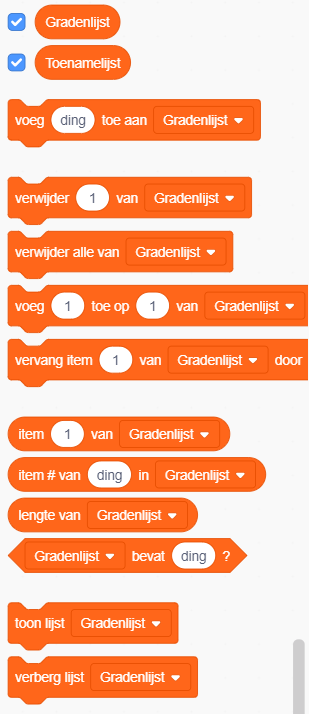
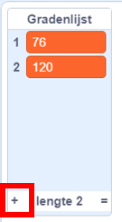

## De computer helpen

Weet je nog, een paar stappen terug, waar ik je vroeg om een paar van je favoriete getallen op te schrijven voor `toename`{:class="block3variables"} en `graden`{:class="block3variables"}, de getallen met de mooiste patronen? Als je dit niet gedaan hebt, geen paniek: je kunt het willekeurige programma een tijdje laten lopen en die combinaties opschrijven die mooie resultaten geven.

Je gaat Scratch een aantal van deze getallen combinaties aanleren, zodat het die gebruikt om alleen maar geweldige tekeningen te maken!

Hiervoor heb je een **lijst** nodig. Je vindt lijsten bij de variabelen in het **Variabelen** gedeelte. Net zoals je deed bij de variabelen, moet je eerst je eigen lijst maken!

\--- task \---

Click **Make a List**, and enter `Degrees List`{:class="block3variables"} as the name.


\--- /task \---

Your list, which is empty at the moment, will appear on the Stage, and you'll see a bunch of blocks for it in **Variables**.



\--- task \---

Make another list called `Increase List`{:class="block3variables"}

\--- /task \---

\--- task \---

Now, by clicking on the little plus sign (**+**) at the bottom of the lists, add in the first pair of values of `increase`{:class="block3variables"} and `degrees`{:class="block3variables"} you liked, each value into the right list. Do this again to add the second pair of values. This will be enough for now — you'll add the rest of the value pairs you like later!



Make sure that the `degrees`{:class="block3variables"} value and the `increase`{:class="block3variables"} value that worked well together are at the same position in the `Degrees List`{:class="block3variables"} and the `Increase List`{:class="block3variables"}. They need to be there so your program can match them up again using their position!

\--- /task \---

Now you have the lists, you just need to get your code to read them and loop over them! To do this, you’re going to use a new variable to act as a counter, some **incrementing**, and an `if then`{:class="block3control"} **Control** block.

## \--- collapse \---

## title: Wat betekent ophogen?

To increment something means to add something to it.

You will use a variable to act as a counter to keep track of what position you're at in your lists. To move through the lists, you'll keep incrementing the counter by `1` (so, adding `1` to it) until you get to the end of the list.

\--- /collapse \---

\--- task \---

Create a new variable called `counter`{:class="block3variables"}, and update your code to look like this:

```blocks3
    wanneer groene vlag wordt aangeklikt
maak [teller v] [0]
herhaal
+ als <(teller) = (lengte van [Toenamelijst v] :: list)> dan
+ maak [teller v] [0]
end
+ verander [teller v] met (1)
maak [stappen v] [0]
+ maak [toename v] (item (teller) van [Toenamelijst v] :: list)
+ maak [graden v] (item (teller) van [Gradenlijst v] :: list)
pen op
verdwijn
wis alles
ga naar x: (0) y: (0)
maak pen kleur [#4a6cd4]
pen neer
herhaal tot <raak ik [rand v] ?>
neem (stappen) stappen
draai cw (graden) graden
verander [stappen v] met (toename)
end
end
```

\--- /task \---

Notice the new blocks that:

1. De `teller`{:class="block3variables"} op `0` zetten, buiten alle lussen om.
2. Controleer of het getal dat opgeslagen is in `teller`{:class="block3variables"} de lengte van de lijst is, en zo ja, zet de `teller`{:class="block3variables"} op `0`. Dit betekent dat deze variabele altijd het getal van een positie in de lijsten is, en ook niet groter zal worden.
3. `1` bij `teller`{:class="block3variables"} optellen.
4. Neem het item uit de `Toenamelijst`{:class="block3variables"} waarvan de `teller`{:class="block3variables"} de positie aangeeft, en stop het in de `toename`{:class="block3variables"} variabele. Doe hetzelfde voor de `Gradenlijst`{:class="block3variables"} en de `graden`{:class="block3variables"} variabele.

## \--- collapse \---

## title: Hoe werkt de code?

This is what happens when you run your program:

1. Maak `teller`{:class="block3variables"} `0`.
2. Begin de `herhaal`{:class="block3control"} lus.
3. Kijk of `teller`{:class="block3variables"} (`0`) hetzelfde is als de lengte van de `Toenamelijst`{:class="block3variables"} (`2`). Dat is niet zo.
4. Verander `teller`{:class="block3variables"} met `1`. Nu `teller`{:class="block3variables"} = `1`.
5. Maak `stappen`{:class="block3variables"} `0`.
6. Pak het item in de positie die `teller`{:class="block3variables"} (`1`) in de `Toenamelijst`{:class="block3variables"} aangeeft, en zet het in `toename`{:class="block3variables"}.
7. Pak het item in de positie die `teller`{:class="block3variables"} (`1`) in de `Gradenlijst`{:class="block3variables"} aangeeft, en zet het in `graden`{:class="block3variables"}.
8. Doe alles wat met het tekenen van patronen te maken heeft.
9. Begin de `herhaal`{:class="block3control"} lus opnieuw:
10. Kijk of `teller`{:class="block3variables"} (`1`) hetzelfde is als de lengte van de `Toenamelijst`{:class="block3variables"} (`2`). Dat is niet zo.
11. Verander `teller`{:class="block3variables"} met `1`. Nu `teller`{:class="block3variables"} = `2`.
12. Maak `stappen`{:class="block3variables"} `0`.
13. Pak het item in de positie die `teller`{:class="block3variables"} (`2`) in de `Toenamelijst`{:class="block3variables"} aangeeft, en zet het in `toename`{:class="block3variables"}.
14. Pak het item in de positie die `teller`{:class="block3variables"} (`2`) in de `Gradenlijst`{:class="block3variables"} aangeeft, en zet het in `graden`{:class="block3variables"}.
15. Doe alles wat met het tekenen van patronen te maken heeft.
16. Begin de `herhaal`{:class="block3control"} lus opnieuw:
17. Kijk of `teller`{:class="block3variables"} (`2`) hetzelfde is als de lengte van de `Toenamelijst`{:class="block3variables"} (`2`). Dat is zo!
18. Maak `teller`{:class="block3variables"} `0`.
19. Ga door met **stap 4** van deze lijst, in een oneindige lus!

\--- /collapse \---

\--- task \---

Once you're happy with the code, go ahead and add the rest of the pairs of values you noted down to the `Degrees List`{:class="block3variables"} and the `Increase List`{:class="block3variables"}.

\--- /task \---

That's it! Sit back and watch your program keep drawing lovely patterns in a never-ending loop! If you want to add more patterns, you can: just add more pairs of numbers to the two lists and restart the program.