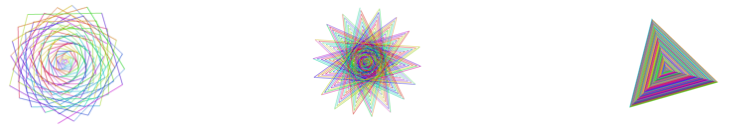

\--- no-print \---

To jest wersja projektu korzystająca z **Scratch 3**. Istnieje również [wersja tego projektu dla Scratch 2](https://projects.raspberrypi.org/en/projects/cd-intermediate-scratch-sushi-scratch2).

\--- /no-print \---

## Wprowadzenie

Nauczyłeś się już podstaw Scratch (a jeśli nie, zapoznaj się z Kartami Sushi w Scratch dla początkujących), aby stworzyć swoją pierwszą grę w Scratch. Tutaj nauczysz się kilku fajnych sztuczek i zrobisz jeden z moich ulubionych projektów Scratch: który rysuje kolorowe wzory i, jeśli ustawisz je poprawnie, mogą dać efekt, który naprawdę fajnie się ogląda.

### Co zrobisz

Oto projekt, który przygotowałem:

  <iframe allowtransparency="true" width="485" height="402" src="https://scratch.mit.edu/projects/embed/205355399/?autostart=false" frameborder="0"></iframe>

## \--- collapse \---

## title: Czego się nauczysz

W średnio zaawansowanych kartach Sushi w Scratch dowiesz się jak:

+ Korzystać z narzędzia Pióro
+ Używać i aktualizować zmienne w pętlach
+ Korzystać z pętli "Powtarzaj aż"
+ Pobierać wartości wejściowe za pomocą bloków zapytań
+ Używać wielu list z właściwościami powiązanymi według indeksu

\--- /collapse \---

## \--- collapse \---

## title: Czego będziesz potrzebować

### Sprzęt

+ Komputer, na którym można uruchomić Scratch 3

### Oprogramowanie

+ Scratch 3 ([online](https://scratch.mit.edu/projects/editor/){:target="_blank"} lub [offline](https://scratch.mit.edu/download/){:target="_blank"})

\--- /collapse \---