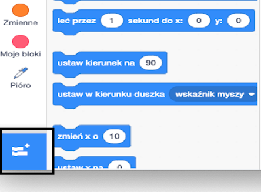
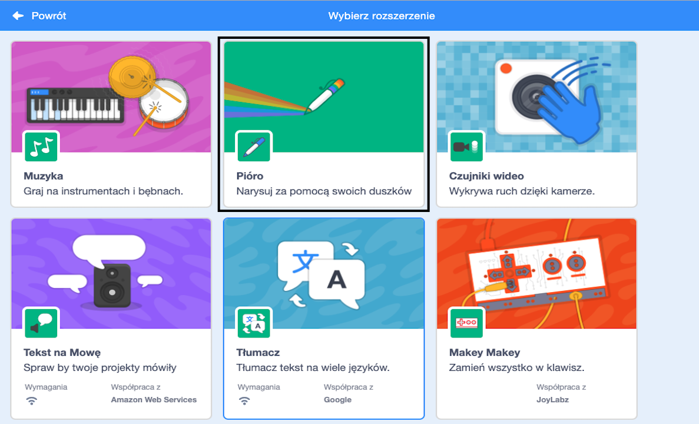
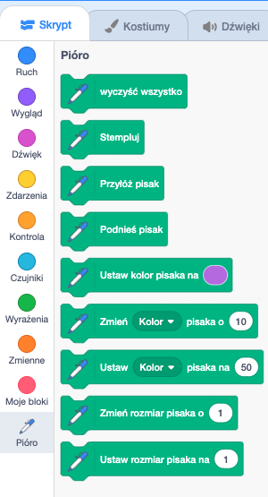

## Korzystanie z narzędzia Pióro

Projekt, który zamierzasz wykonać, opiera się na narzędziu **Pióro**, które rysuje linię za środkiem duszka, gdy się porusza. Nauczysz się go teraz używać!

--- task --- Otwórz nowy plik Scratch, wybierz duszka Kot Scratch i dodaj kilka bloków, które być może już widziałeś, aż będzie wyglądać tak:

```blocks3
    kiedy kliknięto zieloną flagę
    idź do x: (0) y: (0)
    przesuń o (50) kroków
    obróć w prawo o (15) stopni
```

--- /task ---

Teraz czas na przetestowanie pióra!

Aby użyć bloków Pióra w Scratch, musisz dodać **rozszerzenie Pióro**.

--- task --- Kliknij przycisk **Dodaj rozszerzenie** w lewym dolnym rogu.



Kliknij rozszerzenie **Pióro** aby je dodać.



W dolnej części menu bloków pojawi się sekcja Pióro.



Z sekcji **Pióro** wybierz blok `przyłóż pisak`{:class="block3extensions"} i dodaj go do początku swojego programu, tak jak poniżej:

```blocks3
    kiedy kliknięto zieloną flagę
+ przyłóż pisak
    idź do x: (0) y: (0)
```

--- /task ---

--- task --- Teraz kliknij kilka razy zieloną flagę i zobacz, co się stanie. --- /task ---

Jeśli widzisz linie za duszkiem kota, to pióro działa i możesz zacząć tworzyć naprawdę fajne wzory.

Po pierwsze, powinieneś pozbyć się duszka. Przeszkadza w rysowaniu!

--- task --- Dodaj blok `ukryj`{:class="block3looks"} z sekcji **Wygląd** na początku programu i duszek kota zniknie.

```blocks3
    kiedy kliknięto zieloną flagę
+ ukryj
    przyłóż pisak
```

--- /task ---

Teraz możesz zmienić kolor pióra za pomocą innego bloku z sekcji **Pióro**, ale blok jest trochę inny niż pozostałe. To jest blok `ustaw kolor pisaka na`{:class="block3extensions"} i wygląda tak:

```blocks3
    ustaw kolor pisaka na [#4a6cd4]
```

--- task --- Przeciągnij blok `ustaw kolor pisaka na`{:class="block3extensions”} w panelu duszków i upuść go nad blokiem `przyłóż pisak`{:class="block3extensions”}.

```blocks3
    kiedy kliknięto zieloną flagę
    ukryj
+ ustaw kolor pisaka na [#4a6cd4]
    przyłóż pisak
```

Teraz kliknij na pole koloru (w powyższym kodzie kolor jest niebieski) i wybierz kolor. --- /task ---

Jeśli cały ten czas klikałeś na zieloną flagę, aby przetestować swój kod, to zauważyłeś pewnie, że rysunki, które tworzy pióro nie znikają.

--- task --- Dodaj blok `wyczyść wszystko`{:class="block3extensions"} z sekcji **Pióro** na początku kodu, aby się tym zająć:

```blocks3
    kiedy kliknięto zieloną flagę
+ wyczyść wszystko
    ukryj
```

--- /task ---