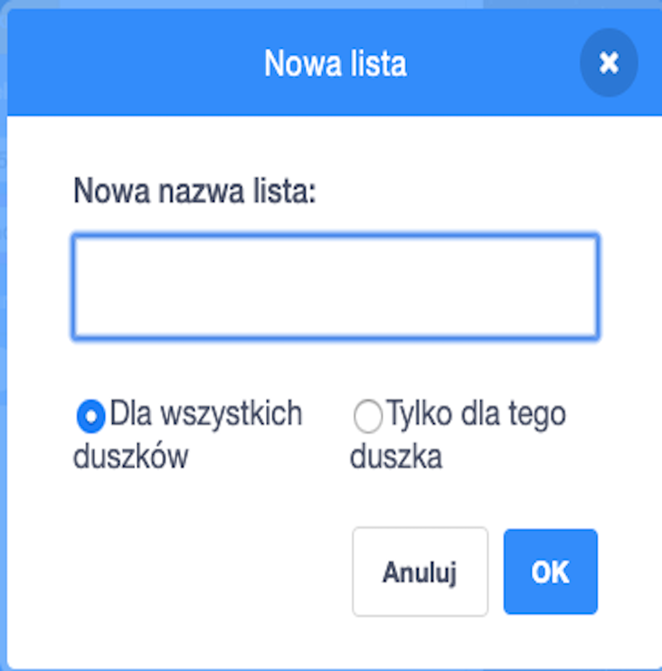
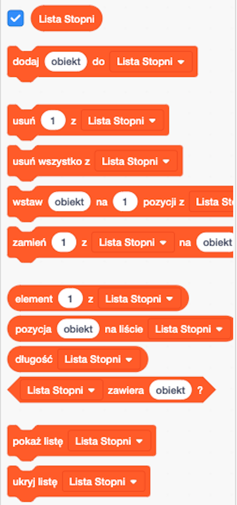
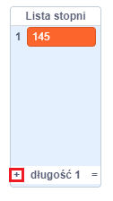

## Pomaganie komputerowi

Czy pamiętasz jak kilka kroków wstecz powiedziałem, żebyś zapisał niektóre z twoich ulubionych wartości dla zmiennych `powiększenie`{:class="block3variables"} i `stopnie`{:class="block3variables"}, które dały najlepiej wyglądające wzory? Jeśli tego nie zrobiłaś, nie martw się: możesz po prostu oglądać losowo uruchamiany program przez chwilę i zapisać te kombinacje, które dają świetne wyniki.

Nauczysz Scratch tych kombinacji wartości, aby mógł je wykorzystać do robienia niesamowitych obrazków!

Aby to zrobić, będziesz potrzebować **listy**. Listę zmiennych najdziesz w sekcji **Zmienne**. Podobnie jak w przypadku zmiennych, musisz najpierw utworzyć swoją listę!

--- task --- Kliknij **Utwórz listę**i wprowadź tekst `Lista stopni`{:class="block3variables"} jako nazwę.



--- /task ---

Twoja lista, która jest w tej chwili pusta, pojawi się na scenie, i zobaczysz kilka bloków dla tej listy w sekcji **Zmienne**.



--- task --- Zrób kolejną listę o nazwie `Lista powiększenia`{:class="block3variables"} --- /task ---

--- task --- Teraz, klikając mały znak plus (**+**) na dole list, dodaj pierwszą parę ulubionych wartości `powiększenie`{:class="block3variables"} i `stopnie`{:class="block3variables"}, każdą wartość do odpowiedniej listy. Zrób to ponownie, aby dodać drugą parę wartości. Na razie to wystarczy - resztę par ulubionych wartości dodasz później!



Upewnij się, że wartość `stopnie`{:class="block3variables"} i wartość `powiększenie`{:class="block3variables"}, które działały dobrze, są w tej samej pozycji na `Liście stopni`{:class="block3variables"} i `Liście powiększenia`{:class="block3variables"}. Muszą tam być, aby Twój program mógł je ponownie dopasować, wykorzystując ich pozycję!

--- /task ---

Teraz, gdy masz już listy, musisz tylko określić swój kod do odczytania i zapętlenia ich! Aby to zrobić, użyjesz nowej zmiennej, która będzie działać jako licznik, niektórych **zwiększających** i bloku `jeżeli to`{:class="block3control"} z sekcji **Kontrola**.

--- collapse ---
---
title: Co oznacza zwiększające?
---

Zwiększenie czegoś oznacza dodanie do niego czegoś.

Użyjesz zmiennej, która będzie działać jako licznik, aby śledzić, na której pozycji w twoich listach jesteś. Aby poruszać się po listach, będziesz zwiększał licznik o `1` (tak więc dodając do niego `1`), aż dojdziesz do końca listy.

--- /collapse ---

--- task --- Utwórz nową zmienną o nazwie `licznik`{:class="block3variables"} i zaktualizuj swój kod, aby wyglądał tak:

```blocks3
    kiedy kliknięto zieloną flagę
    ustaw [licznik v] na [0]
    zawsze 
+ jeżeli <(licznik) = (długość [Lista powiększenia v] :: lista)> to 
+ ustaw [licznik v] na [0]
        koniec
+ zmień [licznik v] o (1)
        ustaw [kroki v] na [0]
+ ustaw [powiększenie v] na (element (licznik) z [Lista powiększenia v] ::list)
+ ustaw [stopnie v] na (element (licznik) z [Lista stopni v] ::list)
        podnieś pisak
        ukryj
        wyczyść wszystko
        idź do x: (0) y: (0)
        ustaw kolor pisaka na [#4a6cd4]
        przyłóż pisak
        powtarzaj aż <dotyka [krawędź v] ?> 
            przesuń o (kroki) kroków
            obróć w prawo o (stopnie) stopni
            zmień [kroki v] o (powiększenie)
        koniec
    koniec
```

--- /task ---

Zwróć uwagę na nowe bloki, które:

1. Ustawiają `licznik`{:class="block3variables"} na `0`, poza wszystkimi pętlami.
2. Sprawdzają, czy liczba zapisana w zmiennej `licznik`{:class="block3variables"} jest długością listy, a jeśli tak, ustawiają zmienną `licznik`{:class="block3variables"} na `0`. Oznacza to, że ta zmienna zawsze będzie numerem pozycji na listach i nie będzie większa.
3. Dodają `1` do zmiennej `licznik`{:class="block3variables"}.
4. Wybierają element z `Listy powiększenia`{:class="block3variables"}, który znajduje się na pozycji opisanej przez zmienną `licznik`{:class="block3variables"}, i umieszczają go w zmiennej `powiększenie`{:class="block3variables"}. Zrób to samo dla listy `Lista stopni`{:class="block3variables"} i zmiennej `stopnie`{:class="block3variables"}.

--- collapse ---
---
title: Jak działa ten kod?
---

Oto co dzieje się po uruchomieniu programu:

1. Ustaw `licznik`{:class="block3variables"} na `0`.
2. Uruchom pętlę `zawsze`{:class="block3control"}.
3. Sprawdź, czy `licznik`{:class="block3variables"} (`0`) jest taki sam, jak długość listy `Lista powiększenia`{:class="block3variables"} (`2`). Nie jest.
4. Zmień `licznik`{:class="block3variables"} o `1`. Teraz `licznik`{:class="block3variables"} = `1`.
5. Ustaw zmienną `kroki`{:class="block3variables"} na `0`.
6. Weź element z pozycji wskazanej przez zmienną `licznik`{:class="block3variables"} (`1`) w liście `Lista powiększenia`{:class="block3variables"} i umieść go w zmiennej `powiększenie`{:class="block3variables"}.
7. Weź element z pozycji wskazanej przez zmienną `licznik`{:class="block3variables"} (`1`) w liście `Lista stopni`{:class="block3variables"} i umieść go w zmiennej `stopnie`{:class="block3variables"}.
8. Zrób wszystkie rzeczy związane z rysowaniem wzorów.
9. Uruchom ponownie pętlę `zawsze`{:class="block3control"}:
10. Sprawdź, czy `licznik`{:class="block3variables"} (`1`) jest taki sam, jak długość `Listy powiększenia`{:class="block3variables"} (`2`). Nie jest.
11. Zmień `licznik`{:class="block3variables"} o `1`. Teraz `licznik`{:class="block3variables"} = `2`.
12. Ustaw `kroki`{:class="block3variables"} na `0`.
13. Weź element z pozycji wskazanej przez zmienną `licznik`{:class="block3variables"} (`2`) w liście `Lista powiększenia`{:class="block3variables"} i umieść go w zmiennej `powiększenie`{:class="block3variables"}.
14. Weź element z pozycji wskazanej przez zmienną `licznik`{:class="block3variables"} (`2`) w liście `Lista stopni`{:class="block3variables"} i umieść go w zmiennej `stopnie`{:class="block3variables"}.
15. Zrób wszystkie rzeczy związane z rysowaniem wzorów.
16. Uruchom ponownie pętlę `zawsze`{:class="block3control"}:
17. Sprawdź, czy `licznik`{:class="block3variables"} (`2`) jest taki sam, jak długość `Listy powiększenia`{:class="block3variables"} (`2`). Jest!
18. Ustaw `licznik`{:class="block3variables"} na `0`.
19. Kontynuuj od **kroku 4** tej listy, w niekończącej się pętli!

--- /collapse ---

--- task --- Gdy jesteś zadowolony ze swojego kodu, dodaj pozostałe pary zapisanych wartości do `Listy Stopni`{:class="block3variables"} i `Listy powiększenia`{:class="block3variables"}. --- /task ---

Gotowe! Usiądź wygodnie i obserwuj, jak twój program rysuje piękne wzory w niekończącej się pętli! Jeśli chcesz dodać więcej wzorów, możesz: po prostu dodaj więcej par liczb do dwóch list i uruchom ponownie program.


Tłumaczenie wykonane przez wolontariuszy

Projekt ten przetłumaczył **Marek Lubinski** a zweryfikował **Seweryn Kras**.

Dzięki naszym wspaniałym wolontariuszom, ludzie na całym świecie mogą nauczyć się kodowania. Tłumacząc nasze projekty możesz pomóc nam dotrzeć do większej liczby ludzi. Więcej informacji na stronie [rpf.io/translate](https://rpf.io/translate).