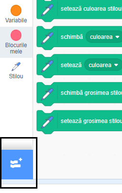
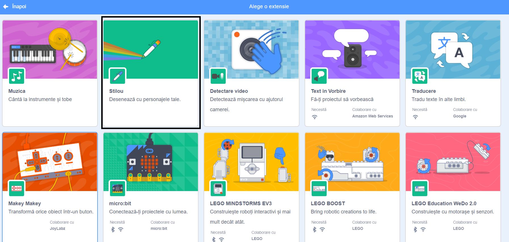
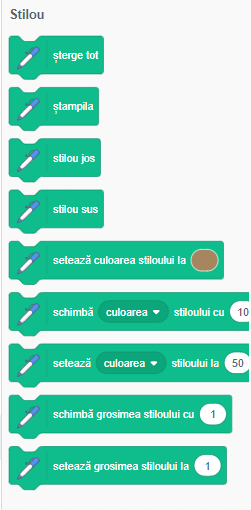

## Utilizarea instrumentului Stilou

Proiectul pe care îl vei face se bazează pe instrumentul **Stilou**, care trasează o linie în spatele centrului unui personaj în timp ce se mișcă. Vei învăța să îl utilizezi acum!

\--- task \--- Deschide un fișier nou Scratch, selectează personajul Pisică și trage câteva blocuri pe care le-ai văzut deja, până când arată astfel:

```blocks3
    când se dă click pe stegulețul verde
    mergi la x: (0) y: (0)
    mergi (50) pași
    rotește-te cw (15) grade
```

\--- /task \---

Acum, e timpul pentru a testa stiloul!

Pentru a utiliza blocurile Stilou în Scratch, trebuie să adăugi **extensia Stilou**.

\--- task \--- Dă click pe butonul **Adaugă o extensie** în colțul din stânga jos.



Dă click pe extensia **Stilou** pentru a o adăuga.



Secțiunea Stilou va apărea apoi în partea de jos a meniului blocurilor.



Din secțiunea **Stilou**, selectează blocul `Stilou jos`{:class="block3extensions"} și adăugă-l la începutul programului, după cum urmează:

```blocks3
    când se dă click pe stegulețul verde
+    stilou jos
    mergi la x: (0) y: (0)
```

\--- /task \---

\--- task \--- Acum, dă click pe stegulețul verde de câteva ori și urmărește ce se întâmplă. \--- /task \---

Dacă poți vedea liniile din spatele pisicii, atunci pixul funcționează și poți începe să faci șabloanele interesante.

Mai întâi, trebuie să scapi de personaj. Ea rămâne în calea desenului!

\--- task \--- Adaugă blocul `ascunde`{:class="block3looks"} din **Aspect** la începutul programului și va dispărea.

```blocks3
    când se dă click pe stegulețul verde
+    ascunde
    stilou jos
```

\--- /task \---

Acum, poți schimba culoarea stiloului cu un alt bloc din secțiunea **Stilou**, dar blocul este puțin diferit față de cele pe care le-ai văzut. Este blocul `seteaza culoarea stiloului la`{:class="block3extensions"} și arată astfel:

```blocks3
    setează culoarea stiloului la [#4a6cd4]
```

\--- task \--- Trage un bloc de tip `seteaza culoarea stiloului la`{:class="block3extensions"} în panoul personajului tău și adaugă-l peste blocul `stilou jos`{:class="block3extensions"}.

```blocks3
    când se dă click pe stegulețul verde
    ascunde
+    setează culoarea stiloului la [#4a6cd4]
    stilou jos
```

Dă click pe caseta de culoare (în codul de mai sus este cea albastră) și alege o culoare. \--- /task \---

Dacă ai dat click pe steagul verde pentru a testa codul, ai observat că desenele pe care le realizează stiloul nu dispar.

\--- task \--- Adaugă blocul `șterge tot`{:class="block3extensions"} din secțiunea **Stilou** la începutul codului pentru a remedia problema:

```blocks3
    când se dă click pe stegulețul verde
+    șterge
    ascunde
```

\--- /task \---