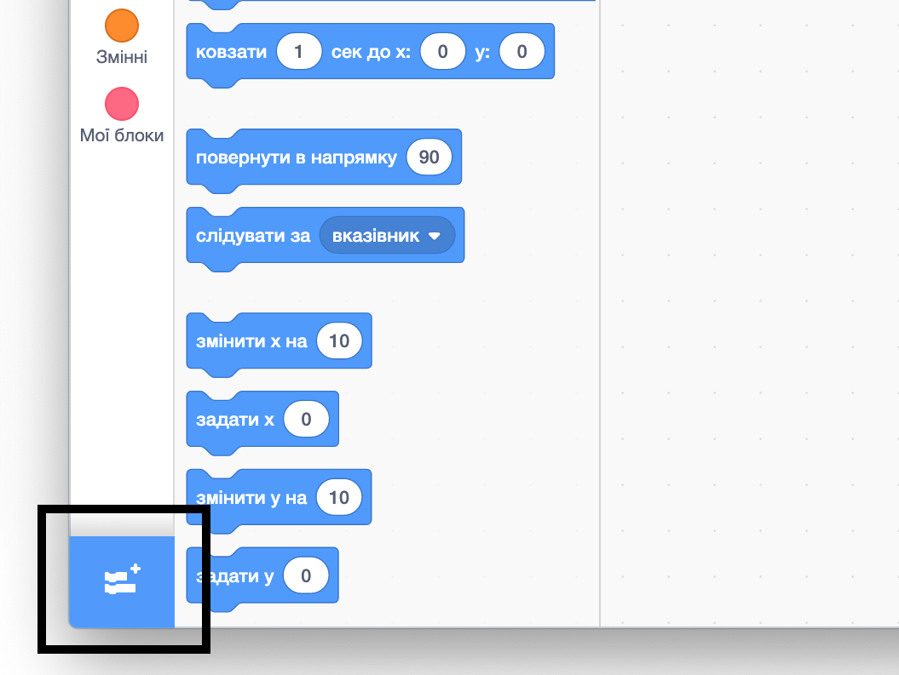

## Використання інструменту "Олівець"

Проєкт, який ти збираєшся зробити, використовує інструмент **Олівець**, який малює лінію за центром спрайта, коли той рухається. Зараз ти навчишся його використовувати!

--- task ---

Відкрий новий проєкт Скретч.

**Онлайн:** відкрий новий онлайн проєкт Скретч на [rpf.io/scratch-new](http://rpf.io/scratch-new){:target="_blank"}.

**Офлайн:** відкрий новий проєкт в офлайн-редакторі.

Якщо тобі треба завантажити та встановити офлайн-редактор Скретч, то ти можеш його знайти на [rpf.io/scratchoff](http://rpf.io/scratchoff){:target="_blank"}.

--- /task ---

--- task ---

Вибери спрайт Кота, і перетягни кілька блоків, які тобі вже зустрічались раніше, поки не отримаєш щось подібне:

```blocks3
    when green flag clicked
    go to x: (0) y: (0)
    move (50) steps
    turn cw (15) degrees
```

--- /task ---

Тепер, час випробувати Олівець!

Для того, щоб використовувати блоки інструменту Олівець у Скретч, потрібно додати розширення **Олівець**.

--- task ---

Натисни на кнопку **Додати розширення** у нижньому лівому куті.



Натисни на розширення **Олівець**, щоб додати його.


Розділ Олівець з’явиться у меню блоків знизу.


З розділу **Олівець** візьми блок `опустити олівець`{:class="block3extensions"} і додай його до початку програми, як тут:

```blocks3
    when green flag clicked
+    pen down
    go to x: (0) y: (0)
```

--- /task ---

--- task ---

А зараз натисни кілька разів на зелений прапорець і подивися, що станеться.

--- /task ---

Якщо ти бачиш лінії за спрайтом Кота, значить олівець працює, і ти можеш почати малювати ним дійсно круті візерунки.

Спочатку слід позбутися спрайта. Він заважає малюванню!

--- task ---

Додай блок `сховати`{:class="block3looks"} з розділу **Вигляд** на початок програми, і він зникне.

```blocks3
    when green flag clicked
+    hide
    pen down
```

--- /task ---

Тепер ти можеш змінити колір олівця за допомогою іншого блоку з розділу **Олівець**, але цей блок трохи відрізняється від інших, які тобі зустрічалися раніше. Це блок `надати олівцю колір`{:class="block3extensions"} і виглядає він так:

```blocks3
    set pen color to [#4a6cd4]
```

--- task ---

Перетягни блок `надати олівцю колір`{:class="block3extensions"} до панелі спрайта і прикріпи його над блоком `опустити олівець`{:class="block3extensions"}.

```blocks3
    when green flag clicked
    hide
+    set pen color to [#4a6cd4]
    pen down
```

Тепер натисни на поле кольору (у коді, написаному вище, цей колір синій), та обери колір.

--- /task ---

Натискаючи зелений прапорець, щоб перевірити свій код, можна помітити, що малюнки, зроблені олівцем, не зникають.

--- task ---

Додай блок `очистити все`{:class="block3extensions"} з розділу **Олівець** до початку свого коду, щоб позбавитись цього:

```blocks3
    when green flag clicked
+    clear
    hide
```

--- /task ---