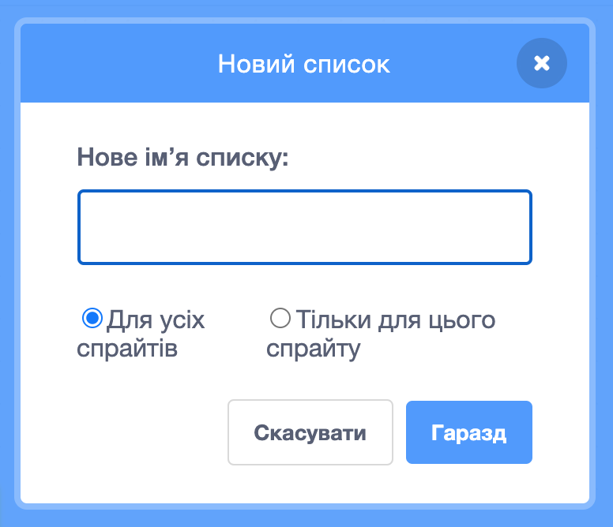
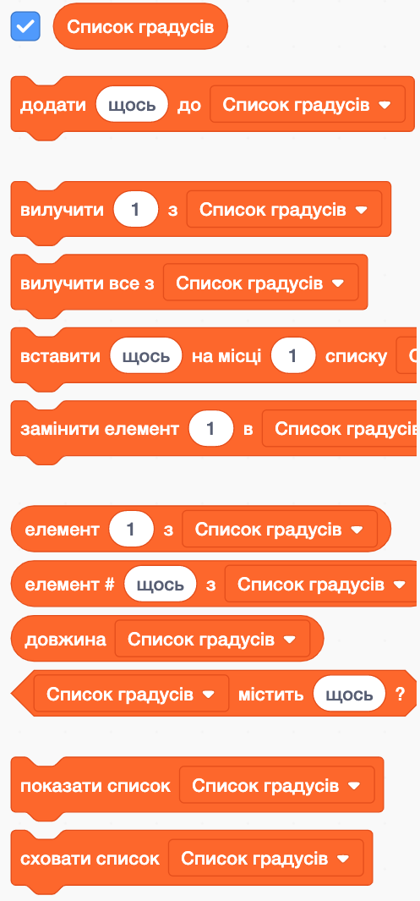
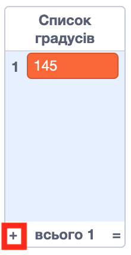

## Допоможи комп’ютеру

Пам'ятаєш, кілька кроків назад ти записував свої улюбленні значення для змінних `приріст`{:class="block3variables"} та `градуси`{:class="block3variables"}, такі, що дають найкращі візерунки? Якщо ти цього не зробив(-ла), не хвилюйся: зараз ти можеш просто деякий час спостерігати за виконанням випадкової програми і записувати комбінації, які дають чудові результати.

Ти можеш навчити Скретч обирати ці комбінації значень для створення дивовижних зображень!

Для цього тобі знадобиться **список**. Ти знайдеш списки зі змінними у розділі **Змінні**. Як і зі змінними, тобі спочатку потрібно створити свій список!

--- task ---

Натисни **Створити список** та назви його `Список градусів`{:class="block3variables"}.



--- /task ---

Твій список, наразі порожній, з’явиться на Сцені, і ти побачиш купу блоків для нього у розділі **Змінні**.



--- task ---

Створи інший список з назвою `Список приростів`{:class="block3variables"}

--- /task ---

--- task ---

Тепер, натиснувши на знак "плюс" (**+**) у нижній частині списків, додай першу пару значень змінних `приріст`{:class="block3variables"} та `градуси`{:class="block3variables"} які тобі сподобались, кожне значення у відповідній список. Зроби те саме ще раз, щоб додати другу пару значень. Наразі цього буде достатньо — ти зможеш пізніше додати решту пар значень, які тобі подобаються!



Переконайся, що значення `градуси`{:class="block3variables"} та значення `приріст`{:class="block3variables"}, які добре працювали разом, знаходяться на однакових позиціях у списках `Список градусів`{:class="block3variables"} та `Список приростів`{:class="block3variables"}. Вони повинні бути там, щоб програма могла їх співставити знову, використовуючи їх положення!

--- /task ---

Тепер, коли у тебе є списки, тобі потрібно просто організувати свій код так, щоб він читав їх у циклі! Для цього тобі потрібно використовувати нову змінну у якості лічильника для **збільшення**, а також блок `якщо то`{:class="block3control"} з розділу **Керування**.

--- collapse ---
---
title: Що означає збільшення?
---

Для того, щоб щось збільшити, треба додати щось до нього.

Ти будеш використовувати цю змінну у якості лічильника, щоб відстежувати, на якій позиції ти знаходишся у своїх списках. Для переміщення у списках продовжуй збільшувати лічильник на `1` (додаючи `1` до нього), поки не дістанешся кінця списку.

--- /collapse ---

--- task ---

Створи нову змінну під назвою `лічильник`{:class="block3variables"} та онови свій код таким чином:

```blocks3
    when green flag clicked
    set [лічильник v] to [0]
    forever 
+        if <(лічильник) = (length of [Список приростів v] :: list)> then 
+            set [лічильник v] to [0]
        end
+        change [лічильник v] by (1)
        set [кроки v] to [0]
+        set [приріст v] to (item (лічильник) of [Список приростів v] :: list)
+        set [градуси v] to (item (лічильник) of [Список градусів v] :: list)
        pen up
        hide
        clear
        go to x: (0) y: (0)
        set pen color to [#4a6cd4]
        pen down
        repeat until <touching [edge v] ?> 
            move (кроки) steps
            turn cw (градуси) degrees
            change [кроки v] by (приріст)
        end
    end
```

--- /task ---

Зверни увагу на нові блоки:

1. Зовні всіх циклів встанови значення `лічильник`{:class="block3variables"} у `0`.
2. Перевір, чи значення у `лічильнику`{:class="block3variables"} дорівнює довжині списку, і якщо так, то встанови `лічильник`{:class="block3variables"} у `0`. Це означає, що ця змінна завжди буде номером позиції у списках, і не вийде за їх межі.
3. Додай `1` до `лічильника`{:class="block3variables"}.
4. Вибери елемент зі `Списку приростів`{:class="block3variables"}, що відповідає позиції `лічильника`{:class="block3variables"}, і запиши його у змінну `приріст`{:class="block3variables"}. Зроби те ж саме для `Списку градусів`{:class="block3variables"} та змінної `градуси`{:class="block3variables"}.

--- collapse ---
---
title: Як працює код?
---

Ось що відбувається, коли ти запускаєш програму:

1. Встановлюється `лічильник`{:class="block3variables"} у `0`.
2. Запускається цикл `завжди`{:class="block3control"}.
3. Перевіряється, чи `лічильник`{:class="block3variables"} (`0`) дорівнює довжині `Списку приростів`{:class="block3variables"} (`2`). Це не так.
4. Змінна `лічильник`{:class="block3variables"} збільшується на `1`. Тепер `лічильник`{:class="block3variables"} = `1`.
5. Змінна `кроки`{:class="block3variables"} встановлюється у `0`.
6. Отримується елемент, який знаходиться на позиції, відповідній до значення `лічильника`{:class="block3variables"} (`1`) у `Списку приростів`{:class="block3variables"}, і записується у змінну `приріст`{:class="block3variables"}.
7. Отримується елемент, який знаходиться на позиції, відповідній до значення `лічильника`{:class="block3variables"} (`1`) у `Списку градусів`{:class="block3variables"}, і записується у змінну `градуси`{:class="block3variables"}.
8. Відбувається все, що пов’язано з малюванням візерунків.
9. Перезапускається цикл `завжди` {:class="block3control"}:
10. Перевіряється, чи `лічильник`{:class="block3variables"} (`1`) дорівнює довжині `Списку приростів`{:class="block3variables"} (`2`). Це не так.
11. Змінна `лічильник`{:class="block3variables"} збільшується на `1`. Тепер `лічильник`{:class="block3variables"} = `2`.
12. Змінна `кроки`{:class="block3variables"} встановлюється у `0`.
13. Отримується елемент, який знаходиться на позиції, відповідній до значення `лічильника`{:class="block3variables"} (`2`) у `Списку приростів`{:class="block3variables"}, і записується у змінну `приріст`{:class="block3variables"}.
14. Отримується елемент, який знаходиться на позиції, відповідній до значення `лічильника`{:class="block3variables"} (`2`) у `Списку градусів`{:class="block3variables"}, і записується у змінну `градуси`{:class="block3variables"}.
15. Відбувається все, що пов’язано з малюванням візерунків.
16. Перезапускається цикл `завжди` {:class="block3control"}:
17. Перевіряється, чи `лічильник`{:class="block3variables"} (`2`) дорівнює довжині `Списку приростів`{:class="block3variables"} (`2`). Це так!
18. Встановлюється `лічильник`{:class="block3variables"} у `0`.
19. Програма продовжується з **кроку 4** цього списку, в нескінченному циклі!

--- /collapse ---

--- task ---

Як тільки вигляд твого коду тебе задовільнить, додай решту пар значень, які тобі сподобались, до `Списку градусів`{:class="block3variables"} та `Списку приростів`{:class="block3variables"}.

--- /task ---

Ось і все! Сідай відпочити та дивись, як твоя програма продовжує малювати чудові візерунки у нескінченному циклі! Якщо хочеш додати більше візерунків, можна просто додати ще декілька пар значень у два списки та перезапустити програму.


***
Цей проєкт переклали волонтери:

Valentyna Yerofieieva

Володимир Соботович

Завдяки волонтерам, ми надаємо можливість людям у всьому світі навчатися рідною мовою. Ви також можете допомогти нам у цьому — більше інформації про волонтерську програму на [rpf.io/translate](https://rpf.io/translate).