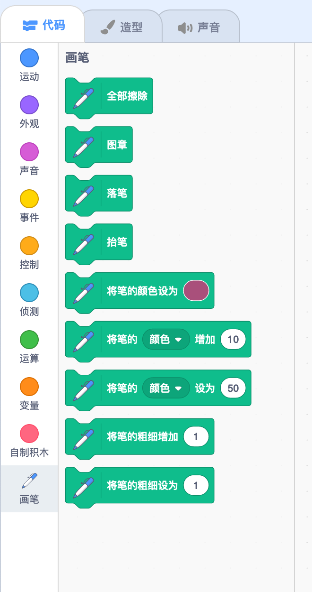

## 使用画笔工具

你要制作的项目会用到 **画笔**工具：它能在精灵图移动的时候在其中心背后画一条线。 现在来学习这个工具吧！

--- task ---

打开一个新的 Scratch 文件，选择 Scratch 猫精灵，然后拖动一些你可能已经看到的块，直到看起来像这样：

```blocks3
    when green flag clicked
    go to x: (0) y: (0)
    move (50) steps
    turn cw (15) degrees
```

--- /task ---

现在是测试画笔的时候了！

要在 Scratch 中使用画笔块，你需要添加 **画笔扩展**。

--- task ---

点击左下角的 **添加扩展** 按钮。


点一下 **画笔** 扩展就可以添加它。


然后画笔积木就会出现在代码菜单的底部。



从**画笔**部分中，选择`下笔`{:class="block3extensions"}块并将其添加到程序的开头，如下所示：

```blocks3
    when green flag clicked
+    pen down
    go to x: (0) y: (0)
```

--- /task ---

--- task ---

现在，点击绿色旗子几次，然后看看会发生什么。

--- /task ---

如果你可以看到猫精灵后面的线条，则说明笔正在工作，你就可以用它来绘制出非常酷的图案。

首先，你应该移除掉精灵。 因为它会妨碍到绘图！

--- task ---

从** 外观**中选择并添加`隐藏`{:class="block3looks"}块到程序的开头，精灵就会消失。

```blocks3
    when green flag clicked
+    hide
    pen down
```

--- /task ---

现在，你可以从**画笔**部分用另一个模块更改笔的颜色， 注意它与你看到的其他方块有些不同。 这是`将笔的颜色设置为`{:class="block3extensions"}，如下所示：

```blocks3
    set pen color to [#4a6cd4]
```

--- task ---

把`将笔的颜色设为`{:class="block3extensions"}拖动到你的精灵面板，并将其卡进`落笔`{:class="block3extensions"}块。

```blocks3
    when green flag clicked
    hide
+    set pen color to [#4a6cd4]
    pen down
```

现在，单击颜色框（在上面的代码中为蓝色），然后选择一种颜色。

--- /task ---

如果你已经单击绿色旗子来测试您的代码，你会注意到用笔绘制的图不会消失。

--- task ---

从**画笔**部分添加一个`全部擦除`{:class="block3extensions"} 块到你的代码开头，请注意：

```blocks3
    when green flag clicked
+    clear
    hide
```

--- /task ---