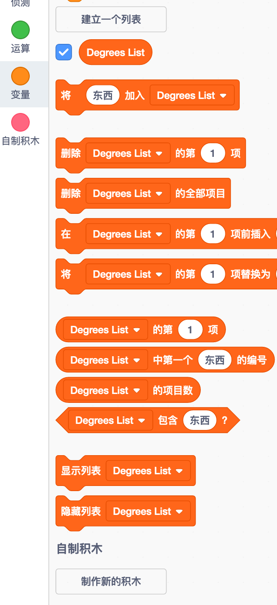
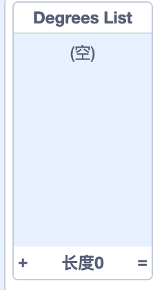

## 帮助计算机

还记得前几步我告诉过你可以在`增加`{:class="block3variables"}和`度数`{:class="block3variables"}中写下一些你喜欢的值， 那些提供了好看绘图的数字？ 如果你不记得了，那也不要紧：您可以看着随机程序运行一段时间，然后写下可以产生出色结果的组合。

你将要教Scratch这些组合的值，以便它可以使用它们来制作精美的图片！

为此，你需要一个**列表** 。 你将在**变量**部分找到相关模块。 就像变量一样，你需要先创建一个列表！

--- task ---

点击**建立一个列表** ，然后输入`度数表`{:class="block3variables"}作为名称。


--- /task ---

你的列表（目前为空）将出现在舞台上，并且你会在**变量** 中看到一堆框。



--- task ---

制作另一个叫做`递增列表`{:class="block3variables"}的列表

--- /task ---

--- task ---

现在，通过单击在列表的底部的小加号（**+** ），添加你喜欢的第一对值`增加`{:class="block3variables"}和`度数`{:class="block3variables"}，每个值都要放入正确的列表中。 再次执行此操作以添加第二对值。 现在就足够了 — — 稍后你会添加你喜欢的其他值对!



确保在 `度数表`{:class="block3variables"} 和 `递增列表`{:class="block3variables"} 中， `度数`{:class="block3variables"} 和 `增加`{:class="block3variables"} 处于同一位置并能一起工作。 它们需要在那里，以便你的程序能够使用他们的位置再次匹配它们！

--- /task ---

现在你已经有了列表，你只需要获取代码即可阅读并循环它们！ 为此，你将使用一个新变量 **incrementing** 作为计数器，此外还需要一个 `如果 那么`{:class="block3control"} **控制** 块。

--- collapse ---
---
title: 递增是什么意思？
---

要增加某些东西就意味着为它添加一些东西。

你将使用变量作为计数器，以跟踪你在列表中所处的位置。 要在列表中移动，你将持续给计数器递增 `1` (添加`1`），直到你到列表末尾。

--- /collapse ---

--- task ---

创建一个名为`计数器`{:class="block3variables"}的新变量，然后将代码更新为以下形式：

```blocks3
    when green flag clicked
    set [计数器 v] to [0]
    forever 
+        if <(计数器) = (length of [递增列表 v] :: list)> then 
+            set [计数器 v] to [0]
        end
+        change [计数器 v] by (1)
        set [步骤 v] to [0]
+        set [增加 v] to (item (计数器) of [递增列表 v] :: list)
+        set [度数 v] to (item (计数器) of [度数表 v] :: list)
        pen up
        hide
        clear
        go to x: (0) y: (0)
        set pen color to [#4a6cd4]
        pen down
        repeat until <touching [edge v] ?> 
            move (步骤) steps
            turn cw (度数) degrees
            change [步骤 v] by (增加)
        end
    end
```

--- /task ---

注意新的块：

1. 在所有循环之外设置`计数器`{:class="block3variables"}为`0`。
2. 检查存储在`计数器`{:class="block3variables"} 中的数字是否为列表长度，如果是，请设置`计数器`{:class="block3variables"}为`0`。 这意味着此变量将永远是列表中一个位置的数字，且不会比这更大。
3. 添加`1` 到 `计数器`{:class="block3variables"}.
4. 从`递增列表`{:class="block3variables"} 中选择位于`计数器`{:class="block3variables"}所描述的位置的项目，然后将其放在变量`增加`{:class="block3variables"}中。 对于`度数表`{:class="block3variables"} 和 `度数`{:class="block3variables"} 变量做同样的操作。

--- collapse ---
---
title: 代码如何工作？
---

这是当你在运行程序时发生的情况：

1. 设置`计数器`{:class="block3variables"}为`0` 。
2. 开始 `重复执行`{:class="block3control"} 循环快。
3. 检查`计数器`{:class="block3variables"}（`0`）的长度是否与`递增列表`{:class="block3variables"}（`2`）相同。 不是。
4. 把 `1` 加到 `计数器`{:class="block3variables"} 上。 现在`计数器`{:class="block3variables"} = `1`.
5. 设置`步骤`{:class="block3variables"} 为`0`。
6. 找到位于`递增列表`{:class="block3variables"}，名为`计数器`{:class="block3variables"} (`1`)的条目，并将其放入`增加`{:class="block3variables"}。
7. 找到位于`度数表`{:class="block3variables"}，名为`计数器`{:class="block3variables"} (`1`)的条目，并将其放入`度数`{:class="block3variables"}。
8. 执行所有与绘制图案相关的内容。
9. 从头开始执行 `重复执行`{:class="block3control"} 循环块。
10. 检查`计数器`{:class="block3variables"}（`1`）的长度是否与`递增列表`{:class="block3variables"}（`2`）相同。 不是。
11. 把`1`加到 `计数器`{:class="block3variables"} 上。 现在`计数器`{:class="block3variables"} = `2`.
12. 设置`步骤`{:class="block3variables"} 为`0`
13. 找到位于`递增列表`{:class="block3variables"}的，名为`计数器`{:class="block3variables"} (`2`)的条目，并将其放入`增加`{:class="block3variables"}。
14. 找到位于`度数表`{:class="block3variables"}，名为`计数器`{:class="block3variables"} (`2`)的条目，并将其放入`度数`{:class="block3variables"}。
15. 执行所有与绘制图案相关的内容。
16. 从头开始执行 `重复执行`{:class="block3control"} 循环块。
17. 检查`计数器`{:class="block3variables"}（`2`）的长度是否与`递增列表`{:class="block3variables"}（`2`）相同。 它是！
18. 设置`计数器`{:class="block3variables"}为`0`。
19. 从列表中的**step 4** 继续执行，它永远不会停止！

--- /collapse ---

--- task ---

对代码满意后，继续并将记下的其余几对值添加到`度数表`{:class="block3variables"}和`递增列表`{:class="block3variables"}中。

--- /task ---

这样就完成了！ 坐下来，看着你的程序不断循环绘制可爱的图案！ 如果你想要添加更多的模式，你可以：在两个列表中添加更多的数字对并重新启动程序。


***
该项目由以下志愿者翻译：

鄢然

Xianbin

正因为志愿者们的辛勤工作，我们才能为世界各地的人们提供用母语来学习的机会。您也可以通过志愿翻译工作来帮助我们吸引更多的人 - 更多信息，请访问[rpf.io/translate](https://rpf.io/translate)。